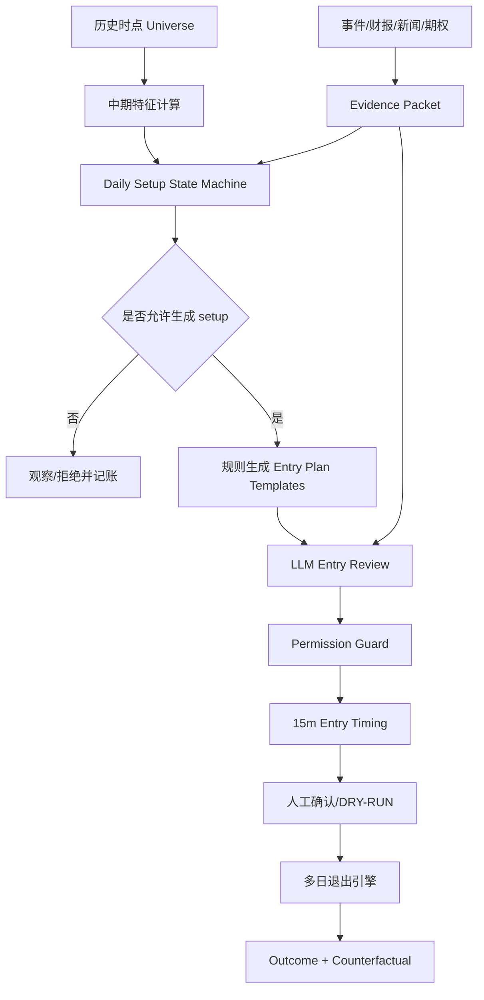

# 买入策略优化详细技术设计（2026-09-10）

## 1. 背景与结论

当前 `dip_buy` 用 15 分钟评分同时承担两个职责：判断一只股票是否值得买，以及决定何时成交。历史回测显示，这一组合在 4,873 笔交易上的毛期望为负；八根 15 分钟 bar 的持仓周期也无法覆盖一只股票从持续下跌、筑底到趋势反转的数周过程。

本设计把“是否值得买”和“何时买”分开：

1. 周线、日线和事件数据决定股票是否进入中期机会池；
2. 日线状态机判断股票处于下跌、稳定、反转还是确认阶段；
3. 规则生成有限、可审计的交易 setup；
4. LLM 复核下跌原因、投资论文、反证和事件风险；
5. 15 分钟模块只负责成交时机；
6. 持仓和退出周期与 setup 的 10–40 个交易日目标一致。

当前 `dip_buy` 不立即删除。它作为基线继续回测，并改名为 `intraday_entry_timing` 后参与增量价值实验。

## 2. 目标与非目标

### 2.1 目标

- 避免在明确的日线下降趋势中，仅因分钟超卖而买入；
- 支持 `trend_pullback` 和 `reversal_confirmed` 两种主要 setup；
- 所有指标只使用当时已经完成的数据；
- LLM 对中期论文和风险发挥作用，但不能创造价格、仓位或止损；
- 每层决策均可冻结、回放、对账和结算 outcome；
- 能证明 15 分钟择时相对“次日开盘买入”是否有增量；
- 回测执行全局最多三仓、资金占用和信号竞争约束。

### 2.2 非目标

- 本阶段不自动实盘下单；
- 不让 LLM 覆盖硬止损；
- 不同时上线 Position constrained action；
- 不在同一历史区间寻找最优指标组合；
- 不把当前八只股票的结果外推为全市场结论。

## 3. 总体架构



决策采用三种时间尺度：

| 层级 | 频率 | 回答的问题 |
|---|---|---|
| 周线/日线资格层 | 每日收盘后 | 未来 1–3 个月是否值得寻找机会 |
| 日线 setup 层 | 每日收盘后 | 是否已形成可交易结构 |
| 15 分钟执行层 | 开盘期间 | 今天是否出现合格成交点 |

## 4. 策略定义

### 4.1 Strategy A：`trend_pullback`

用途：在中长期强势股票中买短期回调，不对持续下降股票抄底。

第一版资格条件：

- 至少 250 根已完成日线；
- 调整后收盘价在 MA200 上方；
- MA50 高于 20 个交易日前的 MA50；
- 股票 20 日相对行业代理收益为正；
- 行业代理不处于明确防御状态；
- 没有财报窗口、交易停牌或关键数据质量失败。

setup 条件：

- 最近 3–10 日发生回调；
- 回调低点位于 MA20、MA50或前突破位的可配置 ATR 距离内；
- 回调没有跌破最近确认的结构低点；
- 日线出现更高低点或收复前一日高点；
- 从计划入场价到结构止损的距离不超过风险上限。

15 分钟触发：

- 只使用已经收盘的 15 分钟 bar；
- 收盘突破最近五根已完成 bar 的高点，或收复 VWAP 后形成更高低点；
- 成交价不得超过日线计划触发价 `max_chase_atr`；
- 当天价格跌破日线失效位后，setup 当日作废。

### 4.2 Strategy B：`reversal_confirmed`

用途：持续下跌数周后，等日线结构确认再参与反转。

状态必须从 `FALLING` 逐级演进，禁止从 `FALLING` 直接进入可买状态。

第一版 setup 条件：

- 最近 20–60 日存在明确回撤；
- 最近 5–10 个交易日停止创新低；
- 出现确认后的更高低点；
- 收盘重新站上 MA20，或突破最近局部反弹高点；
- MA20 斜率由下降转平或改善；
- 相对行业强度不再创新低；
- LLM 未将下跌归类为 `thesis_broken`；
- 关键证据质量满足 Entry 使用要求。

这不是机械摊低成本。价格继续下跌不会触发加仓，只有新的结构确认才能生成下一阶段模板。

### 4.3 旧 `dip_buy`

旧策略调整为：

- `standalone_enabled=false`：不得独立产生可下单 proposal；
- `shadow_baseline=true`：继续记录原信号和反事实；
- `timing_enabled=true`：可作为已批准日线 setup 的执行触发器之一。

## 5. 日线状态机

新增状态：

```text
FALLING → CAPITULATION → STABILIZING → REVERSING → CONFIRMED
   ↑             │              │            │          │
   └─────────────┴──────────────┴────────────┴──────────┘
                    任一失效条件可退回 FALLING
```

### 5.1 状态定义

| 状态 | 必要含义 | 允许行为 |
|---|---|---|
| `FALLING` | 新低、均线下行或相对强度恶化 | 观察，不生成 Entry |
| `CAPITULATION` | 大幅波动或放量下跌 | 记录事件，不买入 |
| `STABILIZING` | 数日不创新低、ATR/卖压改善 | 建立观察条件 |
| `REVERSING` | 更高低点、收复均线或相对强度改善 | 可生成小仓模板 |
| `CONFIRMED` | 突破局部高点且论文有效 | 可生成标准仓模板 |

`CAPITULATION` 是可选路径：股票可以从 `FALLING` 直接进入 `STABILIZING`，但不能直接进入 `REVERSING`。

### 5.2 转换原则

- 状态每天只在收盘数据稳定后计算一次；
- 使用 `effective_session` 而非服务器自然日；
- 每次转换保存 `from_state`、`to_state`、原因码和输入快照哈希；
- 状态进入可买阶段后仍必须通过硬排除和质量门；
- 重大负面事件、结构低点失守或数据撤销可立即失效；
- 同一股票、同一交易日、同一特征版本最多产生一次转换。

## 6. 数据模型

### 6.1 `SetupStateSnapshot`

```json
{
  "code": "US.MU",
  "session": "2026-09-10",
  "state": "REVERSING",
  "previous_state": "STABILIZING",
  "strategy_family": "reversal_confirmed",
  "feature_version": "daily-setup-v1",
  "features": {
    "close": 150.2,
    "ma20": 146.3,
    "ma50": 155.7,
    "ma200": 121.4,
    "ma20_slope_5d": 0.002,
    "atr14": 6.1,
    "drawdown_60d": -0.18,
    "days_since_low": 7,
    "relative_strength_20d": 0.04
  },
  "structure": {
    "swing_low": 137.5,
    "higher_low": 142.1,
    "reversal_level": 151.0,
    "invalidation_price": 141.8
  },
  "reason_codes": ["NO_NEW_LOW_5D", "HIGHER_LOW", "RECLAIM_MA20"],
  "as_of": "2026-09-10T20:10:00Z"
}
```

### 6.2 `SetupCandidate`

```json
{
  "setup_id": "setup_...",
  "code": "US.MU",
  "strategy": "reversal_confirmed",
  "state_snapshot_id": "...",
  "selection_decision_id": "decision_...",
  "status": "active",
  "valid_from": "2026-09-11T13:30:00Z",
  "expires_at": "2026-09-18T20:00:00Z",
  "trigger_price": 151.0,
  "invalidation_price": 141.8,
  "initial_stop": 140.5,
  "max_chase_price": 154.0,
  "risk_per_share": 10.5,
  "reason_codes": ["DAILY_REVERSAL_CONFIRMED"]
}
```

### 6.3 生命周期

`active → triggered → proposed → approved/rejected → filled/expired/revoked`

撤销条件包括结构失效、数据修订、重大事件、组合风险变化和新版本 setup 替代。任何撤销都必须让旧 Entry 模型回调失效。

## 7. 模块设计

### 7.1 新增模块

```text
scripts/live_trading/
  setup_features.py          # 已完成日线特征，纯函数
  setup_state_machine.py     # 状态转换，纯函数
  setup_store.py             # 状态/setup SQLite 投影
  setup_scanner.py           # 每日扫描与幂等调度
  entry_timing.py            # 15m 执行择时，纯函数
  setup_outcomes.py          # 多期限与反事实结算
mutifactor/llm/contracts/
  setup_review_v1.py         # 中期 setup 的 LLM 契约
```

### 7.2 复用模块

- `strategy_rules.py`：保留 `completed_bars()`、ATR 和已有 pullback 逻辑；
- `pullback_monitor.py`：逐步改为消费 `SetupCandidate`，不重复计算日线资格；
- `decision_bridge.py`：Entry packet 增加 setup snapshot 和 selection context；
- `DecisionEngine`：复用快照、attempt、permission、replay；
- `ProposalStore`：继续承担人工确认；
- `hard_exit_router.py`：硬止损保持最高优先级。

## 8. 特征计算约束

所有日线特征必须由一个公共入口生成，回测和实盘共用。

```python
compute_setup_features(
    stock_bars,
    sector_bars,
    market_bars,
    as_of_session,
    config,
) -> SetupFeatures
```

约束：

- 当前交易日未收盘时排除当天日线；
- 指标只能使用 `bar_end <= as_of` 的数据；
- 股票与行业按交易日期内联，不对缺失收益填零；
- 前复权方式、时区和 session calendar 必须写入版本；
- 少于所需 warmup bar 时返回质量失败，不填默认指标；
- pivot 必须等待右侧 bar 完成后才视为确认；
- 每个特征同时记录 value、source timestamp 和 quality。

## 9. LLM 的职责和契约

LLM 只评估程序提供的 setup，输出限定为：

```json
{
  "action": "execute | defer | reject",
  "selected_template_id": "template_... | null",
  "decline_type": "normal_pullback | cyclical_decline | event_shock | thesis_broken | unclear",
  "thesis": [],
  "confirming_evidence_ids": [],
  "counterevidence_ids": [],
  "invalidation_condition_ids": [],
  "missing_information": [],
  "confidence": "low | medium | high"
}
```

规则：

- `thesis_broken` 必须对应 `reject`；
- `unclear` 且缺少关键材料必须对应 `defer`；
- `selected_template_id` 必须来自程序冻结模板；
- 所有事实声明必须引用 Evidence ID；
- LLM 不输出自由价格、数量、止损或目标；
- shadow 阶段的 `effective_action` 始终由规则和人工基线决定。

LLM 输入应包含：Selection 论文、日线状态变化、公司事件、财报时间、行业相对强度、期权摘要、组合敞口和数据质量。分钟原始 K 线不直接塞入 Prompt，只传程序提取的执行状态。

## 10. 仓位与入场模板

程序生成四种模板：

| 模板 | 适用状态 | 仓位 |
|---|---|---:|
| `no_entry` | 任意 | 0% |
| `probe` | `REVERSING` | 标准风险的 25% |
| `confirmed` | `CONFIRMED` | 标准风险的 50%–100% |
| `retest` | 突破后回踩确认 | 标准风险的 50%–100% |

仓位按风险而非固定金额计算：

```text
risk_budget_usd = equity × per_trade_risk × regime_multiplier
quantity = floor(risk_budget_usd / (entry_price - initial_stop))
quantity = min(quantity, position_value_cap / entry_price)
```

还必须受全局最多三仓、风险组上限、相关性、杠杆 ETF 限额和剩余风险预算约束。多个 setup 同时触发时，按冻结的组合排序选取，不能逐股独立假设全部成交。

## 11. 退出设计

退出与 setup 绑定。

### 11.1 硬退出

- 价格穿越 `initial_stop`；
- 跳空按第一可成交价格；
- 不等待 LLM；
- 保护线只能向盈利方向移动。

### 11.2 结构失败

- `trend_pullback` 跌破确认结构低点；
- `reversal_confirmed` 收盘重新跌破底部结构；
- 突破后规定交易日内重新跌回突破区间；
- 新重大证据使论文失效。

### 11.3 趋势退出

第一版对照两种确定性方案：

- 日线 2ATR Chandelier；
- 最近确认 higher-low 与 2ATR 中较紧的一条。

### 11.4 时间退出

- `probe`：5–10 个交易日内未确认则退出；
- `confirmed`：20–40 个交易日仍无趋势进展则退出；
- 不再使用两小时作为中期 setup 的默认生命周期。

## 12. 回测设计

### 12.1 必须采用组合级事件循环

回测按时间排序处理全部股票：

1. 收盘后更新所有日线状态；
2. 生成下一交易日有效 setup；
3. 盘中按时间处理 15 分钟触发；
4. 同一时刻多个信号按冻结排序竞争最多三个仓位；
5. 先处理已有保护线退出，再更新新的保护线；
6. 记录被资金约束拒绝的反事实信号。

禁止继续把各股票独立回测后直接相加。

### 12.2 四组核心实验

| 组别 | 日线 setup | 15m timing | 用途 |
|---|---:|---:|---|
| A | 无 | 旧 dip_buy | 历史基线 |
| B | 有 | 旧 dip_buy | 测试日线过滤价值 |
| C | 有 | 无，次日开盘 | 测试 setup 本身价值 |
| D | 有 | 有 | 测试分钟择时增量 |

D 必须在成交价、MAE、止损率或风险调整收益上稳定优于 C，15 分钟模块才有保留价值。

### 12.3 出场正交矩阵

对完全相同的入场信号测试：

- 固定持有 5/10/20/40 日；
- 固定止损；
- 1.5/2/2.5/3ATR；
- higher-low 结构退出；
- 结构退出 + ATR；
- 旧八根 bar 退出作为反例基线。

### 12.4 数据和样本外

- 使用历史时点可获得的股票池，记录上市、退市和纳入日期；
- 至少加入非当前观察池的同期股票；
- 按时间做 anchored walk-forward；
- 参数只在训练窗口确定，测试窗口不得修改；
- 股票、行业、事件簇和交易周用于 independence group；
- 杠杆 ETF 与普通股票分层报告；
- 成本至少测试 0.1%、0.2%、0.5%、1.0%。

## 13. Outcome 与指标

每个 setup，无论是否成交，都结算：

- 1/3/5/10/20/40 日绝对收益；
- 相对 SPY 和行业代理收益；
- MFE、MAE；
- 是否先触发失效位或目标位；
- setup 状态转换后的收益；
- 次日开盘、15m timing、未入场三条反事实；
- LLM execute/defer/reject 的分组结果。

核心验收指标：

- setup candidate 相对 rejected 的 10/20 日超额收益；
- D 相对 C 的 MAE 改善和净收益差；
- 每个策略的年度正期望比例；
- 最大回撤、风险预算占用和并发拒绝率；
- 前三笔、前两只股票的利润集中度；
- confidence calibration；
- LLM 相对规则基线的增量。

少于 20 个独立 setup 批次只展示描述统计；少于 50 个独立 Entry 样本不讨论权限升级。

## 14. 配置草案

```yaml
buy_strategy_v2:
  enabled: true
  mode: shadow
  standalone_dip_buy: false
  max_positions: 3

  trend_pullback:
    enabled: true
    min_daily_bars: 250
    require_above_ma200: true
    require_ma50_rising_days: 20
    relative_strength_days: 20
    pullback_window: [3, 10]
    ma_buffer_atr: 0.5
    max_stop_atr: 2.0
    max_chase_atr: 0.5

  reversal_confirmed:
    enabled: true
    drawdown_window: 60
    stabilization_days: 5
    require_higher_low: true
    reclaim_ma: 20
    setup_ttl_sessions: 5

  intraday_timing:
    enabled: true
    timeframe_minutes: 15
    lookback_bars: 5
    require_completed_bar: true

  exits:
    probe_timeout_sessions: 10
    confirmed_timeout_sessions: 40
    atr_period: 14
    atr_multiple: 2.0
```

数值是第一轮实验起点，不是已经验证的最佳参数。

## 15. 发布阶段

### Phase 0：修复研究基础

- 修复 dip_buy 同一 bar 先更新止损、再检查历史 low 的时序；
- 建立组合级三仓回测；
- 保存 MFE、MAE、阶段历史和信号被拒原因；
- 建立历史时点 universe。

验收：基线结果可重放，数据覆盖完整，组合账本守恒。

### Phase 1：Daily setup shadow

- 实现特征和状态机；
- 每日生成状态快照和 setup；
- 不进入确认台；
- 结算 1–40 日 outcome。

验收：至少 20 个独立批次，状态转换无前视，重复运行幂等。

### Phase 2：Entry shadow

- setup 接入 Entry v2；
- LLM 只记录建议；
- 15 分钟 timing 记录反事实；
- 规则和人工行为不变。

验收：至少 50 个独立 Entry 样本，模型不可用不阻塞信号生命周期。

### Phase 3：DRY-RUN proposal

- 仅 `CONFIRMED` 和合格 `REVERSING/probe` 进入确认台；
- 用户决定是否模拟下单；
- 硬止损、价格漂移和组合风险仍由程序控制。

验收：至少 20 个模拟 proposal，对账、回放、订单关联完整。

### Phase 4：SIMULATE

只有样本外策略收益、执行质量和风险指标均通过后，才连接券商模拟账户。实盘权限另行评审。

## 16. 测试要求

必须包含：

- 未收盘日线不能进入特征；
- pivot 右侧确认无前视；
- 状态不能从 `FALLING` 直接跳到 `CONFIRMED`；
- 数据不足时 fail closed；
- setup revision 使旧模型回调失效；
- 同一 setup revision 最多调用一次 LLM；
- 模型只能选择冻结模板；
- 多信号竞争时最多三个仓位；
- 入场当天即可触发原有止损；
- 跳空穿线按开盘价；
- 先检查旧保护线，再根据新数据更新；
- 未来 horizon 不足写 pending；
- 回测和实盘对同一冻结输入生成相同特征及状态。

## 17. 建议代码提交顺序

1. `fix(backtest): correct intrabar exit ordering and portfolio constraints`
2. `feat(setup): add daily feature snapshot and setup state machine`
3. `feat(setup): add trend pullback and confirmed reversal candidates`
4. `feat(entry): attach setup context and bounded LLM contract`
5. `feat(outcome): add setup and timing counterfactual settlement`
6. `feat(runtime): run setup scanner in shadow mode`

每个提交独立可回滚。状态机、模型接入和交易权限不在同一提交切换。

## 18. 第一轮开发范围

第一轮只完成：

1. 修复现有 dip_buy 回测时序；
2. 新增组合级回测框架；
3. 实现 `SetupFeatures` 和状态机纯函数；
4. 实现 `trend_pullback`、`reversal_confirmed` 日线候选；
5. 输出 shadow JSONL/SQLite 记录；
6. 完成 A/B/C/D 四组离线对照。

第一轮不修改确认台、不切换 Entry 权限、不改变现有实际监控器行为。只有离线和 shadow 结果通过后，才进入主交易链路。
