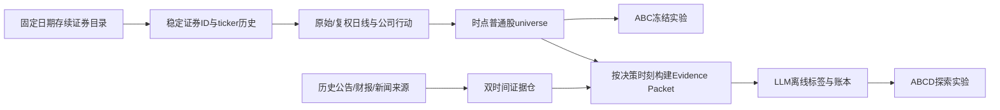

# 存续普通股扩池与时点证据快照：技术设计交接手册（2026-09-12）

## 0. 交接结论与边界

本手册交付给下一位工程负责人，目标是把当前 13 只证券的工程试点，推进为**当前仍上市普通股组成的固定研究样本**，并建立能够审计 LLM 输入是否含未来信息的历史证据快照。**用户明确不纳入退市样本**：不采购或实现退市证券历史导入与退市结算，先完成存续普通股 A/B/C 样本，再建设证据快照；D 组只能在证据质量达标后探索，不能以伪标签补齐。

当前 `BUY-WD-ABC-EXP-002` 是工程复核，不能证明策略优势。它使用 13 只当前观察池证券，没有历史 LLM 标签。未来扩池同样只能得出**在所选存续股票中**的条件性结论，不能推断历史全市场表现或消除幸存者偏差。旧 `EXP-001` 因退出时间、右删失和 Manifest 问题已失效，保留仅供追溯。

本文描述**待开发的接口与命令**。凡标为“建议新增”的脚本尚未存在，不可直接照抄运行；交接者须先实现并通过对应测试。不要修改既有实验产物，不要在补数据过程中调节买卖策略阈值。整个阶段不需要解锁交易账户，也不产生真实订单。

项目目录：`/Users/wh1817w/Documents/quant/quant_us-main`。Git 仓库根目录在其父目录。现有入口：

| 组件 | 文件 | 可复用部分 | 必须改变或新增 |
|---|---|---|---|
| 试点主数据 | `scripts/data/build_security_master_from_futu.py` | 当前代码、名称、证券类型查询 | Futu 当前目录可作为本轮存续股票扩池候选来源；必须固定选择日期并核验上市日和证券类型，不能称为历史全市场总体 |
| 主数据合并 | `scripts/data/build_security_master.py` | 现有字段校验 | 增加稳定证券 ID、ticker 历史、来源优先级、冲突审计 |
| 历史股票池 | `scripts/historical_universe.py` | T-1 流动性门、上市日期过滤 | 用稳定 ID 连接日线和 ticker 映射；明确这是固定存续样本内的每日可交易集合 |
| 日线流水线 | `scripts/data/run_daily_pipeline.py` | 不可覆盖 run、哈希、质量报告 | 新增已核验主数据模式，不用首根 K 线覆盖真实上市日；扩大当前存续普通股日线 |
| 数据质量 | `scripts/data/validate_market_history.py` | 覆盖率、OHLC、重复和失败年份 | 增加拆股、ticker 变更与复权一致性审计 |
| 证据包 | `scripts/live_trading/decision_ledger/evidence_packet.py` | `published_at/observed_at/content_hash/evidence_id` 思路 | 历史来源时间门、修订版本、拒绝原因、冻结文件与证据时间证明 |
| LLM 选股 | `scripts/live_trading/llm_selection.py` | packet/hash/prompt/model/批次结构 | 历史离线作业、只读输入、模型知识污染防线、标签质量门 |
| 实验冻结 | `scripts/experiment_manifest.py` | 相对路径、哈希、Git/成本/组别 | 纳入主数据版本、ticker 映射、公司行动、证据快照、数据许可与缺失统计 |

## 1. 两条工作流与依赖



可以并行开发证券与证据适配器；冻结 D 组前必须同时通过两侧质量门。ABC 不等待历史 LLM 标签。证据快照缺失不应阻塞 ABC。

## 2. 工作流 A：历史证券主数据与普通股扩池

### 2.1 样本框架先登记，再取行情

先确定研究对象、日期区间和抽样规则，写入 `docs` 或 `backtests/buy_v2/experiment-log.md`，然后再下载数据。不可先看收益再挑证券。

建议三层样本：

1. **工程扩池**：20–50 只在样本选择日仍上市的普通股，用来验证行情、ticker 变更与公司行动路径；它不承担策略显著性结论。
2. **条件性研究池**：在预先登记的选择日期，从当时仍上市的普通股目录按固定规则选取并冻结名单；目标数量由覆盖年份、独立交易数和检验功效确定。可以先规划数百只，但不把“股票数达标”当作统计充分性的替代。
3. **资产类型对照**：普通 ETF 作市场/行业基准，杠杆 ETF 单独风险层；普通股主结论不得混入杠杆 ETF。当前观察池只能作为兼容性切片。

样本框架必须列出：**样本选择日**、市场、交易所、普通股定义、最低价格和流动性门、上市不足 N 日是否单列、行业分类来源、抽样种子、起止日期和排除规则。选择日后的名单不可因历史收益增删；不得用今天的指数成分倒推历史成员，也不得把该固定存续样本称为历史全市场总体。建议沿用现有实验时间边界：开发 2016–2020、验证 2021–2023、测试 2024–2026-08-31；若改动，先登记新实验编号，测试期收益仍不得提前查看。由于样本在 2026-09-12 才按“仍上市”筛选，2024–2026-08-31 的回测即使未调参，也不能称为股票池选择上的样本外验证。更强的验证应从样本冻结后的交易日开始前瞻运行。

### 2.2 正式证券主数据的数据契约

建议新增不可变的 `security_master_v2.csv` 或 Parquet，**一行代表一只证券的一个有效属性区间**，字段如下。示例只是格式，不代表真实证券信息：

```csv
security_id,issuer_id,asset_type,exchange,currency,valid_from,valid_to,listed_at,source_id,source_record_id,source_observed_at,ingested_at,record_hash,quality_status
SEC-000001,ISS-000001,stock,NASDAQ,USD,2017-01-01,,2017-01-01,futu_basicinfo,abc123,2026-09-12T00:00:00Z,2026-09-12T00:00:00Z,sha256...,verified
```

关键字段语义：

| 字段 | 必要含义 |
|---|---|
| `security_id` | 不随 ticker 更换而改变；合并/拆分/重组后如果成为新证券，应使用新 ID 并建立关系 |
| `issuer_id` | 发行人 ID，用于同公司多证券和更名追踪；不能代替证券 ID |
| `asset_type` | `stock/etf/leveraged_etf/adr/other`；主样本只取事先登记的 `stock`，ADR 单列或排除 |
| `valid_from/valid_to` | 该属性版本有效时间，闭开区间 `[from,to)`；不得重叠冲突 |
| `listed_at` | 上市日期；若来源返回 1970 占位或未知，标记 `unverified`，不能当作真实上市日 |
| `source_observed_at` | 可靠归档或源系统何时首次可见；不得把 2026 年下载时间伪装成历史首次可见 |
| `ingested_at` | 本系统实际采集时间；历史批量导入通常是当前时间，不等于历史可见时间 |
| `record_hash` | 对标准化字段规范序列化后的 SHA-256；相同记录跨运行稳定 |
| `quality_status` | `verified/unverified/conflict/missing_history`，必须有来源证据 |

另建 `symbol_history.csv`，一行一个 ticker 有效区间：

```csv
security_id,symbol,exchange,valid_from,valid_to,source_id,source_record_id,quality_status
SEC-000001,US.OLD,NASDAQ,2017-01-01,2022-04-01,licensed_master,abc123,verified
SEC-000001,US.NEW,NASDAQ,2022-04-01,,licensed_master,abc124,verified
```

约束：同一 `security_id` 的 symbol 区间不可重叠；同一交易所、同一时间窗口内若 ticker 被复用，必须能由有效区间定位到不同 `security_id`。行情和交易结果的主键应逐步从 `(symbol,date)` 迁移到 `(security_id,session)`；页面仍可展示当时有效 ticker。

另建 `corporate_actions.csv`：`security_id,action_type,ex_date,effective_at,ratio,cash_amount,source_id,source_record_id,source_published_at,source_observed_at,record_hash`。优先覆盖拆股、反向拆股和现金/股票股息；若出现并购或分拆，单独处理或从固定样本排除并记录原因；没有数据时必须标记缺口，不准假设“无行动”。

### 2.3 数据源验收与采集接口

不指定某一家商业供应商。接手者首先评估本机 Futu 对**当前存续普通股**、历史日线、上市日期及拆股信息的覆盖和研究/本地保存权限。ticker 变更或公司行动缺失时，可补其他来源或将受影响证券标为 `quality_fail`；不再要求退市证券来源。

建议新增：

```text
scripts/data/import_security_master_v2.py
scripts/data/import_symbol_history.py
scripts/data/import_corporate_actions.py
scripts/data/import_historical_daily.py
scripts/data/audit_security_master_v2.py
```

适配器接口：`fetch(source, window, cursor) -> raw immutable files`；`normalize(raw) -> typed records`；`audit(records) -> quality + conflicts`。原始响应连同来源版本、请求参数、下载时间和哈希保存到 `data/source_archive/<source>/<run-id>/`。标准化后不修改原始文件。分页、限流和重试写入检查点；同一 run-id 不可覆盖。

来源冲突不能由 `groupby(...).last()` 静默选择。定义来源优先级，但冲突输出 `master_conflicts.csv`，人工复核后才能把受影响证券标为 `verified`。主数据来源更换时创建新 `master_version`。

### 2.4 行情与复权口径

正式批次至少保存两条价格视图：

- **原始可交易价格**：用于 T+1 开盘成交、止损、价格门和费用；不应使用未来拆股后的前复权标价冒充当时可成交价格。
- **研究特征价格**：用于均线、回撤、ATR 等，可使用截至决策时已生效公司行动构造的 as-of 复权序列；特征计算不得应用未来生效行动。

需要记录 `price_basis`、`adjustment_as_of`、`action_version`。对拆股日前后构造测试，确认原始执行收益与复权研究收益一致地转换；反向拆股、现金股息和分拆单独测试。现有 `raw/day/qfq` 缓存可用于工程比较，不应未经上述审计就作为正式长期执行价格。

本轮固定样本只含选择日仍上市的证券，不开发退市结算。若样本期内发生更名、分拆、并购等无法正确衔接的事件，受影响区间标 `corporate_action_unresolved` 并排除绩效，不能把最后一根 K 线当作正常退出。

### 2.5 历史时点 universe

每个交易日使用截至 T−1 收盘已知的价格和流动性，结合 T 日有效的证券状态，输出：

```text
universe_date,security_id,symbol_as_of,asset_type,listed,tradable,
previous_raw_close,adv20_usd,liquidity_as_of,eligible,reason,
master_version,price_version,quality_status
```

建议在现有 `scripts/historical_universe.py` 上新增 v2 函数，保留旧接口供试点复现。主样本只允许 `asset_type=stock`；ETF 和杠杆 ETF 输出独立切片。`liquidity_as_of < universe_date` 必须为真。上市前不能 eligible；ticker 换名不能产生两只“新股票”；无法证明交易状态的日期不能进入主样本。

入场候选应保留被拒绝记录及 `reason`：未上市、暂停交易、历史主数据冲突、缺行情、覆盖不足、价格过低、流动性不足、公司行动未解析等。拒绝数量是数据质量报告的一部分。

### 2.6 质量门与验收测试

每个证券×年份输出：期望交易日、实际日线、覆盖率、重复、OHLC 异常、成交量异常、公司行动未解析、ticker 映射冲突、上市前 bar、停牌/数据中断、未解析公司行动。现有 98% 覆盖门继续适用，但仅靠覆盖率达标不足以放行公司行动冲突。

必须包含的测试样本：

1. 固定存续样本：名单在选择日冻结，历史回放不能按后来收益增删；
2. ticker 改名：同一 `security_id` 连续，旧/新 symbol 互不重叠；
3. ticker 复用：同 symbol 的两只不同证券不串价；
4. 拆股与反向拆股：原始成交价格和 as-of 特征价格各自正确；
5. 若固定样本中有并购/分拆，无法核实价格衔接时该区间阻断绩效；
6. 数据源冲突：质量门阻断，不被最后一行覆盖；
7. 只使用 T−1 流动性：改变 T 日成交额不改变 T 日 universe；
8. 扩池前后旧 13 只共同样本的特征/Setup 一致；发生差异须有价格口径或公司行动说明。

工程扩池通过条件：20–50 只当前存续普通股、至少各有改名/拆股/缺行情的 fixture 或真实样本，所有质量失败都有原因、人工复核不少于 30 个证券日期。统计研究池的通过条件应另按独立交易数、市场阶段、资产类型和检验功效预登记；不能简单沿用“20–50 只”作为正式收益验收门。

## 3. 工作流 B：历史证据快照

### 3.1 双时间原则

每条事实同时记录至少四个时间：

| 字段 | 含义 |
|---|---|
| `event_at` | 业务事件发生时间，例如财报季度末或交易发生时间；**不能**据此判断何时可用于决策 |
| `published_at` | 事实首次对外公开时间；需要源页面、公告接收时间或可信归档证明 |
| `observed_at` | 数据提供方首次捕获/可查询时间；必须来自可审计的历史归档或供应商元数据 |
| `ingested_at` | 本系统下载进入库的时间；历史回填通常是现在 |

决策时间为 `decision_cutoff` 时，事实只有在 `published_at <= decision_cutoff` **且** `observed_at <= decision_cutoff`，并通过其他质量门，才能进入严格历史回放。若只知道 `published_at`，但没有可信历史首次可见时间，应标 `OBSERVED_AT_UNPROVEN`，放入诊断层，不能伪造为当时已被系统获得。可以预先登记保守延迟（如下一交易日开盘/收盘）做敏感性实验，但必须与严格层分开，不得混为同一 D 组。

`ingested_at` 不用于倒填历史 `observed_at`。对修订财报、新闻更正和晚到数据，每个版本单独保存 `version_id`、`supersedes_id`、原始内容哈希和首次可见时间；历史查询只能取当时可见版本。

### 3.2 证据记录 Schema

建议新增不可变 JSONL/Parquet：

```json
{
  "evidence_id": "ev_sha256...",
  "security_id": "SEC-000001",
  "symbol_as_published": "US.NEW",
  "kind": "filing|earnings|news|analyst|macro|quote|option",
  "source_id": "archived_source",
  "source_record_id": "source-native-id",
  "source_url_or_archive_path": "archive://...",
  "event_at": "2022-02-01T00:00:00Z",
  "published_at": "2022-02-02T21:05:00Z",
  "observed_at": "2022-02-02T21:06:00Z",
  "ingested_at": "2026-09-12T00:00:00Z",
  "version_id": "v1",
  "supersedes_id": null,
  "content_hash": "sha256...",
  "summary_hash": "sha256...",
  "quality_status": "verified",
  "availability_proof": "source timestamp + archive snapshot",
  "license_tag": "research-retention-allowed"
}
```

原文/原始 JSON/PDF 要按许可保存；若许可不允许保存原文，至少保存可合法保留的来源 ID、时间、哈希和摘要，并在报告中说明复现限制。摘要必须可回指原文版本，不能在 2026 年用后验总结替换 2022 年的事实表达。

### 3.3 来源范围与分层

首轮优先处理有精确时间与可追溯版本的材料：公司公告/监管申报、财报发布、历史价格和交易所状态。新闻与分析师观点作为第二阶段；历史期权链如果没有完整 as-of 快照，就明确 `missing`，不能用当前 IV/PCR/Max Pain 回填。

每个来源先做 100 条左右的可用性审计：时间字段是否稳定、时区是否明确、修订是否可见、是否存在批量回填时间、是否覆盖所选存续股票、是否允许本地保存。审计结果入 `source_quality.json`，未通过的来源不能进入严格历史证据包。

### 3.4 快照查询与拒绝日志

建议新增：

```text
scripts/evidence/import_historical_evidence.py
scripts/evidence/audit_historical_evidence.py
scripts/evidence/build_historical_packet.py
scripts/evidence/replay_historical_selection.py
```

接口契约：

```python
build_packet(security_id, decision_cutoff, source_version, price_version,
             evidence_policy) -> (packet, exclusions)
```

快照查询顺序：先按 `security_id` 和当时有效 symbol 定位；再按 `published_at`、`observed_at`、版本与源许可过滤；随后去重相同源事件，程序计算行情与财务指标；最后写出 `packet.json`、`exclusions.json`、`packet.sha256`。所有拒绝事实必须记录 `evidence_id` 和原因：`FUTURE_PUBLICATION`、`FUTURE_OBSERVATION`、`OBSERVED_AT_UNPROVEN`、`REVISED_AFTER_CUTOFF`、`SOURCE_UNVERIFIED`、`LICENSE_RESTRICTED`、`SYMBOL_AMBIGUOUS`、`STALE`、`CONFLICT`。

`packet` 沿用现有 `build_evidence_packet` 的结构，但历史作业应提供明确 `decision_cutoff`；不可依赖 `datetime.now()`、当前选股池、当前基本面或当前期权视图。行情日线只有在对应收盘后才能进入收盘决策；T 日收盘产生的 Setup 最早 T+1 开盘执行。所有时间转 UTC 保存，并保留纽约交易日映射及夏令时测试。

### 3.5 LLM 标签作业与额外污染防线

历史标签输出至少包括：

```text
setup_id,security_id,decision_cutoff,packet_id,packet_hash,
llm_decision,reason_codes,cited_evidence_ids,model,model_version,
prompt_version,schema_version,temperature,generated_at,
raw_response_hash,validation_status,missing_information
```

作业只接受已冻结 `packet`；不允许联网检索、不调用当前行情/基本面/期权接口；结构化输出须通过现有 `validate_selection` 或对应买入审核 schema，并校验每个引用 ID 都在 packet 内。输入/输出写不可覆盖批次。标签与 `setup_id` 一对一；异常、超时、拒答、证据不足都保留，不得删除后只汇报成功样本。不得把 `missing` 当 `candidate`。

**重要方法限制**：即使 prompt 只含历史证据，2026 年的模型参数仍可能记得 2022 年以后的公司结果。引用校验能减少凭空输出，不能证明模型完全忘记未来。历史 D 组只能称为“受限证据的回放探索”；验证 LLM 真实增量的最强证据来自从现在起冻结输入的前向 shadow 批次。报告应并列展示历史探索和前向效果，不可把二者合成单一显著性结论。

### 3.6 证据质量门和测试

需要以下确定性测试：

1. 公告在 16:05 ET 发布，不进入当日 16:00 ET 的决策包；可进入下一决策时点；
2. `event_at` 在过去但 `published_at` 在未来，仍拒绝；
3. `published_at` 在过去但 `observed_at` 在未来，仍拒绝；
4. 缺 `observed_at` 的历史材料只进诊断层，严格层拒绝；
5. 后来修订的财报不能覆盖原始版本；
6. ticker 改名和复用时证据正确归属 `security_id`；
7. 同一事件多个转载只作为一个独立事件簇，避免重复计数；
8. 数据源时区缺失、夏令时切换、周末和半日收盘均有用例；
9. packet 重建哈希稳定，任一证据内容/时间改变则 packet_hash 改变；
10. 模型引用 packet 外 ID 时标签校验失败；
11. 标签缺失/失败仍留在分母，报告覆盖率和原因；
12. 把决策时间向前移动一分钟，不能出现新增的未来事件。

首轮 D 的研究级门槛应预先登记：严格层时间字段完整率、可追溯原文比例、ticker 映射成功率、packet 构建成功率、LLM 结构化输出成功率、有效引用率、缺失率、股票/年份覆盖率。不要在运行后根据实际数据设阈值；若达不到，保持 D=`inconclusive`，继续 ABC。

## 4. 实验衔接与冻结

### 4.1 ABC 先行

取得固定的当前存续普通股股票池后，使用新 run-id 跑主数据、行情、质量、universe、setup。冻结前检查股票数、行业分布、上市日期质量和样本纳入数量、质量拒绝数和时段覆盖。至少单独报告普通股主样本、次新股、普通 ETF、杠杆 ETF；后两者不可提高普通股主结论的收益。

使用新实验编号，例如 `BUY-WD-ABC-SURVIVOR-001`。Manifest 必须含：Git commit、主数据版本、symbol_history/corporate_actions 哈希、原始及 as-of 价格版本、run-id、质量文件、universe、Setup、成本、A/B/C 分组、开发/验证/测试区间、样本选择日、存续样本限定和预登记验收标准。当前 `experiment_manifest.py` 只冻结通用文件哈希；建议扩展显式元数据字段并增加验证。输出目录不可覆盖。

ABC 的实验输入必须与 `BUY-WD-ABC-EXP-002` 分离；它是新样本、新数据口径，不能在旧 Manifest 内替换 CSV。分析继续采用 11 种退出与四种成本、右删失处理、共享独立组联合重采样。若退出模拟仍无法准确处理公司行动，该证券对应交易不得计入绩效。

当前 Manifest 校验要求工作区干净且 `HEAD` 等于实验记录的 commit。未来继续开发或提交本文后，在最新 `HEAD` 校验旧实验会出现 `GIT_COMMIT_MISMATCH`，这表示当前代码版本不同，不代表旧文件哈希损坏。复现实验时应在独立工作树检出 Manifest 记录的 commit，并放置对应的已冻结数据快照，再验证哈希；不能编辑旧 Manifest 的 commit 来让它在新代码上通过。

### 4.2 D 单独冻结

历史证据与标签质量达标后创建 `BUY-WD-ABCD-...` 新编号，ABC 行的 Setup、股票池、价格、执行和退出规则与相应 ABC 基线一致。D 只能在 C 的相同候选中按冻结 LLM 决策过滤；显式统计资料不足、模型失败、因证据质量拒绝及有效接受率。实验报告标明历史 D 为回放探索；前向 shadow 另建持续批次。

### 4.3 样本外和前向验证

冻结后先在开发期验证代码与质量，不因验证/测试收益调参。验证期只选择策略家族，测试期最后一次打开。已看过测试收益的旧 13 只试点不能重新充当盲测试集。前向 shadow 至少两个独立交易日、三个有效研究批次是**管道联调的最低值**，并不足以判断收益优势；收益评估应按实际独立决策数和持仓周期等待足够样本。

## 5. 分期实施任务与交付物

| 顺序 | 工程任务 | 交付物 | 放行条件 |
|---:|---|---|---|
| 1 | 选定历史市场范围与数据源，核对保留/研究许可 | `source-assessment.md`、样本框架、冲突处理政策 | 当前存续普通股/历史日线覆盖可证，许可明确 |
| 2 | 主数据 v2 与 symbol_history 导入 | 原始归档、v2 表、冲突表、哈希清单 | 更名/复用案例通过；无静默冲突 |
| 3 | 原始价、as-of 特征价与公司行动 | 双价格表、行动表、差异报告 | 拆股与复权测试通过 |
| 4 | 历史时点 universe 与 20–50 普通股工程扩池 | 新 run、质量报告、拒绝漏斗 | 98% 覆盖门和所有关键完整性门通过 |
| 5 | 扩大固定存续样本并冻结 ABC | Manifest、132 单元、条件性报告 | 干净 commit、相对路径、实验协议成立；前瞻期与历史回放分开报告 |
| 6 | 历史证据来源与双时间仓 | 原始归档、证据表、来源质量报告 | 未来/修订/无观察时间均正确阻断 |
| 7 | 冻结 packet 与离线标签 | packets、exclusions、labels、账本 | 时间与引用校验、缺失分母完整 |
| 8 | ABCD 探索 + 前向 shadow | 新 Manifest、176 单元、shadow 对账 | D 来源与局限明确，未提升交易权限 |

每一步代码应配相应单元、契约和小型集成测试。数据重跑必须使用新 run-id；代码改动后创建新 Git commit 和新实验编号。完成一阶段后记录：实际命令、耗时、输入哈希、输出哈希、通过/拒绝数量、失败样本、修复 commit 与审阅人。

## 6. 建议新增 CLI（实现后才能执行）

建议 CLI 契约，名称可随工程风格调整，但输入/输出和不可覆盖语义不变：

```bash
python3 scripts/data/import_security_master_v2.py \
  --source-archive data/source_archive/<source>/<run-id> \
  --output-dir data/security_master_runs/<master-version>

python3 scripts/data/audit_security_master_v2.py \
  --master data/security_master_runs/<master-version>/security_master_v2.csv \
  --symbols data/security_master_runs/<master-version>/symbol_history.csv \
  --actions data/security_master_runs/<master-version>/corporate_actions.csv \
  --output-dir data/security_master_runs/<master-version>/quality

python3 scripts/evidence/build_historical_packet.py \
  --setups data/market_history/runs/<run-id>/setups.csv \
  --evidence-version <evidence-version> \
  --output-dir data/evidence_packets/<packet-run-id>

python3 scripts/evidence/replay_historical_selection.py \
  --packets data/evidence_packets/<packet-run-id> \
  --mode strict \
  --output-dir data/historical_llm_labels/<label-run-id>
```

正式脚本需提供 `--help`、`--dry-run`、不可覆盖输出、失败退出码、结构化 JSON 摘要和不含密钥的日志。任何 API/模型调用由配置显式开启，测试默认使用本地 fixture。

## 7. 审查清单与最终状态定义

交接审查时逐项问：

- 固定样本选择日期、ticker 改名与复用是否在数据和测试中可核对？
- 当前存续证券池是否还被误称为历史总体？
- `security_id` 是否贯穿行情、universe、Setup、证据和结果？
- 价格是否区分当时可交易原始价与用于特征的 as-of 复权价？
- 未解析公司行动是否阻断收益计算？
- 历史 `published_at` 和 `observed_at` 是否有来源证明，而非 2026 年下载时造出的时间？
- 未来发布、未来观察、修订、时区与 ticker 冲突是否产生拒绝日志？
- 历史 packet 是否只含决策时点可用材料？模型是否只准引用 packet 内证据？
- 历史 D 的模型参数后见知识局限是否明确写在报告？
- Manifest 是否在另一目录依然可验证，旧实验是否仍不可覆盖？
- 普通股主结论是否排除了 ETF/杠杆 ETF，是否报告年份、成本、集中度与右删失？
- shadow 是否继续只读且没有真实券商订单？

最终只允许以下状态：

| 状态 | 含义 |
|---|---|
| `engineering_pass` | 数据与代码契约通过，但不作策略优势结论 |
| `research_ready_abc` | 主数据、样本、价格和执行口径足以运行预登记 ABC |
| `research_ready_d_exploratory` | 严格历史证据与标签可审计，允许 D 回放探索 |
| `forward_validation` | 前向 shadow 累积独立决策与到期结果，可检验 LLM 实际增量 |
| `blocked` | 主数据、时间证据、许可或质量门未通过；保留原因和原始证据 |

不得把 `engineering_pass` 写成“买入策略有效”，也不得把 `research_ready_d_exploratory` 写成“LLM 已创造收益”。
