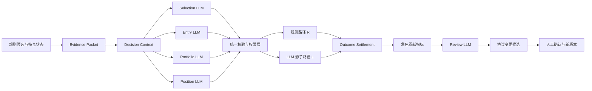

# LLM 全链路决策增强详细技术设计

日期：2026-09-19  
状态：拟实施基线  
适用范围：`quant_us-main` 的 Selection、Entry、Portfolio、Position、Review 决策链  
前置文档：`llm-decision-role-audit-2026-09-18.md`、`llm-position-counterfactual-design-2026-09-19.md`

## 1. 文档目的

本设计用于继续提高 LLM 在交易闭环中的有效决策作用，并作为后续编码、测试、影子运行和权限评审的唯一实施基线。

这里的“决策作用”指 LLM 在明确权限内改变了候选排序、入场模板、影子资金分配、持仓动作或协议改进建议，并且该改变能够与同期规则路径比较。模型调用次数、文字长度和报告数量不计为决策作用。

系统采用“程序定义边界和动作，LLM在边界内判断，账本记录实际影响，反事实评估增量价值”的结构。硬风控、数量计算、成交约束和真实账户权限继续由程序控制。

## 2. 当前基线

截至本设计编写时：

- Selection v2 已以 shadow 方式运行，能够排序和排除候选；
- Entry 仍为 legacy，尚未进入统一 v2 评估闭环；
- Position v2 shadow 已启用，支持 HOLD、收紧保护、减仓和退出模板；
- 证据保留真实归属，同证券、MARKET 和候选身份声明的板块/风险组显式放行；
- REDUCE/EXIT 必须引用有效证据；
- 持仓 L/R 反事实已支持冻结、1/3/5/10/20 日自动结算和健康指标；
- 所有 LLM 权限仍为 shadow；
- 当前主要故障是 Selection 偶发引用输入包中不存在的 evidence ID；
- 当前独立有效样本不足，不能证明 LLM 已产生正收益贡献。

当前运行模式：

| 角色 | 模式 | 是否改变影子路径 | 是否影响真实账户 |
|---|---|---:|---:|
| Selection | shadow | 部分，仅形成研究结果 | 否 |
| Entry | legacy | 否 | 原规则与人工确认 |
| Portfolio | 未统一 | 否 | 否 |
| Position | shadow | 仅反事实 L 路径 | 否 |
| Review | 工具分散 | 否 | 否 |

## 3. 目标和非目标

### 3.1 目标

1. 让 LLM 在 Selection、Entry、Portfolio、Position 和 Review 五个角色中承担不同的结构化判断任务；
2. 让有效决策在影子账户中真正改变路径，而不仅生成说明文字；
3. 对每次改变保存输入、输出、权限、程序裁决和后续结果；
4. 以规则路径 R 为同期基线，计算 LLM 路径 L 的净增量；
5. 按角色独立控制权限，允许表现好的角色晋级，表现差的角色退回；
6. 模型失败、超时、越权或证据不足时，规则主链能够继续运行。

### 3.2 非目标

- 本阶段不接入新的公司公告、资讯或公司事件源；
- 不允许 LLM 自由生成交易数量、委托价格、止损或风险预算；
- 不允许 LLM 放宽保护线、推迟硬退出、增加已持仓数量；
- 不开放真实账户自动交易权限；
- 不由模型直接修改生产规则、配置或提示词；
- 不用样本内回测结果直接触发权限升级。

## 4. 总体架构



核心约束：

- LLM 不接触券商 API；
- 每个角色只选择程序给出的动作模板；
- 所有输入在调用前冻结；
- 所有输出先校验，再经过权限层；
- `model_action` 与 `effective_action` 分开记录；
- R/L 路径共享相同的初始状态、时钟、市场数据和成本口径。

## 5. 统一决策对象

### 5.1 Decision Context

所有角色共用以下上下文头：

| 字段 | 含义 |
|---|---|
| `decision_id` | 冻结输入与版本共同生成的稳定 ID |
| `role` | selection / entry / portfolio / position / review |
| `subject_type` | batch / signal / portfolio / trade / evaluation_window |
| `subject_id` | 对应对象 ID |
| `account_scope` | DRY-RUN、模拟账户或未来的受限账户 |
| `as_of` | 明确时区的决策时间 |
| `market_session` | pre / regular / post / closed |
| `input_snapshot_id` | 不可变输入快照 |
| `versions` | packet、prompt、schema、feature、rule、permission 版本 |
| `model` | provider、model_id、temperature、timeout |

### 5.2 Role Contract

新增统一 `DecisionRoleContract` 概念，每个角色必须声明：

- 必需输入；
- 可选输入；
- 允许动作；
- 动作模板来源；
- 必要证据规则；
- 默认回退动作；
- 是否允许改变影子路径；
- 结算期限与指标；
- 权限等级；
- 最低样本量和晋级门槛。

建议实现位置：

```text
scripts/live_trading/decision_contracts.py
```

Role Contract 只描述协议，不包含模型调用或交易逻辑。

## 6. 五类角色设计

### 6.1 Selection：候选理解与排序

#### 输入

- 规则发现的完整候选池；
- 每只候选的规则得分、技术状态和风险组；
- MARKET、合法板块及同证券证据；
- 当前持仓、候选冲突和可用容量；
- 数据质量与证据覆盖声明。

#### 允许动作

- `rank`：在合格池内重排；
- `watch`：保留观察；
- `exclude`：从 L 路排除；
- `abstain`：证据不足，不改变规则排序。

#### 限制

- 不得把规则不合格对象提升为可交易候选；
- 不得引用候选包之外的 evidence ID；
- 排序必须逐只给出 thesis、counterevidence 和失效条件；
- 市场证据只能支持宏观或风险偏好判断，不能伪装为公司事实。

#### 输出作用

Selection 首先只保存规则排名与模型排名。当 Entry v2 稳定后，在 L 路候选超过容量时，由模型排名决定进入后续 Entry 的顺序。

#### 结算

- 各期限收益与超额收益；
- Top-N 相对规则 Top-N 的收益差；
- 被替换候选的机会成本；
- 排名 IC；
- 排除避损与错误排除。

### 6.2 Entry：是否在当前窗口承担风险

#### 输入

- 已通过规则资格的单只候选；
- Selection 决策及其证据；
- 规则计划、入场窗口、止损和程序计算的模板；
- 当前组合容量与风险预算；
- 行情新鲜度和执行时间约束。

#### 动作模板

v1：

- `execute_now`：采用标准规则模板；
- `defer`：当前窗口不入场，等待程序定义的下次观察点；
- `veto`：本次机会终止；
- `abstain`：模型无有效判断，沿用规则基线。

v2 在 v1 样本稳定后增加：

- `reduced_size`：选择程序计算的 0.5x 模板。

#### 限制

- LLM 不生成数量、价格、止损和有效期；
- `veto` 必须引用与本证券或明确市场风险相关的有效证据；
- 数据过期、执行窗口已过或模板失效时，程序直接拒绝应用；
- 模型失败时 R 路正常继续，L 路按 `abstain` 处理。

#### 结算

- 入场后的净收益、R 倍数和最大回撤；
- `defer/veto` 避免的亏损；
- 延迟或否决造成的错失收益；
- 计划改变率与实际应用率；
- 从模型完成到下一可成交时刻的延迟。

### 6.3 Portfolio：在合格机会间分配有限容量

Portfolio 不判断某只股票是否满足基础规则，而是在全部候选均合格时解决容量冲突和集中度问题。

#### 输入

- Selection 与 Entry 的有效输出；
- 当前持仓及待入场候选；
- 程序计算的风险预算、板块暴露和相关性；
- 可用现金、最大仓位数和风险组上限。

#### 动作模板

- `keep_rule_allocation`；
- `select_ranked_subset`；
- `reduce_same_group_concentration`；
- `hold_cash_buffer`。

程序预先生成所有合法组合模板，每个模板包含具体候选、数量和预计风险。LLM 只能选择模板。

#### 限制

- 不得突破总风险预算、单票上限和风险组上限；
- 不得引入未通过 Selection/Entry 的证券；
- 不得为增加收益而降低现金或流动性约束；
- 没有容量冲突时默认不调用，避免制造无意义决策。

#### 结算

- 组合净值、最大回撤和波动率；
- 资金利用率和现金占用；
- 风险组集中度；
- 被替换机会的收益差；
- L 相对 R 的组合级净贡献。

### 6.4 Position：持仓论文与退出管理

Position 沿用已经落地的 v2 契约并扩展为连续路径。

#### 输入

- 入场时冻结的 thesis；
- 上次 thesis 状态；
- 新增和失效证据 delta；
- 当前仓位、入场价格、主动保护线和规则退出计划；
- 程序计算的 HOLD、收紧、减仓、退出模板。

#### 允许动作

- `hold`；
- `tighten_protection`；
- `reduce_25`；
- `reduce_50`；
- `exit`；
- `post_exit_review`。

#### 优先级

1. 程序硬退出；
2. 已批准且仍有效的保护动作；
3. LLM 动作模板；
4. HOLD。

LLM HOLD 不能延迟硬退出，LLM 不能降低保护线或增加仓位。

#### 连续反事实

每笔交易维护一条 R 路径和一条 L 路径。后续多次评审在同一 L 路径上顺序应用：

- 已减仓数量不能再次减；
- 重复事件和服务重启不得重复执行动作；
- 已退出的 L 路径只允许 `post_exit_review`；
- R 路径回放实际机械追踪止损，而不是永久固定初始保护线；
- 每次动作保留前后仓位、成交假设、引用证据和原因。

### 6.5 Review：从结果提出可检验改进

Review LLM 不参与单笔交易执行。其任务是读取结构化 outcome，提出协议级假设。

#### 输入

- 各角色的决策、应用和结果；
- R/L 收益与回撤；
- 按证据来源、动作、市场状态和风险组分层后的统计；
- 模型失败、程序拦截和人工覆盖记录；
- 当前版本的规则与权限说明。

#### 输出

- 观察到的失败模式；
- 支持该判断的样本组；
- 建议修改的单一变量；
- 预期改善指标；
- 可能恶化的指标；
- 验证窗口、最低样本量和停止条件。

Review 输出只生成 `protocol_change_candidate`，不得直接修改配置。程序计算统计，人确认后生成新版本。

## 7. 证据协议

### 7.1 允许的证据归属

在不新增公司事件源的约束下，允许：

- 当前证券代码；
- `MARKET`；
- packet `identity.sector`；
- packet `identity.risk_group`。

其他证券或未声明板块一律拒绝。

### 7.2 引用要求

| 动作 | 最低引用要求 |
|---|---|
| watch / hold / abstain | complete 状态需事实或推断；insufficient 可列缺失信息 |
| exclude / veto | 至少一条支持排除的有效证据 |
| reduced_size | 至少一条与风险或论文相关的有效证据 |
| reduce / exit | 至少一条有效引用，且必须说明论文变化 |
| portfolio 换序 | 每个受影响候选至少一条比较依据 |

### 7.3 Evidence ID 封闭集合

模型输出 schema 中的 evidence ID 必须来自当前 packet 的枚举。实现分两层：

1. 提示层：为每个角色明确列出可引用 ID；
2. 校验层：继续以 packet index 为准，拒绝不存在的 ID。

允许一次结构修复尝试。修复请求只包含原输出、校验错误和合法 ID，不重新提供完整行情分析任务，避免第二次调用改变原判断。修复后仍失败则记录 `validation_failed`。

## 8. 权限模型

每个角色独立使用四级权限：

| 等级 | 含义 |
|---|---|
| `observe` | 记录输出，不改变任何路径 |
| `shadow_affect` | 改变 L 路径，R 路径与现有系统不变 |
| `paper_authority` | 改变正式模拟账户，仍不触及真实账户 |
| `limited_live` | 未来的有限真实权限，本设计不实施 |

权限判断输入包括角色、动作、账户、模型版本、协议版本、样本状态和数据质量。权限层输出：

- `model_action`；
- `effective_action`；
- `permission_level`；
- `applied`；
- `blocked_reason`；
- `fallback_action`。

默认状态：

| 角色 | 初始等级 |
|---|---|
| Selection | shadow_affect |
| Entry | observe，完成 P0 后升 shadow_affect |
| Portfolio | observe |
| Position | shadow_affect |
| Review | observe |

## 9. 失败与回退

| 故障 | 处理 |
|---|---|
| 数据缺失或过期 | 不调用或标记 insufficient；规则主链继续 |
| 模型超时 | 记录 attempt timeout；使用角色默认回退 |
| JSON/schema 错误 | 允许一次结构修复；失败则回退 |
| evidence ID 非法 | 修复或拒绝，不猜测映射 |
| 动作模板不存在/过期 | 拒绝应用，保留模型原始输出 |
| 权限不足 | model_action 保留，effective_action 使用基线 |
| 账本写入失败 | 不应用 L 动作；主交易链继续 |
| outcome 行情不足 | 标记 pending，不提前结算 |

禁止在模型调用已经开始后改走另一套 legacy 模型判断，以免同一次决策出现不可解释的双模型选择。允许回退的是程序基线动作。

## 10. 状态与事件模型

继续使用 append-only `decision_events` 和现有投影表。新增或统一以下事件：

| 事件 | 用途 |
|---|---|
| `decision_requested` | 冻结角色、对象和输入 |
| `model_attempt_started/completed/failed` | 模型调用轨迹 |
| `decision_repair_attempted` | 结构修复尝试 |
| `decision_validated/validation_failed` | 校验终态 |
| `permission_applied` | 权限裁决 |
| `decision_effective_action` | 实际影响路径的动作 |
| `counterfactual_frozen` | R/L 初始状态 |
| `counterfactual_action_applied` | L 路实际动作 |
| `outcome_observed` | 成熟期限结果 |
| `protocol_change_candidate` | Review 提出的变更候选 |
| `protocol_version_approved/rejected` | 人工协议决策 |

幂等键至少包含：账户、角色、subject、input snapshot、版本和逻辑窗口。相同事件 ID 出现不同 payload 时必须拒绝覆盖。

## 11. R/L 评估设计

### 11.1 路径定义

- R：现有规则和人工流程；
- L：在相同时钟、市场数据、初始资金和成本模型下，应用获得权限的 LLM 动作；
- 未应用的模型建议不得计入 LLM 决策贡献；
- 模型失败或 abstain 时 L 与 R 相同，计入覆盖率但不制造收益差。

### 11.2 独立样本

默认独立组：

```text
account_scope + role + security_id + primary_event_cluster + trading_week
```

同一证券、同一事件簇和同一交易周的重复评审不能当作多个独立样本。Position 连续动作以整笔 trade 为主要样本，同时保留动作级明细。

### 11.3 核心指标

通用：

- eligible、called、valid、applied、blocked、fallback 数量；
- 有效输出率和路径改变率；
- 延迟、token 和模型成本；
- L−R 净收益与回撤差；
- 独立样本数及成熟比例。

角色指标：

| 角色 | 主要指标 |
|---|---|
| Selection | Top-N 增量、rank IC、排除避损、错误排除 |
| Entry | 避损、错失收益、净 R、计划改变率 |
| Portfolio | 组合收益、回撤、集中度、资金利用率 |
| Position | saved loss、missed upside、连续路径净贡献 |
| Review | 被采纳假设比例、样本外改善、协议回滚率 |

## 12. 权限晋级与回滚

单个角色从 `observe` 晋级 `shadow_affect` 的最低条件：

- 契约和失败回退测试全部通过；
- 输出有效率不低于 95%；
- 无硬风控越权；
- 所有应用动作均可重放；
- 页面与账本能够区分 model/effective action。

从 `shadow_affect` 晋级 `paper_authority`：

- 至少 30 个独立成熟样本；
- 扣除交易成本和模型成本后，主要 L−R 指标为正；
- 最大回撤不显著恶化；
- 不依赖单一证券或单一事件贡献；
- 至少经历一个预先锁定的样本外观察窗口；
- 人工批准新 permission version。

触发回滚：

- 连续出现越权或错误应用；
- 有效输出率低于门槛；
- 数据质量门失效；
- 样本外 L−R 明显为负；
- 账本无法重放或出现重复动作。

回滚只改变权限版本，不删除历史事件。

## 13. 分阶段落地

### P0：有效输出与 Entry 影子闭环

目标：让 LLM 在入场端第一次真实改变 L 路径。

改动：

- 新增统一 Role Contract；
- 修复 Selection evidence ID 封闭枚举与一次结构修复；
- 实现 Entry v2 的 execute/defer/veto/abstain；
- 冻结 Entry R/L 路径并自动结算；
- 在健康接口展示角色覆盖率和失败原因。

验收：

- Selection 最终有效率达到 95%；
- 同一输入重放得到同一有效动作；
- 至少一条 Entry 决策完整贯穿 packet、模型、校验、权限、L 路和 outcome；
- 不创建真实订单。

### P1：排序影响容量与连续持仓路径

目标：让 Selection 和 Position 产生可计算的组合影响。

改动：

- Selection 排序用于 L 路容量选择；
- 实现规则排名与模型排名对照；
- 将 Position 单次反事实升级为连续仓位状态；
- 回放真实机械追踪止损；
- 按 trade 和独立事件组汇总结果。

验收：

- 能解释模型替换了哪个候选；
- 重启、重复事件不会重复减仓；
- 硬退出始终优先；
- 每笔交易可重放完整 R/L 仓位曲线。

### P2：Portfolio 模板与 Review 协议候选

目标：让 LLM 参与有限容量分配，并把复盘转为可检验改进。

改动：

- 程序生成合法组合模板；
- Portfolio LLM 选择模板；
- Review LLM 生成 protocol change candidate；
- 增加版本审批和样本外观察窗口；
- 建立角色级周报。

验收：

- Portfolio 不突破任何程序风险限制；
- 模型提出的改进不能自动进入生产；
- 新旧协议可以并行回放和明确归因。

## 14. 预计代码改动位置

| 模块 | 计划改动 |
|---|---|
| `scripts/live_trading/decision_contracts.py` | 新增统一角色契约 |
| `scripts/live_trading/decision_engine.py` | 统一修复尝试、校验和角色路由 |
| `scripts/live_trading/decision_runtime.py` | 新角色开关与回退策略 |
| `scripts/live_trading/decision_bridge.py` | Entry/Portfolio packet 与 legacy 投影 |
| `mutifactor/llm/contracts/*_v2.py` | 输出 schema、模板和角色校验 |
| `mutifactor/llm/validators/evidence.py` | 封闭 ID 与角色证据规则 |
| `scripts/live_trading/decision_ledger/` | R/L 状态、连续路径、独立样本和事件 |
| `scripts/live_trading/run_outcomes.py` | Entry/Portfolio/Position 自动结算 |
| `scripts/live_trading/project_decision_metrics.py` | 角色贡献和权限门槛指标 |
| `web/app.py` | 只读健康、路径影响和角色指标 API |
| `config.yaml` | 分角色模式和 permission version |

## 15. 测试策略

### 单元测试

- 每个角色的合法和非法动作；
- evidence ID 不存在、跨证券、非法板块；
- 一次修复成功与失败；
- 模板过期、数量不匹配和权限不足；
- 模型超时、schema 错误和账本失败；
- 硬止损、跳空、重复减仓和已退出状态；
- 独立样本聚合和指标计算。

### 集成测试

- Selection → Entry → Portfolio → Position → Outcome 全链路；
- R/L 使用相同时钟、行情和成本；
- 服务重启后不重复调用或应用动作；
- legacy 或程序基线在模型失败时继续运行；
- API 正确区分 model action、effective action 和 blocked reason。

### 运行验收

- dry-run 服务正常启动；
- 不产生真实订单；
- 冻结事件、动作事件和 outcome 可以从 SQLite 重放；
- 至少一条自然产生的完整 LLM 决策轨迹；
- fixture 只用于故障与边界测试，不计入真实贡献样本。

## 16. 可观测性与页面展示

健康页按角色展示：

- 是否启用、当前权限与版本；
- eligible / called / valid / applied / blocked / fallback；
- 最近失败原因；
- evidence 引用归属构成；
- 独立样本数和已成熟期限；
- L−R 收益、回撤和胜率；
- 尚未达到的晋级条件。

选股页继续区分报告观察候选与通过 DecisionEngine 校验的正式研究结果。模型校验失败时显示具体失败类别，不用报告候选冒充正式模型决策。

## 17. 安全与运维要求

- API key 必须迁移到环境变量，禁止继续保存在仓库配置；
- 原始模型回复可能包含不可信文本，只按数据处理；
- 所有时间必须带时区；
- 数据源时间、报告文件时间和决策时间分别保存；
- 模型及协议版本变更后不得与旧样本混算；
- 定时任务失败必须留事件并允许重试，但不得重复应用动作；
- 任何真实账户权限必须另写设计和验收，不由本方案自动获得。

## 18. 完成定义

本设计的整体目标完成，需要同时满足：

1. 五个角色都有明确契约、版本、事件和指标；
2. Selection、Entry、Portfolio、Position 至少能在 L 路实际改变一个决策对象；
3. Review 能生成可检验但不可自动生效的协议候选；
4. 每个改变都能还原输入、证据、模型输出、程序裁决和结果；
5. R/L 同期对照能够计算扣除成本后的角色贡献；
6. 任一 LLM 组件失败时，规则风控和现有交易主链继续工作；
7. 未经过独立样本和人工审批，不提升到更高权限。

后续实施顺序固定为 P0 → P1 → P2。每一阶段完成后更新本文“当前基线”和验收结果，再开始下一阶段，避免代码状态领先于文档口径。

## 19. 实施记录

### 2026-09-19：P0 第一批

已完成：

- 新增 `DecisionRoleContract`，统一 Selection、Entry、Position 的 subject、允许动作、回退动作和结算期限；
- DecisionEngine 在权限应用前校验角色动作；
- 增加一次可配置的结构修复尝试，修复请求只包含原输出、校验错误、合法 evidence ID 和输出 schema；
- 原始 attempt 与 repair attempt 分开落账，并保存各自 validation errors；
- Entry 路由切换为 v2 shadow；
- 有效 Entry 决策自动冻结标准规则路径 R 和模型模板路径 L；
- 每日 outcome 任务自动拉取未来行情，从下一交易日开盘结算 Entry 1/3/5/10/20 日反事实；
- 健康接口增加 Entry 反事实的增量收益、胜率、避损和错失收益；
- live 单元测试 635 项通过。

尚未完成：

- Selection schema 层面的 evidence ID 动态枚举，目前由提示修复与校验器共同保证；
- Entry 的 defer 连续复审状态机仍沿用现有触发器，尚未形成跨多次决策的单一路径；
- P1 的 Selection 容量排序与 Position 连续仓位路径；
- Portfolio 和 Review 两类新角色。

### 2026-09-19：P1 Selection 容量影子路径

已完成：

- Selection prompt 的 schema 动态枚举本次冻结输入中可用的 evidence ID；
- 容量反事实冻结规则基线篮子与模型 `portfolio_rank` 篮子，并记录替入、替出和引用证据；
- 每日 outcome 任务按相同的下一交易日开盘和后续收盘，计算等权 R/L 篮子的 1/3/5/10/20 日收益差；
- 研究批次保存 `selection_counterfactual_id`，健康指标保存 Selection 容量反事实结果；
- 对 1 日期限明确采用“首日开盘入场、首日收盘估值”的口径。

限制：当前规则基线篮子采用 `execution_eligible_codes` 的冻结顺序。只有在调用方提供确定性规则评分或排序时，才可将它表述为“规则排名”；在此之前，报告必须标为“规则基线顺序”。

### 2026-09-19：P1 持仓连续路径（落点改为 portfolio_shadow）

**落点变更**：本节原计划在 `decision_ledger` 内实现连续路径（§14 的表格亦如此写）。实际改为落在 `scripts/portfolio_shadow/`，职责边界为：**`decision_ledger` = 事件 / 证据 / 模型输出 / 归因层；`portfolio_shadow` = 持仓状态 / 成交 / 净值**，两者用稳定的 `opportunity_id` / `decision_id` / `action_id` 关联。理由：影子账户已有完整账户会计（T+1 结算、分红应收、除息下调止损、回撤阶梯、五仓约束），R/L 直接就是两个完整影子账户的净值，不必再造一套持仓会计并承担长期发散风险。

**R 的定义（与本文 §6.4 措辞的差异，须以本节为准）**：影子引擎里**没有追踪止损** —— `Position.stop_micro` 入场后只在拆股与现金分红两处变动，全仓检索无 ratchet/trailing/breakeven。规则的出场只有三条：跳空止损（`open <= stop` 按开盘成交）、日内硬止损（`low <= stop` 按止损价成交）、时间退出（`holding_sessions >= horizon` 按收盘成交）。因此本交付比较的是“**LLM 持仓管理与影子账户既有规则路径**”，不是与实盘 chandelier 比较。§6.4 的“回放实际机械追踪止损”在 `decision_ledger` 落点下成立，落到影子账户后语义已变，不得沿用该措辞。

已完成：

- **评审主体 = R 账户的持仓**（规则决定、与 L 历史无关）。动作按 **tier 相对**应用到 L：`reduce:25` 卖 L **自身剩余**的 25%，`exit` 清掉 L 剩余。冻结的绝对数量是按评审主体（R）的剩余量算的，按它卖 L 会过量 —— 这是本交付必须处理的正确性问题。
- **引擎新增持仓动作阶段**（`paper_engine.step` 的 2.5，位于跳空止损之后、开盘入场之前）：此时公司行动已调整完 `shares`/`stop_micro`（否则评审日拆股会把减仓量算错），且释放的仓位槽与现金当日可用。硬退出优先由阶段顺序保证；减到 0 必须 `del`（`invariants()` 要求 `shares > 0`）；无法应用时写 `missed` 事件（`POSITION_NO_BARS` / `POSITION_SIZE_ZERO`），**“为什么没应用”必须入账**。
- **`replay.apply_event` 的 SELL 分支支持部分卖出**（数量 ≥ 持仓则删除，否则保留剩余）。全量卖出行为不变。
- 新增 `position_overlay.py`（动作词汇与校验）、`position_packet.py`（冻结证据包）、`position_review.py`（评审主体与编排），以及 CLI 的 `prepare-position-reviews` / `review-positions`，并把持仓动作接入 `settle-session` 与 `run-daily`。
- **编排序列抽成共用基类** `overlay_review.OverlayReviewer`：入场与持仓共用同一套租约 / 崩溃恢复 / 冻结语义，角色差异收敛到 `OverlaySpec` 与主体键。原 `EntryReviewer` 的公开 API 与持久化字段保持不变。
- 报告新增 `position_metrics`（路径改变率 / 动作应用率 / 漏斗 / 未应用原因），分母为 0 时返回 None 而非 0。
- **发现并修复一个既有缺陷（影响正确性，非本功能引入）**：`sessions_to_settle` 原先只返回“有入场机会排期”的日子，于是没有入场排期的交易日**永不推进** —— 持有计数少计（时间退出推迟）、跳空止损/拆股/分红整段漏掉、净值序列有洞。实测形态：生产实验 R/L 都停在 `last_session=2026-09-17` 持有 LITE，而 09-18 已收盘且数据就绪门为 READY。现改为返回 `(max(last_settled, start_session 起点), target]` 内的**全部交易日**；`floor` 取 `manifest.start_session` 以收住首次运行的历史扫描。
- 契约仍然**只增不删不改名**：`Application` 未加字段、`Position`/`AccountState` 未加字段、未引入新的引擎事件类型，故 `SHADOW_SCHEMA_VERSION` **不递增**（递增会让现有冻结实验的账本立即不可读，等于动了生产实验）。新增的 manifest 开关放在既有 `llm_policy` 字典内且默认关闭，旧 manifest 的哈希不变。
- 全量测试 **1102 passed**（`tests/unit/portfolio_shadow` 351）。

尚未完成 / 已知限制：

- **验收只能靠 fixture**：工作区当前没有任何影子持仓，指标分母将长期为 0。
- **启用需要新的 `experiment_id`**：`position_overlay` 一变 `manifest_hash` 就变，`save_experiment` 会以 `EXPERIMENT_ALREADY_FROZEN` 拒绝原地修改；届时按先例归档现有实验（移动不删除）。
- `tighten_protection` 记录但不应用：程序模板的 `new_protection_price` 恒等于当前保护线，数值上是空操作。程序计算真正收紧的止损是**行为变更**（改的是模型看到的模板与校验器），需另立交付。
- **分角色归因尚未解决**：R/L 净值差同时包含入场否决与持仓管理两个角色的贡献，需角色隔离实验才能分开。
- 设计 §6.4 的“把 L 路径状态暴露给模型”（让模型知道自己还剩多少）需要评审先于结算运行，与本设计的“结算时才应用”冲突，属后续设计。

### 2026-09-19（续）：放宽证据归属守卫 —— 由“必须本证券证据”改为“必须引用 + 披露归属”

**发现的硬事实**：实测当前证据供给**只有市场级日报**（`load_events(<任一候选>)` 恒返回 1 条 `security_id='MARKET'` 的事件，公司级事件 0 条）。而两道守卫要求改变仓位/否决类动作必须引用一条**本证券**证据：

- `llm_overlay` 的 `VETO_NO_COMPANY_EVIDENCE`（此前由用户选定“严格”口径）；
- `position_overlay` 的 `POSITION_NO_COMPANY_EVIDENCE`（本次新增）。

⇒ **Entry 的 `VETO` 与 Position 的 `reduce`/`exit` 在该供给下结构上不可达**，L 恒等于 R：机制在、账目在、判断永远不会发生。这正是本项目反复出现的“看起来在工作、实际没有”。

**这同时暴露文档内部一处未承认的张力**：§3.2 非目标写“本阶段不接入新的公司公告、资讯或公司事件源”，而 §7.2 要求改变仓位的动作必须有支持它的证据 —— 两条同时成立即等于“改变仓位的动作不可达”。

**改动（按设计 §7.1/§7.2 与审计 §4.2 的原始要求）**：

- 去掉两道“必须有本证券证据”的守卫。设计 §7.1 明确把 `MARKET` 列为**允许的归属**；§7.2 对排除类动作只要求“至少一条支持排除的有效证据”，对 reduce/exit 只要求“至少一条有效引用，且必须说明论文变化”；审计 §4.2 的原话是“要求至少一条有效引用，并**在报告中分开统计**同证券与市场/板块证据”——即**引用 + 披露**，不是禁止。
- 保留“≥1 条有效引用且必须在包内”（`VETO_NO_EVIDENCE` / `EVIDENCE_NOT_IN_PACKET`；reduce/exit 的引用要求由 `validate_position_v2` 保证），以及 `thesis_contrast`。
- **配套披露**：新增 `llm_overlay.citation_subjects`，报告侧 `_cited_subjects` 从冻结包 + 尝试记录的原始输出还原**实际引用**的归属构成；`entry_metrics` 与 `position_metrics` 各增 `market_only_applications`，Markdown 单列一行。数据均为派生，**不落新字段 ⇒ 不需要账本 schema 变更**。
- 模型侧 `ENTRY_VETO_SYSTEM` 同步改写（不得据一套已不存在的规则评判模型）：市场级日报是允许的依据，但若反证只来自市场背景，必须说明这是市场层面的判断。

**端到端验证**：`test_position_cli.py::test_market_only_evidence_can_drive_a_reduce_end_to_end` —— 只有 MARKET 证据时，评审产出 `POSITION_REDUCE_25`，L 由 125 股减到 94 股、R 保持 125 股，且 `market_only_applications=1`。全量 **1105 passed**。

**须如实记录的口径反转**：此前的严格口径是用户明确选定的，本次因上述运行证据而放宽。凡引用本设计 §7.2 的结论，须按本条口径理解；**当前所有 LLM 判断的适用范围是“市场证据驱动的决策”，不得外推为公司基本面判断能力**。

**仍未解决**：§8 的四级权限模型与 §12 的晋级门槛在代码中不存在（实际为 `shadow/recommend/constrained_action/disabled`，按权限名而非按角色划分，且 `config.yaml` 无 `llm_permissions` ⇒ 一切默认 `shadow`，校验通过的决策也不改变路径）。Portfolio 与 Review 两个角色整体未实现。正式前向实验至今 `shadow_job_runs=0`，**从未有过一次真实模型决策**——P0 的门槛验收（“至少一条 Entry 决策完整贯穿 packet→模型→校验→权限→L 路→outcome”）仍未达成。

### 2026-09-19（续二）：Selection 提示词闭集按股票分立；§7.1 归属边界钉进测试

**修掉一个已确认的契约 bug。** `build_selection_prompt` 给的证据 ID 闭集是**全部股票扁平合并**的一份 `enum`，而校验层用的是 `_evidence_index(by_code[code])` —— **每只股票独立索引**（`evidence_id` 由 `stable_id('evidence', code, source_id)` 按代码命名空间化）。系统提示写着“只能复制**当前股票** evidence 中的 evidence_id”，schema 却把别的股票的 ID 一并列为合法，两者矛盾。

实测证据（失败决策 `540638ee`）：packet 内 63 条证据、模型引用 44 条、**零臆造**，但其中 `evidence_3d209dae…` **属于 US.SNDK、被用在 US.MU 的 counterevidence 上** → 逐条拒为 `引用不存在`。校验是 fail-closed，**一条即足以让整批决策失败**。这正是生产 selection 决策约半数失败的成因之一。

改法：给 `ranked` 每条加 `allOf`/`if-then`，按 `code` 把该条目的证据集合收紧（与全局闭集取交集）；`market_view.claims` 不按股票，保持全局闭集。新增测试 4 条（同股票通过、跨股票被 **prompt schema 本身**拒掉、未知 ID 仍拒）。

**更正一处先前的判断。** 上一轮曾把“§7.1 的板块/风险组归属不可达”列为待补缺口。重读 §7.1 原文后确认**不应改**：

> 允许：当前证券代码；MARKET；packet `identity.sector`；packet `identity.risk_group`。**其他证券或未声明板块一律拒绝。**

即：允许的是**被声明为板块/风险组**的证据，而**同板块同行的证券归属证据本就应当拒绝**。当前证据供给里没有任何来源把证据标成板块级（市场日报标 `MARKET`，财报日历与期权视角按证券标），因此那条允许在实践中是**惰性**的——**惰性不是缺口，放宽它才是越界**（那会把 §7.1 的隔离悄悄改成“允许引用同行证券”）。

已新增 `tests/unit/live/test_evidence_claims.py`（12 条）把这条边界钉死：本证券 / MARKET / **声明的板块标签**放行；**同板块同行的证券归属**、未声明板块、缺归属一律拒绝；质量、有效期、时间泄漏与 fact 逐字匹配各自覆盖。此前 `allowed_subject_codes` 这条路径**全库零测试**——正因如此它才会成为“顺手放宽”的目标。

**已确认无需改动的另两项**：① `subject_code` 缺失（曾导致 `证据缺少归属`）**已由 §4.2 的修复解决**（`evidence_packet.py` 保留来源归属），实测归属完整进包；记录的失败快照产生于该修复之前。② 空引用（`缺少证据引用`）在当前代码里**不可复现** —— `CLAIM_SCHEMA` 有 `minItems: 1` 且 schema 校验先于 claim 校验并立即返回。未找到第二条能产生该消息的路径，不作猜测。

### 2026-09-19（续三）：§8 权限等级配置 + §12 晋级资格判定（只读）

**落地口径（按用户明确要求）**：默认仍全部 `shadow`；补齐配置与校验、算出晋级资格、输出可审计判定与未达标原因；**满足门槛只表示"具备晋级资格"，不自动切换权限、不改变执行路径**。

**等级对应**（写下以免两套词汇各说各话）：代码 `shadow` ⟷ 设计 `observe`；代码 `recommend` ⟷ 设计 `shadow_affect`（影响流程但需人工确认）；代码 `constrained_action` ⟷ 设计 `paper_authority`；代码 `disabled` = 显式关闭（**不在晋级阶梯上**，不得被越过）。设计没有与 `recommend` 等价的级别，`limited_live` 无对应物且本设计不实施。

已完成：

- **`config.yaml` 新增 `llm_permissions` 段**：八项权限全部显式写出（此前该段缺席 ⇒ `level_for` 静默回落，安全门是否生效看不出来）+ `_default: shadow` + `promotion` 门槛块（设计 §12 的数值：输出有效率 ≥0.95、硬风控越权 0、不可重放 0、≥30 独立成熟样本、扣成本后 L−R > 0、回撤差 ≤0.05、单一贡献占比 ≤0.5、样本外窗口与人工批准须人工声明）。
- **`llm_permission.validate_permissions`**：严格校验未知权限名 / 非法等级 / 缺 `_default` / 未知门槛键。**已接进 `preflight_check`**（没人调用的门就是名义上的门）；实测真实配置通过。
- **`llm_permission.promotion_verdict` / `promotion_report`**：逐项给出**实际值 / 门槛 / 未达标原因**，并从角色名下权限取**最严格**等级作为当前等级。此前 `promote_candidate` 把 `eligibility_met` 的 `checks` 直接丢掉（`ok, _ = ...`），判定的依据无处可查。
- **`decision_ledger/promotion_review.py`（新）**：从账本算出指标。可算的：输出有效率、硬风控越权、不可重放数、账本能否区分 model/effective、§11.2 口径的独立成熟样本数（事件簇回溯冻结快照，快照缺失则计入 `missing` 而不是用更窄的键凑数——那会**高估**样本数）。**算不出来的一律返回 None 并进入 `unavailable`**（交易成本/回撤差尚未进 outcome 投影；样本外窗口与人工批准须人工声明），判定侧据此拒绝晋级——把"算不出来"读成"通过了"是这类门槛最危险的失效方式。
- 用真实账本跑出的第一份判定：**selection 输出有效率 0.4（4/10）**，远低于 0.95 门槛；entry/position 尚无任何已出终态的决策；三者均未达标。这与本轮此前查到的 selection 失败率互相印证。
- 顺带把 §17 的 API key 违规变成启动告警：`preflight_check` 原先对"明文写在 config.yaml 的 key"报 `ok`，现在报 `warn` 并要求迁移到 `${DEEPSEEK_API_KEY}`。

全量 **1143 passed**（新增 `test_permission_promotion.py` 23 条，含两条一致性钉死：角色→权限映射与 `UMBRELLA`/`SPECIFIC_ACTION_PERMISSION` 一致、角色→动作基线与 `EFFECTIVE_BASELINE` 一致——它们漂移时不会报错，只会按另一套集合算）。

**仍未解决**：Portfolio 与 Review 两个角色整体未实现（`ROLE_PERMISSIONS` 只有三个角色，`promotion_verdict` 对未知角色返回"尚未接入权限模型"而不是默认通过）；§11.2 的 `primary_event_cluster` 未进入 outcome 投影，独立样本数只能回溯快照；正式前向实验至今无一次真实模型决策，P0 门槛未达成。

### 2026-09-19（续四）：P2 两角色落地 —— Portfolio（§6.3）与 Review（§6.5）

**共同前提**：两者初始等级都是 `observe`/shadow，**都不改变执行路径**；Review 更是定义上永不改变路径（`may_affect_shadow_path=False`，由测试钉死）。

**Portfolio**：

- `mutifactor/llm/contracts/portfolio_v1.py`：`build_portfolio_templates` 是**唯一的分配者** —— 限额（最大仓位数 / 总风险预算 / 单名上限 / 风险组上限 / 可用现金）在生成器里被强制，且候选只取自传入的合格池。因此「模型不突破风控」「不引入未通过 Selection/Entry 的证券」是**构造性**的，不靠事后拦截。
- 四类模板：`keep_rule_allocation`（规则序）、`select_ranked_subset`（**Selection 给出的 `portfolio_rank` 序**，仅当它与规则序不同时生成）、`reduce_same_group_concentration`（仅当规则序确实撞上风险组上限时生成）、`hold_cash_buffer`（少配一个位置）。
- **`select_ranked_subset` 补上了审计指出的一个缺口**：此前 Selection 的模型排序只进研究反事实，`portfolio_rank` 在交易路径上零消费者；现在它第一次能影响容量 —— 而且是"模型在程序给出的两个排序里选一个"，不是自由分配。
- `consult_required`：规则分配下确有合格候选被限额挡下才为真；否则调用方跳过模型调用（§6.3「没有容量冲突时默认不调用，避免制造无意义决策」），冻结包仍落库作为"评估过且无冲突"的记录。
- 校验 `validate_portfolio_v1`：模板必须存在（不得发明）、模板内证券必须都在合格池、换序/降集中/留缓冲类动作须给出比较依据。

**Review**：

- `mutifactor/llm/contracts/review_v1.py`：三条构造性约束 —— ①**单一变量**，只能取自 `CHANGEABLE_VARIABLES` 白名单；② 白名单**刻意不含任何安全开关**（硬退出、总风险预算、单笔上限、最大仓位数、回撤阶梯、`llm_permissions` 都在 `FORBIDDEN_VARIABLES` 里被明确拒绝），所以"模型提议放松自己的约束"在构造上不可能；③ 有改动时必须给出 `validation_plan`（含**停止条件**）与 `possible_regression`——只讲好处的建议视为无效。样本不足时输出 `null` 改动 + `missing_information`，**这不是失败**。
- 方向白名单：如 `risk_policy.single_position_risk_bp` 只允许 `decrease`（提议加风险是最不该有的能力）。
- 失败模式必须挂在程序给出的 `sample_group` 上，不得自行编造分组。
- `decision_ledger/protocol_changes.py`：候选落成 append-only 的 `protocol_change_candidate` 事件；`approve/reject` 只写 `protocol_version_approved/rejected` 事件并**记录批准人**（匿名批准被拒）。**没有任何通向配置写入或权限变更的路径** —— 「人工确认后生成新版本」在实现上就是人另行动手。
- 无验证计划的候选入账即被拒（无法被检验的候选不该进账本）。

**顺带修掉两处真隐患**：

1. **`VALID_ROLES` 有两份定义**：引擎那份从 `ROLE_CONTRACTS` 派生，而 `decision_run_store.py` 是一份**硬编码**的 `('selection','entry','position')`。新增角色时引擎能路由、快照层却抛「非法 role」——**静默不可用**。已改为从契约表派生，并由测试钉死两份必须相等。
2. **`validate_claims` 的主体隔离只对三个角色生效**：传 `'portfolio'` 会**静默跳过**跨股票隔离。已把该元组扩到含 `portfolio`（加强而非削弱）。另 `_model_action` 的回退从硬编码 `'hold'` 改为取该角色契约的 `fallback_action` —— 写死某个角色的默认值会让新角色的缺失动作变成一次 position 动作。

**仍未完成**：两个角色**都还没有调用方**。Portfolio 缺"在何时为容量冲突发起评审"的接线（模板生成与 `consult_required` 已就绪）；Review 缺**统计构造器**（产出 `sample_groups`/`role_stats`）与排期，以及人工批准的界面（账本已支持 `approve/reject`，但没有入口）。因此 `promotion_review` 对这两个角色目前报全部 `unavailable` —— 正确且是刻意 fail-closed。

全量 **1177 passed**（新增 `test_portfolio_review_roles.py` 31 条）。

### 2026-09-19（续五）：Review 的统计构造器 —— 让这个角色真正能跑

`scripts/live_trading/decision_ledger/review_stats.py`：把账本里的决策/应用/结果按 §6.5 分层，产出 `sample_groups` 与 `role_stats`，供 `build_review_packet` 冻结进包。默认命令只准备包、**不调用模型**（`--model` 给了才发起），与既有 prepare/review 分离一致。

**四条纪律**（都由测试钉死）：

1. **只统计已结算**（`data_quality='good'`）。把 `pending_future_bars` 当成 0 收益，会把"还没发生"读成"没有收益"。
2. **关联不上的结果行如实报出**，不静默丢弃。账本里存在 `decision_id` 不是 `decision_*` 形状的行（研究批次直接以批次 id 落账），它们拿不到角色与动作。
3. **算不出的分层维度显式标注**。§6.5 要求按证据来源、动作、**市场状态**、风险组分层；账本没有 regime 字段，故 `market_state` 不进分层键，而是在 `unavailable_dimensions` 里说明——不杜撰标签。
4. **期限选择必须可复核**：包内列出**全部期限**的可用量（可关联/排除）与选定结果。只报"选中的那个期限"等于给自己留了挑肥拣瘦的口子。并列时按**设计自身的期限顺序**取更短者，而不是按字符串长度或字母序（那两种都是随意的）。

**用真实账本跑出的第一份统计**（并暴露了三件必须披露的事）：

- 期限可用量：`1d: 可用 59 / 排除 144`、`3d: 41 / 144`、`5d: **0** / 128`。5d 下**一条都关联不上**——若默认写死 5d，复盘会得到空包而看不出原因。
- selection：n=59、平均超额 **−5.10%**、标的数 9、单一贡献占比 20.69%。
- **三条 caveat 写进了包**：① `evidence_source` 全部是 `NONE` ⇒ 关联到的冻结包里**没有事件**，这一层目前不携带信息，不得据此说"不同证据来源表现不同"；② 59 个样本里 34 个没有 `effective_action`（决策校验失败，L 采用父策略），与"模型选择了中性动作"是两回事；③ **最关键**：这些结果行衡量的是**研究篮子相对基准**，**不是 L/R 影子路径之差**——把它们当作"LLM 的贡献"是错的，L−R 角色贡献须来自 `portfolio_shadow` 的 `paired_performance`。

**仍未完成**：Review 的**排期**（何时跑一次复盘）与人工批准入口（`protocol_changes` 已支持 `approve/reject`，无界面/CLI）；Portfolio 的调用方（何时为容量冲突发起评审）。

全量 **1193 passed**（新增 `test_review_stats.py` 16 条）。

### 2026-09-19（续六）：Review 的排期 + 两个新角色的引擎级真 bug

`scripts/live_trading/protocol_review.py`：`ProtocolReviewScheduler`，**每周一次**（§13 P2「角色级周报」），周期键 = ISO 年-周。`period_due` 判定到不到期；`run` 执行。事件三种：`protocol_review_skipped`（无统计基础）、`protocol_review_completed`（含动作、成本、样本量）、`protocol_change_candidate`（由 `protocol_changes` 落账）。配置 `llm_decision.protocol_review`，**默认 `enabled: false`** —— 排期会发起付费调用，不该在无人点头时自动开始。

三条纪律：

1. **没有统计基础就不调用模型。** 关联不到任何已结算样本时，调用只会得到"样本不足"却照样花钱。此时记 `protocol_review_skipped` 并**不消耗本周认领**，数据晚到还能再跑。
2. **认领在真要调用之前才做**（复用 `ReviewScheduler.claim_daily_job`，键是任意字符串，周键照样适用）。认领后同周期重跑不再调用付费模型。
3. **本模块没有任何写配置或改权限的路径**：出口只有协议候选，且候选仍须人工批准。

**同时修掉两个新角色里的真 bug**（都是"只测纯函数看不出来"的形态）：

- **`normalize` 回填的键不在 schema 里**。`_decide` 的顺序是 normalize → validate，而两个新契约的 schema 是 `additionalProperties: False` 且不含 `action`（Portfolio 还含 `action_template_id`）⇒ **校验必然失败**，两个角色在引擎里根本走不通。已在 schema 里加上这些键（**不放进 required**，由 normalize 供给）。**这个 bug 只有让角色真正经过 `_decide` 才会暴露** —— 只测 `validate_*`/`normalize_*` 的纯函数测试完全看不到它。已补 `EngineRoutingTests` 三条引擎级用例。
- **`build_portfolio_packet` / `build_review_packet` 没有 `packet_id`**，而校验器按它绑包（模型必须证明它选的是这个包）⇒ 绑定无从成立。已改为内容寻址，并**只保留一处定义**（`review_stats` 原先又算了一份，两份算法一旦不同绑定就会静默错位）。

端到端验证（在**账本副本**上跑，不在生产上）：`--model fixture --force-period` → `status=validated`、`model_action=no_change`、`permission_level=shadow`、**0 候选**；副本 +1 `protocol_review_completed` / +1 认领 / +1 review 角色运行，**生产账本一字未动**。

全量 **1210 passed**（新增 `test_protocol_review.py` 14 条 + 引擎级 3 条）。

### 2026-09-19（续七）：Portfolio 的调用方

三段式与入场/持仓相同：`prepare-portfolio-review --session T`（冻结候选、持仓、限额与全部合法模板，**不调模型**）→ `review-portfolio --execution-session T1`（唯一调模型处）→ `settle-session --session T1`（按已冻结分配筛选 L 侧 intents）。三层顺序在 `run-daily` 里有意义：先由 `prepare-entry-reviews(T)` 落好 T+1 的机会，Portfolio 才有候选可分。

**为什么不放进 `settle-session`**：那条命令的性质是"没有模型"，§9 靠它保证"看到当天结果后补作决策在结构上不可能"。把模型调用塞进去会破坏这条结构性质，哪怕它只在"需要时"触发。

**开启后行为不变（有证明）**：Portfolio 权限为 `shadow` ⇒ 引擎的 `effective_action` 是父策略 `keep_rule_allocation` ⇒ 用于筛选 L 的分配就是规则分配本身。测试 `test_enabling_changes_nothing_under_shadow` 断言开启与不开启得到**同一个 `state_hash`**；配套的反证 `test_a_frozen_allocation_actually_filters` 证明筛选确实接上了（空篮子会真的剔除候选）——没有这条，前一测可能只是"筛选根本没接上"。

**限额的来源必须分清"声明"与"推导"**：

| 限额 | 来源 |
|---|---|
| `max_positions` | manifest **声明**（`risk_policy.max_positions`） |
| `max_name_risk_bp` | manifest **声明**（`single_position_risk_bp`） |
| `max_total_risk_bp` | **推导** = max_positions × single_position_risk_bp（manifest 未声明总风险预算） |
| `max_group_risk_bp` | **无处声明** ⇒ §6.3 要求的「风险组上限」在本实验里无法执行 |

最后一条写进包的 `limits_unavailable`，并说明是「没声明」而不是「没触发」。**顺带修掉一个危险默认**：`_allocate` 原先把缺失的风险组上限按 `0` 处理，于是任何有风险组的候选都会被 `GROUP_LIMIT` 拒掉 —— **静默空仓，而看起来像一个正常的分配结果**。现改用 `None` 表示"未声明、不检查"，与"声明为 0"严格区分。

**`select_ranked_subset` 的生成条件收紧了**：只有**全部候选**都带可用的 `portfolio_rank` 时才生成。否则排序会退化成按代码（缺失时取 `10**9`，全部并列），生成一个挂着"模型排序"之名、实际与模型排序无关的模板 —— 比不生成更坏。`portfolio_rank` **从冻结的 Selection 反事实事件读取，不重算**（重算会得到与当时不同的值，等于用今天的信息改写当时的依据）。

**顺带确认**：早先修的 `sessions_to_settle` 推进节奏**已被定时任务吃到** —— 生产实验在 2026-09-19 18:10 那次运行里把两个账户从 09-17 补到 09-18（`holding_sessions` 1→2、09-18 净值行出现）。

全量 **1217 passed**（新增 `test_portfolio_caller.py` 7 条）。五个角色现在都有调用路径；**Portfolio 与 Review 默认关闭**，开启后按上述证明不改变行为。

### 2026-09-19（续八）：Review 的人工批准入口

`protocol_changes` 的命令行入口：`list` / `approve <candidate_id> --approver --target-version` / `reject <candidate_id> --approver --note`。**只写事件，绝不改配置**（有测试断言配置文件一字未动）。

三条判定规则都是"让批准可核对"：

1. **批准必须指向一个新版本**，且必须**不同于该候选的基线版本**。§6.5 说「人确认后生成新版本」——批准而不指向新版本，事后无法判断配置到底改没改、改成了哪一版，「已批准」就成了空头支票。
2. **拒绝必须给出理由**：无理由的拒绝会让同一个假设被反复提出。
3. **`carried_out` 显式区分「已批准」与「已生效」**。本系统不改配置，所以批准之后需要人真的去改；报告单列「⚠️ 已批准但**未兑现**」一节。**不把这个差距报出来，「已批准」就会被读成「已经改了」—— 协议迭代看起来在推进，实际一次都没落地。**

`list` 输出候选的全部内容（变量、from→to、预期改善、可能恶化、验证计划与停止条件、失败模式及其样本组），并直接给出下一步该敲的命令。

**顺带修掉一个会让入口"看起来没数据"的真 bug**：四个审阅类 CLI（本入口、`promotion_review`、`review_stats`、`protocol_review`）都直接用 `PositionRegistry(path)` 打开账本，而它的**默认 namespace 是 `'unconfigured'`**，事件却写在 `llm_decision.engine_v2.account_scope`（`DRY-RUN`）下 —— 操作者敲 `list` 会得到**空清单，且看不出原因**。已统一改为 `registry_for(config, path, scope)` 从配置解析，并提供 `--scope` 覆盖。实测解析结果为 `DRY-RUN`。

**另修两处**：`candidates()` 构造裁决字典时漏了 `target_protocol_version`，会让「已兑现」**恒为 False**；`_render_candidate` 在「已批准但未兑现」一节不打印目标版本 —— 而那一节存在的意义恰恰就是说明"批准了哪一版、配置还停在哪一版"。

**我自己引入又修掉的一处**：把 `registry_for` 插在 `position_registry` 类的方法中间，导致其后所有方法（`transaction`/`open`/`update`/…/`count`）缩进恰好接进该函数体、变成它的**嵌套函数** —— **不报语法错，只表现为属性凭空消失**。全量测试当场以 61 个失败抓到，已把函数移到模块末尾。

全量 **1225 passed**。

**仍未完成**：把 `protocol_review` 接进服务定时器（现在只有可排期/可手动的 CLI，`enabled` 默认关闭）。

### 2026-09-19（续九）：Review 进服务定时器 + 修一处正在发生的结算链路生产故障

**定时器**：`OutcomeSchedulerThread` 接入每周协议复盘（`_protocol_review_tick`）。两个刻意选择：① 调用放在 **session 门之前** —— 默认星期是美东周五收盘后（北京周六），那天不是交易 session，放在门后会被整段跳过**且不报错**；② 内存里记住"本周期已尝试"，避免 30 秒轮询反复走同一周期。另补一个人工出口 `--retry`：认领在调用之前，一次瞬时失败会烧掉整周，没有它就只能等下一周。

**同时发现并修复了一处正在发生的生产故障**（`live_trading`，与 §8/§12 无关，独立修复）：

`run_outcomes.py` 自 2026-09-19 11:29 起连续 `exit=1`：
```
{"status":"settlement_conflict","reason_code":"event_conflict","retryable": false}
```
在**账本副本**上复现并抓到确切差异：冲突键是 `outcome_observed`，两次运行的
`excess_return_pct` 分别是 `0.004336978873551606` 与 `0.004336978873423566` —— **差 1.28e-13**，而 `return_pct` 完全相同。⇒ 个股收盘序列两次一致，**基准（SPY）序列每次重取、浮点末位不同**。事件键固定 ⇒ `insert_event` 判「同 ID 异内容」⇒ `retryable: false` ⇒ **日结算永久失败、永不重试**。一个没人会看的浮点末位把整条链路钉死了。

修复分三部分，分工刻意：

1. **防重算（主）**：`write_outcome` 对**已结算**的期限直接跳过。判据是**事件是否存在**，不是"投影说 `good`" —— 该函数先在事务 A 更新投影、再在事务 B 写事件，两次之间失败会留下"投影 good 但事件缺失"的行，那种情况跳过就等于让账本永远缺这条记录。实测生产上有 516 条 `good` 行、515 条一致、**0 条事件缺失**、1 条不一致（就是那条 1.28e-13）。
2. **量化（辅）**：落库指标量化到 1e-6。**但量化不保证"相差小于 1e-6 就落入同一档"** —— 落在档边界两侧的数仍然不同，那时**冲突保护照旧生效**。这是要保住的性质，已用测试钉死（既有"噪声归一"，也有"跨档仍冲突"）。真正的防线是第 1 条。
3. **显式修订**：`revise_outcome` 是唯一能改写已记录结果的入口，**不复用原事件键**（加 `rev{n}` 后缀）⇒ 原记录原样留在账本里；载荷带 `previous`/`reason`/`operator`；必须由人显式调用，且要求原因与操作人。

**顺带修正一处会掩盖新行为的计数**：`settled` 原先数的是"算出了多少"，于是重跑也报 10 条 —— "每天报 10 条、实际一条没写"看起来正常。现改为数**真写入了多少**。

**恢复方式（已查明）**：`run_outcomes.main()` 失败时**不持久化任何状态**（只打 JSON 返回 1），服务侧 `ShadowJobs.execute` 的键是 `(job_key, 日期)` ⇒ **次日自然重新领取，无需清理**。真正需要处理的是两件：① 那一条投影与事件不一致的行（`divergences()` 报出，`repair_projection` 修复 —— 只修差异 ≤1e-6 的，更大的差异意味着另有故事，必须走 `revise_outcome`）；② 冲突处**整批中止**，那天之后的条目没结算，会在下次成功运行时补齐（结算是增量的）。**失败记录全部保留**：原始 `outcome_observed` 一字未改，修复与修订各留独立事件。

全量 **1244 passed**（新增 `test_outcome_settlement_guard.py` 15 条）。

### 2026-09-19（续十）：真实模型路径拿不到有效决策 —— 三处「校验器强制的约束没进契约」

**发现方式**：真实模型跑持仓评审，返回完全合理的 `hold`，却被判 `INVALID_OUTPUT` 降级
`POSITION_ABSTAIN`。查 12 条校验错误，全是同一个形态：**校验器 fail-closed 强制的东西，
提示词/契约没告诉模型**。

**已完成**：

- **原因码闭集进提示词**。`validate_entry_v2` / `validate_position_v2` 用
  `valid_for_role(rc, role)` 逐条拒（注册表 14 项），而 `build_*_prompt` 只发 packet + schema，
  schema 里 `reason_codes` 是**任意字符串**。模型只能猜，实测自造 5 个看似合理的码
  （`SUBJECT_ONLY_MARKET_EVIDENCE` 等）⇒ 全部被拒、整条作废。
  新增 `reason_codes.reasons_for_role` / `with_reason_code_enum`（返回**副本** ——
  schema 被多方共享且进快照/进哈希，就地改会串味），接进三个提示词构造器
  （live entry、live position、影子 `build_position_action_prompt`）。
- **entry/position 契约补 `normalize` 钩子**。`validate_claims` 的
  `fact 未逐字匹配证据摘要` 判据**本身对**（不许把释义当事实），但这两个角色的契约
  **没有 normalize 钩子**（selection/portfolio/review 都有）⇒ 直接让整条决策作废。
  而真实模型引的是 6000 字市场日报的**片段**，与整段全等**在长度上不可能**。
  新增 `evidence.downgrade_nonverbatim_facts`：把非逐字 `fact` 降为 `inference`，
  **只降低声明强度**（不动证据、置信度、权限），与 selection 的 `normalize_selection_output`
  同一做法 —— 那条 2026-09 就修过，这两个角色漏了。
  判据取"**每一条**所引摘要都全等"而非"至少一条"：校验器是逐条 eid 比的，
  按"至少一条"保留仍会被判失败，等于没修。
- **持仓路径单独接线**：`validate_position_output` 有**两个**调用方
  （`OverlayReviewer.call_model` 记错误、`resolve_position_overlay` 定动作），
  归一化放在**函数内**而不是各调用点 —— 只补后者会出现"记下的错误"和"据以判定的规则"
  不是同一套（第一版正是这样）。
- **review 的变量方向进包**：校验器强制每个可变更变量的**方向**
  （如 `single_position_risk_bp` 只允许 `decrease`），系统提示只说"取自白名单"、
  包里只有变量名。包新增 `changeable_variable_directions`（派生自同一常量）+ 提示补一句。
- **§12 晋级：`ROLE_BASELINE` 少两个角色**。`promotion_review.ROLE_BASELINE` 手写三项，
  而执行侧 `EFFECTIVE_BASELINE` 有**五项** ⇒ `baseline=None` ⇒ 越权判据
  `effective_action not in (None, None)` 退化成「动作非空即越权」⇒ **完全正确的决策被记成
  硬风控越权、永久挡住晋级**。原一致性测试 `for role, baseline in ROLE_BASELINE.items()`
  只遍历**小**字典，少掉的角色永远测不到。改为派生 + 双向断言。

**为什么此前测试全绿**：夹具路径手工只发合法值（`FakePositionModel` 的注释就写着
"给一个自造的会被校验器拒" —— 阅读时看到的是"已处理"，实际是"绕开了"），
且夹具摘要是一句话。

**验收（真实模型，副本，实时窗口）**：

```
修复前  reason_code=INVALID_OUTPUT   12 条校验错误  → POSITION_ABSTAIN
修复后  reason_code=THESIS_WEAKENED  0 条错误       → POSITION_HOLD
```

`path_changed` 两次都是 0，但含义相反：前者是"决策被丢弃"，后者是"模型判断该持有"。
**Position 角色第一次产出有效真实决策。**

**限制**：`selection` 的证据 ID 闭集修复（续二）**在本批之前从未被运行验证过** ——
6 次失败都在修复前 16 小时。本批手动跑 `run_daily_selection.py` 后 `validated` /
`rule_ranking` / 无新增失败事件，修复后有效率 1/1。

全量 **1299 passed**（新增 11 条）。

### 2026-09-19（续十一）：Portfolio 进实盘层 + 容量分配

**已完成**：

- **Portfolio 的实盘调用方**（设计缺口：此前 `decide_portfolio` 全仓只有影子实验一个调用方，
  实盘 `llm_decision_runs` 里该角色 0 条）。新增
  `scripts/live_trading/portfolio_allocation.py`，照 `protocol_review.py` 的先例
  **直接构造 `DecisionEngine`**，不动 `DecisionRuntime.ROLES`（那是 selection/entry/position 的
  路由门）。**触发点 = 买入提案评审时**：在途提案对 `risk_quantity` 不可见，所以只有那里
  能看到竞争全貌。仅确有容量冲突才调模型，**同账户每天最多一次付费调用**（复用
  `claim_daily_job`；无冲突不消耗当天认领）。
- **两处"结构上不可达"**：① 组上限只支持标量，而实盘是**按组**的
  （`risk_budget.group_limits`），传 `None` 则 `reduce_same_group_concentration`
  **永远生成不出来** —— 改了 `_group_cap` 支持 `int` 或 `{group: bp}`（向后兼容）。
  ② Portfolio 是**多证券**角色而校验器只认单一 `subject_code` ⇒ 候选自己的证据全被判
  「跨股票引用」，而改变分配的模板**必须**引用证据 ⇒ 两条合起来让"改变分配"不可达。
  已把候选证券并入允许主体。（影子实验因包内 `new_evidence` 恒为空从没暴露过。）
- **容量分配**：`risk_quantity` 与 `submit` 的 `occupied` 都只认 `book['orders']`，
  而 `pending` 提案**不是订单** ⇒ 并发的待审提案互相看不见、各自按"容量全空"定仓，
  第 N 个要到提交时才被拒，**谁赢取决于轮询顺序**。修法：
  `ProposalStore.active_buys()`（按 `side` 过滤 —— 卖单共用同一 store 而卖单**释放**容量）；
  `proposal_reservations()` 折成统一预留形状（风险取 `risk_summary.budget_risk` →
  `trade_plan.initial_stop` 现算 → `equity × per_trade` 兜底，**兜底是估计不是 0**）；
  `risk_quantity(..., proposals=())` 默认空 ⇒ 既有调用与数字一字不变；
  **规则序 = 信号到达顺序**从隐式变显式，`submit` 里**只被排在本条前面的提案挡**
  （算上全部会互相阻塞：`max_positions=1` 且有 A、B 时双双被拒、一个都进不去）；
  `reconcile_capacity()` 把超出的按规则序标 `skipped`（note 写明位次与上限，
  **不静默**、**不打断进行中的评审**）；状态机补 `pending/approved → skipped`
  （**不复用 `expired`** —— 那是"过期"，与"容量未分配"是两回事）。
- **受约束买入补 `max_positions`**：`submit_constrained_entry` 的 docstring 声称校验
  "持仓数量"，**代码里没有**（只查风险预算）。补上，口径与 `submit` 一致但**更严一档**
  （决策直发的入场不在提案队列里、没有规则序位次，按"排在最后"处理）。

**验收**：
- 副本上 4 个候选 / 上限 3 → 恰好第 4 位标 `skipped` 且 note 为
  `容量未分配：规则序第 4 位，超出 max_positions=3`，前三位不动。
- Portfolio：`consult_required=True` → `validated` → `promotion_review` 里该角色从
  `unavailable` 变成 `output_validity 1.0`。
- 生产账本全程未动。
- 每处修复都验证过"**没有它会失败**"。

**限制**：Portfolio 的实盘触发今天是**罕见的** —— 监控器前置于"持仓数"、且在途提案
此前不被计入容量，所以"多个不同代码同时挂提案"这个窗口存在但很少被物化。本次修复让它
**可见且确定**，但效果证据仍需真实候选。**P0 门槛（一条 Entry 决策完整贯穿）仍未过**，
仍卡在数据上。

全量 **1319 passed**（新增 20 条）。
