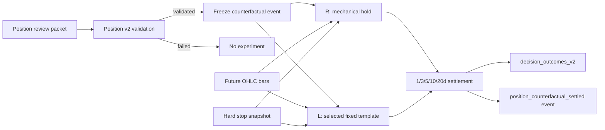

# LLM 持仓反事实实验详细设计

日期：2026-09-19  
状态：v1 已落地，影子运行  
范围：Position Decision v2；不改变真实持仓，不生成订单

## 1. 背景与目标

当前 LLM 在入场端受证据供给限制，持仓端已经能够输出 `hold / tighten_protection / reduce / exit`，但仅记录“建议过什么”，无法回答“采纳建议会不会比原规则更好”。本实验给每次有效持仓评审建立两个共享同一起点的虚拟路径：

- **R（Rule）路径**：忽略 LLM 的仓位动作，继续持有并服从原机械硬退出；
- **L（LLM）路径**：在相同仓位、价格、保护线和后续行情上，执行 LLM 已通过校验的固定动作模板。

实验要度量的是 LLM 对仓位管理的增量价值，而不是模型能否解释行情。核心输出为 L 相对 R 的净收益差、回撤差、避免损失、错失上涨和释放现金。

## 2. 非目标与安全边界

v1 不接券商交易接口，不修改 `PositionRegistry`，不创建 `order_intent`，不改变止损或批准计划。实验写入 append-only 决策事件和 `decision_outcomes_v2` 投影。

v1 不假设释放资金能获得额外收益。减仓/退出所得仅作为现金保存，现金收益率设为 0。这样避免用事后最优标的夸大 L 路表现。

v1 不评价自由文本质量。只有通过 Position v2 schema、动作模板和证据引用校验的完整决策才进入实验。

## 3. 决策对象和路径定义

一次实验对应一条已验证的 `position_reviewed` 决策，唯一键由账户、`trade_id`、`review_id`、`decision_id` 稳定生成。

冻结输入包括：

- 交易与决策标识：账户、股票、交易、评审、决策；
- 起始状态：剩余数量、评审时价格、入场价格、当前硬保护线；
- L 动作：动作类型、模板 ID、程序计算的数量、新保护价；
- 归因信息：引用 evidence ID，以及引用归属按同证券、MARKET、板块/风险组统计；
- 实验假设：成交模型、费率、现金政策和版本。

动作数量不从模型文字推断。`reduce` 只能使用程序预先生成的 25% 或 50% 模板，`exit` 使用已对账的全部剩余数量。

## 4. 时间与成交模型

采用 `next_bar_open_hard_stop_first_v1`：

1. 决策时刻之后的第一根 bar 才可成交，禁止使用评审前或评审同时刻的价格；
2. 每根 bar 先检查硬保护线；若最低价触线，两条路径都退出；
3. 若开盘已跳空穿过保护线，按开盘价成交；否则按保护价成交；
4. 首根未触发硬退出的 bar，L 路按开盘价执行一次模型动作；
5. R 路维持原数量；L 路剩余数量继续受同一冻结保护线约束；
6. 1/3/5/10/20 个交易 bar 收盘结算，不足的期限不发布结果。

“硬退出优先”保证 LLM 的 `hold` 或减仓建议不能延迟止损。v1 固定使用评审时保护线，不回放之后可能发生的追踪止损抬升；这是有意收窄变量，后续可增加 `mechanical-stop-replay-v2`。

## 5. 收益与风险口径

以评审时仓位市值 `starting_quantity × reference_price` 为共同基准：

- 路径权益 = 已卖出净现金 + 剩余数量 × 期限收盘价；
- 路径收益 = 路径权益 / 初始市值 − 1；
- 增量收益 = L 路收益 − R 路收益；
- 最大回撤 = 从路径权益历史峰值到当前权益的最大跌幅；
- 避免损失 = R 为负时，L 相对 R 的正增量；
- 错失上涨 = R 为正时，L 相对 R 的负增量绝对值；
- 释放现金 = L 路减仓/退出的扣费后现金，不做再投资。

`decision_outcomes_v2` 中 `return_pct` 存 L，`benchmark_return_pct` 存 R，`excess_return_pct` 存 L−R；完整双路径指标保存在 body。

## 6. 数据流

事件：

- `position_counterfactual_frozen`：决策完成后立即写入，不依赖未来价格；
- `position_counterfactual_settled`：至少一个期限成熟后写入，携带已结算指标；
- `outcome_observed`：沿用现有 OutcomeSettlement 的逐期限事件。

## 7. 故障隔离和幂等

反事实写入失败不得影响持仓评审主链。调度器捕获实验异常，仍正常记录 `position_reviewed`。实验 ID 和事件 ID 均由稳定输入生成；同一评审重复执行时，内容相同则幂等，内容不同则由 EventStore 拒绝覆盖历史。

结算是纯函数：冻结输入和同一组 OHLC bar 必须得到相同结果。未来行情不足时不伪造期限结果。

## 8. 代码改动

- `scripts/live_trading/decision_ledger/position_counterfactual.py`
  - 冻结实验输入、统计引用归属、模拟 L/R 路径、写冻结事件；
- `scripts/live_trading/position_review.py`
  - 在有效 Position v2 评审后冻结实验，并把 `counterfactual_id` 链回评审；
- `scripts/live_trading/decision_ledger/outcome_jobs.py`
  - 将成熟的反事实期限写入现有 outcome 投影和结算事件；
- `tests/unit/live/test_position_counterfactual.py`
  - 覆盖下一开盘成交、跳空止损优先、HOLD 对照、证据归属和持久化。

## 9. 验收标准

1. 开启 Position shadow 后，有效评审同时产生且仅产生一条冻结事件；
2. 冻结事件中的 L 数量与已验证模板完全一致；
3. 硬止损在首根 bar 触发时，L/R 同价退出，模型动作不执行；
4. HOLD 的 L/R 收益差恒为 0；
5. REDUCE/EXIT 可计算收益差、回撤、释放现金、避免损失和错失上涨；
6. 整条链不修改仓位，不产生订单事件；
7. 实验异常不影响 `position_reviewed` 主事件。

## 10. 运行与后续演进

当前已完成“在线冻结 + 每日自动扫描与增量结算”。收盘后的现有 `run_outcomes.py` 会读取冻结事件、按股票合并拉取窗口、从决策日的下一交易日开始回放，并把成熟期限写入投影。`/api/decision-health` 返回各期限 L−R 的样本数、平均增量收益、胜率、回撤差、避免损失和错失上涨。应先积累至少 30 个可独立分组的动作样本，再比较动作分层和证据来源分层，避免用少数极端行情判断模型能力。

下一阶段依次补：按交易周/证券/事件簇做独立样本聚合、加入真实机械追踪止损回放，以及在 suggestions 页面绘制 L−R 分布。任何实盘权限升级都应另立验收，不由本实验自动触发。
