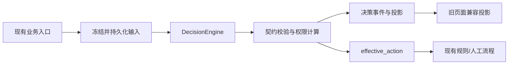
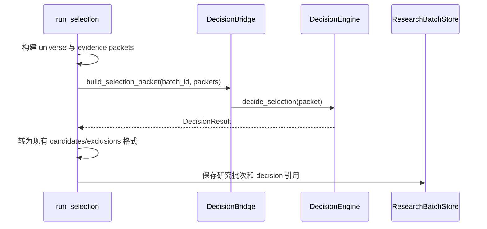
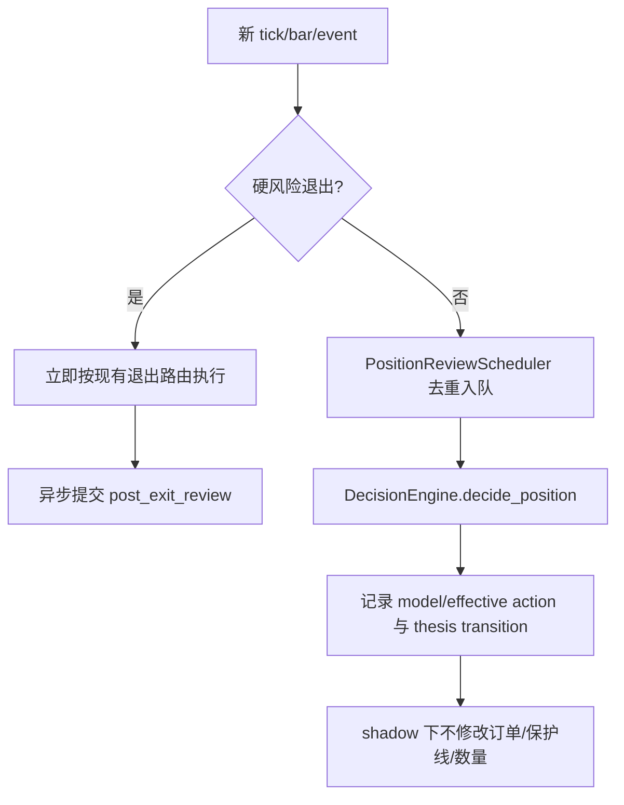

# LLM 决策引擎主链路影子接入详细设计

> 上游文档：
> - [演进路线图](./llm-trading-evolution-roadmap.md)
> - [技术设计](./llm-trading-evolution-technical-design.md)
> - [下一步实施计划](./llm-trading-evolution-next-steps.md)
> - [下一步行动计划（2026-09-10）](./llm-trading-next-actions-2026-09-10.md)
>
> 本文只设计下一项核心工作：把已经实现的 `DecisionEngine` 接入 Selection、Entry、Position 三条现有主链路，在不改变交易行为的前提下生成可回放、可评估的真实影子决策。

---

## 1. 背景与结论

当前系统已经具备 v2 决策契约、输入快照、决策运行账本、权限守卫、Defer 状态机、Outcome 结算和 Metrics 数据层，但生产入口仍走旧调用：

| 角色 | 当前入口 | 当前模型调用 |
|---|---|---|
| Selection | `run_daily_selection.run_selection` | `llm_selection.rank → advisor.chat` |
| Entry | `decision_ledger.workflow.start_review` | `advisor.review_plan(..., "buy")` |
| Position | `PositionReviewScheduler.schedule` | `advisor.review_plan(..., "sell")` |

因此下一步不应继续增加指标或扩大 LLM 权限，而应先完成主链路接线。接线后的目标形态是：



在本阶段，LLM 的 `model_action` 会被完整记录和展示，`effective_action` 仍由现有规则与人工流程决定。任何影子决策都不能自动创建、修改或取消订单。

---

## 2. 目标、非目标与约束

### 2.1 交付目标

1. 三个角色启用后，每个业务决策最多调用模型一次，且统一经过 `DecisionEngine`。
2. 模型调用前先持久化冻结输入；调用后持久化 raw、validated、model/effective action 和版本信息。
3. 现有建议页、确认台、持仓保护和人工审批继续工作。
4. 新旧记录通过 `decision_id`、业务主键和快照 ID 双向关联。
5. 任一角色可以独立关闭 v2 并回到旧链路。
6. 模型不可用时，新买入建议可以失败关闭，已有硬止损和退出不受影响。

### 2.2 本阶段不做

- 不调整 Prompt、选股范围、技术指标或风险参数。
- 不提升 `shadow` 权限，不启用真实 `constrained_action`。
- 不让 LLM 改写数量、限价、止损或硬退出条件。
- 不同时调用新旧模型做在线 A/B；这会增加成本，并产生两个不可比较的回答。
- 不把 Defer 自动接入主循环；先记录“若非 shadow 将 defer”的事实，待接线稳定后单独启用。

### 2.3 不可破坏的约束

- 硬风险退出顺序必须保持：风险规则先执行，LLM 只做异步事后复核。
- 输入快照一旦用于调用模型便不可修改；计划修改必须产生新 revision、新快照和新 decision。
- 兼容投影只能复制决策结果，不得重新解释或二次调用模型。
- `model_action` 与 `effective_action` 必须分别存储和展示。
- 模型调用已经开始后发生失败，不得改走旧模型重试。

---

## 3. 配置与发布开关

新增统一配置：

```yaml
llm_decision:
  engine_v2:
    selection: legacy        # legacy | shadow
    entry: legacy
    position: legacy
    fallback_before_call: true
    account_scope: default
```

状态语义：

| 值 | 行为 |
|---|---|
| `legacy` | 完全保留当前调用，v2 不创建 decision |
| `shadow` | `DecisionEngine` 是该角色唯一模型入口；结果落账并生成旧格式兼容投影，交易权限不变 |

不增加“双跑”状态。测试旧输出兼容性应使用固定 fixture 离线完成，不在交易时段调用两个模型。

`fallback_before_call` 仅允许在下列情况退回旧链路：配置解析失败、桥接数据无法构建、快照尚未创建且模型调用尚未开始。只要已创建 attempt 或模型调用已经开始，就必须把该决策标为 failed，不能再调用旧模型。

建议用一个小型路由对象集中处理开关，避免三个入口各自解释配置：

```python
class DecisionRuntime:
    def mode(self, role: str) -> str: ...
    def engine(self, owner) -> DecisionEngine: ...
    def may_fallback(self, phase: str) -> bool: ...
```

新增文件建议：`scripts/live_trading/decision_runtime.py`。引擎实例按 `account_scope + provider + model` 缓存，不能跨账户复用权限上下文。

---

## 4. 通用调用协议

三条链路统一执行以下步骤：

1. 计算稳定的业务幂等键。
2. 从当前业务对象构建 v2 Packet。
3. 先由 `DecisionRunStore` 冻结并写入 input snapshot。
4. 由 `DecisionEngine.decide_*` 调用模型、校验、计算权限并落账。
5. 将 `DecisionResult` 转为旧页面/旧存储需要的兼容投影。
6. 在原业务对象上写交叉引用。
7. 继续当前规则、人工确认或持仓保护流程。

### 4.1 幂等键

| 角色 | 建议业务键 |
|---|---|
| Selection | `selection:{account_scope}:{batch_id}` |
| Entry | `entry:{account_scope}:{proposal_id}:{plan_revision}` |
| Position | `position:{account_scope}:{position_id}:{trigger_id}:{input_as_of}` |

同一幂等键重复入队时，应返回已有终态或进行中的 decision，不得产生第二次模型调用。人工修改计划后 `plan_revision` 增加，因此会合法地产生新 decision。

### 4.2 统一交叉引用字段

研究批次、交易提案和持仓复核记录都增加：

```json
{
  "decision_id": "...",
  "input_snapshot_id": "...",
  "decision_status": "validated|failed",
  "decision_engine_version": "v2",
  "model_action": "...",
  "effective_action": "...",
  "permission_level": "shadow",
  "contract_version": "..."
}
```

这些字段是引用和展示字段，权威数据仍在 decision ledger。页面查询详情时应使用 `decision_id` 读取权威记录。

### 4.3 失败分类

| 阶段 | 处理 |
|---|---|
| 构建 Packet 失败，尚未调用模型 | 记录 bridge error；允许配置控制的旧链路回退 |
| 快照写入失败 | 不调用模型，fail-closed |
| 模型超时/不可用 | decision failed，不调用旧模型 |
| JSON/契约/证据校验失败 | decision rejected/failed，保存 raw 与错误 |
| 兼容投影写入失败 | decision 保持有效；记录 projection failure 并允许幂等重放投影 |

新增事件建议：`legacy_projection_written`、`legacy_projection_failed`。不要为接线过程再创建一套独立审计库。

---

## 5. Selection 接入设计

### 5.1 修改位置

- `scripts/live_trading/run_daily_selection.py::run_selection`
- `scripts/live_trading/decision_bridge.py::build_selection_packet`
- `scripts/live_trading/llm_selection.py`（保留 legacy 实现）

### 5.2 调用顺序



`batch_id` 必须在模型调用前生成。建议由 `account_scope + as_of + universe_hash` 构成稳定 ID；重复运行相同冻结输入时复用已有 decision。

### 5.3 输出映射

| v2 结果 | 旧建议页 |
|---|---|
| `candidate` | 候选，保留排序、论文、条件和置信度 |
| `watch` | 观察列表 |
| `exclude` | exclusions，并保留原因 |
| 整批无候选 | `no_candidate_reason` |

兼容投影必须携带 `decision_id`。页面可以继续读取当前批次结构，同时增加“模型建议 / 实际权限 / 决策详情”入口。

### 5.4 Selection 验收

- 启用 shadow 后 `advisor.chat` 只从 `DecisionEngine` 内发生一次。
- 8 只股票全部出现在 candidate/watch/exclude 三者之一，不能静默丢失。
- 同一批次重跑不会产生第二次模型调用。
- 建议页展示与 ledger validated snapshot 一致。
- 单只股票数据质量不足只影响该标的；整个 Packet 不满足最低质量门时整批 fail-closed。

Selection 是第一批上线对象，因为它不触碰订单。建议至少积累 3 个独立交易日后再接 Entry。

---

## 6. Entry 接入设计

### 6.1 修改位置

- `scripts/live_trading/decision_ledger/workflow.py::start_review`
- `scripts/live_trading/decision_bridge.py::build_entry_packet`
- `scripts/live_trading/approval/proposal_store.py`

### 6.2 数据来源

Entry Packet 必须从已经持久化的 proposal、plan revision 和 review input 构建，不能在 worker 中重新查询实时行情来替换原数据。至少绑定：

- `proposal_id`、`signal_id`、`plan_revision`；
- 股票、方向、规则信号和候选来源；
- 冻结的 entry/stop/quantity/capital cap；
- 规则基线动作；
- portfolio/risk preview；
- evidence、options summary 和 data quality；
- `expires_at`。

### 6.3 Worker 改造

`start_review` 的异步 worker 根据角色开关选择一条路径：

```python
if runtime.mode("entry") == "legacy":
    raw = advisor.review_plan(snapshot, "buy")
    store.complete_review(...)
else:
    packet = build_entry_packet_from_persisted_revision(request, snapshot)
    result = runtime.engine(owner).decide_entry(packet)
    store.complete_v2_review(request, result)
```

新增 `ProposalStore.complete_v2_review`，职责仅为：

1. 校验回调仍绑定同一 `proposal_id + plan_revision`；
2. 保存 v2 交叉引用与兼容展示字段；
3. 推进 proposal 的 review 状态；
4. 不再调用旧 `validate_review` 二次解释 v2 输出。

晚到的旧 revision 回调只能记为 superseded，不能覆盖当前计划。

### 6.4 动作兼容映射

建议明确集中在 `decision_bridge.py`：

| Entry model action | 旧推荐语义 | shadow effective action |
|---|---|---|
| `execute_now` | `support_execute` | 当前规则/人工基线 |
| `defer` | `wait_for_confirmation` | 当前规则/人工基线 |
| `reject` | `oppose_execute` | 当前规则/人工基线 |

提案页必须同时显示模型建议和当前有效动作，审批按钮仍沿用现有权限。模型反对时，如果当前流程允许人工 override，则必须填写已有的 override note 并留下事件。

### 6.5 Defer 在本阶段的边界

shadow 下不能因为模型返回 `defer` 就改变信号生命周期。系统只记录：

```json
{
  "model_action": "defer",
  "effective_action": "rule_baseline",
  "shadow_defer": {
    "would_create": true,
    "triggers": [],
    "expire_at": "..."
  }
}
```

等 Entry 主链路稳定后，再通过独立权限 `entry_defer=recommend` 创建真实 `DeferredReview`。

### 6.6 Entry 验收

- 决策输入中的价格、数量、止损与 proposal revision 完全一致。
- 模型调用期间修改计划，旧回调不能写入新 revision。
- shadow 下 `execute_now/defer/reject` 均不自动提交订单。
- 同一 proposal revision 重复入队只调用一次模型。
- 模型不可用时提案进入明确的 review failed 状态，不出现永久“评估中”。
- 人工确认和现有 `validate_order_intent` 路径保持可用。

---

## 7. Position 接入设计

### 7.1 修改位置

- `scripts/live_trading/position_review.py::PositionReviewScheduler.schedule`
- `scripts/live_trading/decision_bridge.py::build_position_packet`
- `scripts/live_trading/chandelier_exit_manager.py`（只增加事后复核事件，不改变退出路由）
- `scripts/live_trading/thesis_ledger.py`（增加 v2 兼容写入）

### 7.2 处理顺序



Position Packet 从持仓登记、原始计划、当前保护线、已有论文状态、新证据和数据质量构建。保护线必须是读取值，LLM 不能覆盖权威的 `PositionExitState`。

### 7.3 Thesis 兼容

新增单向适配方法，例如 `ThesisLedger.record_v2_review(result)`：

- validated 的 thesis transition 写入现有论文事件；
- 保存 `decision_id` 与 cited evidence IDs；
- shadow effective action 固定为当前持仓规则基线；
- 同一 decision 不重复写 `position_reviewed`；
- 旧页面从兼容字段展示，权威状态仍可追溯到 ledger。

### 7.4 性能与隔离

- 模型调用必须在队列 worker 中，不能阻塞 `_on_tick`。
- 队列按 `position_id + trigger_id` 去重。
- 高优先级硬退出不能等待 Position 队列，也不能受模型熔断器影响。
- 持仓已清空时，排队中的普通 review 标为 cancelled；已经成交的退出可继续生成 post-exit 复核。

### 7.5 Position 验收

- 模型任意输出均不能降低止损线、扩大仓位或直接发单。
- 模型超时期间硬止损延迟无显著变化。
- 同一触发只生成一个 decision 和一个 `position_reviewed` 事件。
- 持仓关闭后普通复核不会更新 active thesis。
- 硬退出后能关联 post-exit decision，但不影响已完成成交。

---

## 8. 兼容层的代码边界

建议把兼容职责全部收敛到现有 `decision_bridge.py`，增加三个纯函数：

```python
def selection_legacy_projection(result: DecisionResult) -> dict: ...
def entry_legacy_projection(result: DecisionResult) -> dict: ...
def position_legacy_projection(result: DecisionResult) -> dict: ...
```

要求：

- 输入相同则输出确定；
- 不访问网络、不读实时行情、不调用模型；
- 不修改 `DecisionResult`；
- 未知 contract version 明确拒绝；
- 每个字段映射有契约测试。

现有 `llm_selection.rank` 和 `advisor.review_plan` 暂时保留给 `legacy` 开关使用。三个角色全部稳定且回滚窗口结束后，再单独删除旧路径。

---

## 9. 可观测性与页面要求

每个角色至少记录以下指标：

- decision 总数、validated/failed/rejected；
- 模型调用次数和重试次数；
- model/effective action 分布；
- 输入快照写入、模型调用、校验、投影各阶段耗时；
- legacy projection lag/failure；
- 幂等命中数；
- 按 provider/model/prompt/contract version 分组的失败率。

新增健康红线：

| 告警 | 条件建议 |
|---|---|
| 重复调用 | 同一业务幂等键模型调用数 > 1，立即告警 |
| 投影滞后 | validated 后 60 秒仍无业务交叉引用 |
| 快照缺失 | 存在 attempt 但无 input snapshot，立即告警 |
| 行为越权 | shadow decision 产生自动订单，立即熔断 v2 |
| Position 阻塞 | 模型延迟进入行情/硬退出处理路径，立即回滚 position |

建议页和确认台显示 `model_action` 与 `effective_action`。此前“前端只展示 effective action”的旧约束应修订为：**执行按钮只依据 effective action；审计区域同时展示两者**，否则无法评估 LLM 的增量价值。

---

## 10. 测试设计

### 10.1 单元与契约测试

1. 三类 Packet 从真实旧快照 fixture 构建成功。
2. 三类 v2 输出能确定性映射为旧格式。
3. 未知 action、证据引用缺失、scope 不一致时 fail-closed。
4. 同一幂等键并发提交只产生一个 attempt/model call。
5. 模型调用后失败不会触发 legacy fallback。

### 10.2 入口级集成测试

测试必须从真实入口调用，而非只测 `ShadowBridge`：

- `run_selection → DecisionEngine → research batch`；
- `start_review → queue worker → ProposalStore.complete_v2_review`；
- `PositionReviewScheduler.schedule → DecisionEngine → ThesisLedger`。

模型使用可计数 fake advisor，明确断言 `call_count == 1`。

### 10.3 关键回归场景

| 场景 | 必须断言 |
|---|---|
| Selection 重跑 | 返回已有 decision，无第二次模型调用 |
| Entry 计划修订 | 旧回调不能污染新 revision |
| Entry 模型 reject | shadow 下无自动撤销/下单 |
| Entry 模型 defer | 不创建活动 Defer，仅记录 would-create |
| Position 建议加仓 | 仓位、止损、订单均不变化 |
| 硬止损 + 模型宕机 | 退出照常完成 |
| 重启恢复 | running/unknown attempt 按既定恢复规则处理，不盲目重发 |
| 多账户 | decision、权限和 proposal 不跨 account scope |

### 10.4 DRY-RUN 对账

每个交易日输出一份机器可读对账：

```json
{
  "business_key": "...",
  "decision_id": "...",
  "model_action": "...",
  "effective_action": "...",
  "legacy_projection": "written",
  "order_side_effects": 0,
  "replay": "matched"
}
```

---

## 11. 实施拆分

### PR1：运行时路由与兼容投影

- 新增 `decision_runtime.py` 和角色配置。
- 补齐三类 legacy projection 纯函数。
- 增加 fallback phase、幂等和单次调用测试。
- 默认三个角色均为 `legacy`。

完成标准：不改业务入口行为，全量现有测试通过。

### PR2：Selection shadow

- 接入 `run_selection`。
- 研究批次写 decision 交叉引用。
- 建议页展示模型/有效动作与详情链接。
- 运行至少 3 个独立交易日或等价录制 fixture。

完成标准：批次可回放；无重复模型调用；无静默丢股票。

### PR3：Entry shadow

- 接入 `start_review`。
- 新增 `complete_v2_review` 和 revision fencing。
- 记录 shadow defer，不激活 Defer。
- 保持人工确认和 DRY-RUN 执行不变。

完成标准：模型三类动作均不造成自动订单，提案状态不永久卡住。

### PR4：Position shadow

- 接入 `PositionReviewScheduler`。
- 增加 ThesisLedger 兼容写入和 post-exit review。
- 验证模型故障与硬退出隔离。

完成标准：止损/仓位/订单零变化；硬退出时延不受模型影响。

### PR5：统一验收与旧链路冻结

- 运行六个 DRY-RUN 端到端场景。
- 加入 Metrics 健康告警和每日对账。
- 标记旧模型入口 deprecated，但暂不删除。

完成标准：启用的三角色模型调用全部可追到 `DecisionEngine`，每条决策可回放，影子运行无交易行为变化。

---

## 12. 发布与回滚

按角色逐步启用：

1. `selection=shadow`，Entry/Position 保持 legacy。
2. Selection 稳定后设置 `entry=shadow`。
3. Entry 稳定后设置 `position=shadow`。
4. 三者同时运行 DRY-RUN，积累 outcome 后才讨论权限晋级。

回滚只修改对应角色为 `legacy` 并重启相关 worker。已经写入的 v2 decision 和交叉引用保留，不能删除或覆盖。若发现 shadow 产生订单副作用，应立即：关闭全部 v2 角色开关、停止新 Entry review、保留硬退出进程、记录 incident event 并核对订单账本。

---

## 13. 最终验收清单

- [ ] 启用角色的模型调用仅发生在 `DecisionEngine`。
- [ ] 每次调用前存在不可变 input snapshot。
- [ ] 同一业务幂等键最多一次模型调用。
- [ ] Selection、proposal、position review 均保存 `decision_id`。
- [ ] validated decision 可以 replay 且结果一致。
- [ ] 页面明确区分 model action 和 effective action。
- [ ] shadow 下自动订单副作用为 0。
- [ ] Entry revision 晚到回调被隔离。
- [ ] Position 模型故障不影响硬退出。
- [ ] 任一角色可独立回滚到 legacy。
- [ ] 至少完成六个入口级 DRY-RUN 场景。

完成以上清单后，系统才具备评估 LLM 在选股、买入和卖出中的真实增量价值的基础。下一阶段应依据独立样本的 outcome、校准和反事实数据，决定是否先把 `selection` 或 `entry_defer` 从 shadow 晋级到 recommend，而不是直接开放自动交易。

---

## 14. 实施记录（2026-09-09）

本设计的主链路接线已实现：

- 新增 `decision_runtime.py`，三个角色默认 `legacy`，支持独立切换 `shadow`；
- Selection 已从真实 `run_selection` 入口接入，批次键绑定冻结输入，v2 输出投影到现有建议页；
- Entry 已从 `start_review` 接入，绑定 proposal revision，并由 `complete_v2_review` 隔离晚到回调；
- Position 已从 `PositionReviewScheduler` 接入，继续在队列中异步运行，不修改保护线、仓位或订单；
- 确认台展示 model action、effective action、权限和 decision ID；
- Selection v4 校验要求 candidate/watch/exclude 覆盖全部可研究股票，防止静默遗漏；
- 新增入口级测试，使用可计数 fake advisor 验证每个入口只调用模型一次。

初始交付时三个角色均为 `legacy`；完成下述首轮联调后，当前配置为 Selection=`shadow`、Entry/Position=`legacy`。后续每一步完成真实 DRY-RUN 对账后再启用下一项。真实 constrained action、活动 Defer 和权限晋级仍不在本次接线范围内。

### 14.1 Selection 首轮真实联调（2026-09-10）

- `selection=shadow` 已启用，Entry/Position 继续为 `legacy`；
- 首次真实数据暴露 Selection claim schema 过宽，升级到 v4.1 后强制每条 claim 提供 `claim_type + evidence_ids`；
- 第二次暴露 context.as_of 使用上一收盘而新闻/期权为本轮采集时间，v4.2 改为冻结输入中的最新时间；
- 对“引用合法但未逐字复制摘要”的 fact 做只降权的确定性 `fact → inference` 规范化，raw attempt 保持原样；
- 修复兼容投影对字符串 `invalidation_conditions` 的处理，并让离线 replay 执行相同规范化；
- 最终决策 `decision_be7b08e0703f2e910a8ea8cf2b2f15b5` validated，8 只股票全部覆盖：3 candidate、5 watch；
- 该决策只有一次模型 attempt，输入、权限、validated 快照各一份，replay 的输入哈希与契约校验均通过；
- `effective_action=rule_ranking`、`permission_level=shadow`，订单和持仓副作用均为 0。
