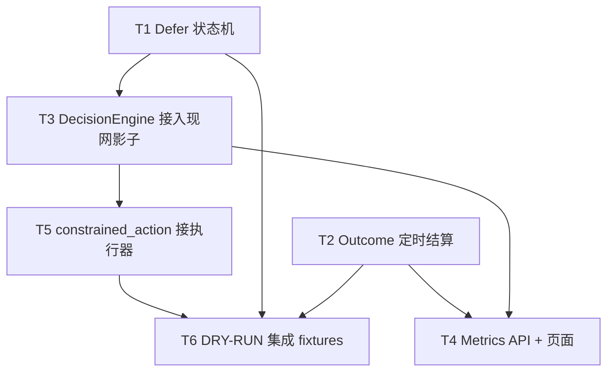

# LLM 交易决策演进 — 下一步实施计划

> 前置文档：
> - [概要设计](./llm-trading-evolution-roadmap.md)
> - [详细设计](./llm-trading-evolution-technical-design.md)
> - [实现与 review 总结](./llm-trading-evolution-implementation-review.md)（含两轮 code review 的修复记录）
> - [主链路影子接入详细设计](./llm-trading-evolution-mainline-integration-design.md)
>
> 本文是「合同与账本层 v2」验收后、到「技术设计完整交付」之间的剩余工作排期。

---

## 1. 当前状态

「合同与账本层 v2」已验收：PR4–8 的决策契约、校验器、权限应用、决策引擎、账本投影、outcome 结算纯函数、指标数据层均已实现。Defer 持久化状态机、Outcome runner、影子桥、Metrics API、受约束执行的 DRY-RUN 能力和六个决策场景测试也已建立。所有能力继续保持默认 shadow，DecisionEngine 尚未接入现有监控器主流程。

**但以下能力尚未接通，系统因此还不能被认定为「技术设计完整交付」：**

| 缺口 | 影响 | 对应设计 |
|---|---|---|
| Defer 状态机尚未接主循环 | 状态持久化和触发判断已实现，但没有持续消费行情并发起新决策 | §8.5 |
| Outcome runner 尚未加入定时调度 | 已能从行情 DataFrame 结算，仍需由交易日任务自动运行 | §16 |
| DecisionEngine 未接入现网 | 现网仍走 v2/v3 旧链路，新契约不被执行 | §12/§14 |
| Metrics 页面未实现 | 只读 API 已实现，页面还没有展示评估结果 | §17 |
| constrained_action 真实券商路径未启用 | DRY-RUN 已实现并校验冻结决策，真实下单仍显式拒绝 | §13/PR8 |
| DRY-RUN 场景仍需接真实主循环 | 六个逻辑场景已覆盖，尚未经过现有监控器入口运行 | §20.6 |

**贯穿性红线**（后续任何一步都必须遵守）：

- 默认 shadow，不提升任何 LLM 权限，不动现网交易行为；
- 硬风险退出永远不经过 LLM/人工确认；
- 输入先于模型调用持久化，任何校验失败 fail-closed；
- model action 与 effective action 分离，前端只展示 effective action。

---

## 2. 任务总览与依赖

- T1、T2 相互独立，可并行。
- T3 依赖 T1（entry 链路先有 defer 才有完整接入）。
- T4 依赖 T2（有结算数据）+ T3（有决策记录）。
- T5 依赖 T3 且需积累真实样本后评估，最后做。
- T6 是贯穿性验收，在所有功能接上后录制。

---

## 3. 任务明细

### T1：Defer 状态机运行时（PR5 收尾）

**目标**：让 `wait_for_confirmation` 从「一条建议」变成「带到期、复审次数、触发器的可持久化观察状态」。

**改动点**

1. 新增 `scripts/live_trading/defer_state.py`（或并入 `review_scheduler.py`）：
   - `DeferredReview` 持久化（字段对齐 §8.5：defer_id / signal_id / decision_id / trigger_ids / review_count / max_reviews / next_review_after / expire_at / status）；
   - 触发器匹配：`price_above` / `price_below` / `volume_ratio` / `new_event` / `option_quality_recovered` / `scheduled_time`；
   - 同一 trigger 只消费一次；
   - 状态迁移：`deferred → queued → resolved/expired/rejected`，`max_reviews` 到顶或 `expire_at` 到期后终止。
2. 到期/复审时生成**新** input snapshot 与 **新** decision_id，不覆盖旧决策（§8.5）。
3. 触发器的驱动源先接 `review_scheduler` 已有的去重键与优先级。

**验收标准**

- 一个 defer 在 trigger 命中后只复审一次；
- 到期、最大次数、新 signal 三条路径各有明确终态；
- 复审用新数据快照，旧输入保持不变；
- defer 期间硬退出或持仓变化能取消复审（§20.4）。

**涉及文件**：新增 `defer_state.py`；`review_scheduler.py`、`decision_engine.py`（接 retry/复审入口）。

---

### T2：Outcome 定时结算 + 真实行情（PR7 收尾）

**目标**：让 `outcome_jobs.py` 从「纯函数」变成「有数据源、能定时结算」的闭环。

**改动点**

1. 数据源：明确收盘价 / 行业代理 / SPY 基准从哪个行情源取（现有 `run_selection_outcomes.py` 已有选股结算，可复用其取数逻辑）。
2. 定时任务：交易日收盘后结算 1/3/5/10/20d 到期的 horizon（§14.1/§16）。
3. 结算写 `decision_outcomes_v2` + `outcome_observed` 事件（`OutcomeSettlement` 已具备）。
4. 规则反事实路径：为每个 entry signal 同时结算 `actual_llm_path` / `rule_immediate_entry_path` / `selected_template_path`（§16.2）。

**验收标准**

- 一个 selection 批次能结算多股票、多期限，不覆盖；
- entry 能结算多模板反事实路径；
- 缺失数据能标记 `data_quality`，不静默跳过；
- projection lag 可观测（§11.2）。

**涉及文件**：新增 `scripts/live_trading/run_outcomes.py`；复用 `outcome_jobs.py`、`run_selection_outcomes.py`。

---

### T3：DecisionEngine 接入现网（影子）

**目标**：让 `decision_engine.py` 成为三类决策的唯一编排入口，先以 shadow 跑通，不改变现网行为。

**改动点**（分三个子步骤，风险递增）

1. **Selection 接入**：`llm_selection.py` 的 `rank()` 改为产出 §7.1 `SelectionPacket` 并调用 `decide_selection`，结果写 run/attempt/outcome，仍走现有建议页展示。
2. **Entry 接入**：`workflow.start_review` / `proposal_store.complete_review` 的模型调用改为 `decide_entry`，`effective_action=rule_baseline`（shadow）时不改变现有审批流。
3. **Position 接入**：`position_review.py` 的 `run()` 改为 `decide_position`，论文状态沿用 `thesis_ledger` 兼容层。

**验收标准**

- 每次决策有完整 input snapshot + decision_id + attempt + validated snapshot，可被 `replay_decision` 回放；
- shadow 下 effective action 全部等于规则基线，现网订单/审批行为零变化；
- 旧 v2/v3 链路逐步退役，模型调用只发生在 DecisionEngine。

**涉及文件**：`decision_engine.py`、`llm_selection.py`、`workflow.py`、`position_review.py`、`proposal_store.py`。

**注意**：这一步是「接线」，最容易引入现网回归，需在 DRY-RUN 下逐步切换，每步跑全量测试 + 一轮手动对账。

---

### T4：Metrics API 与评估页面（PR7 收尾）

**目标**：让「模型比规则多做了什么、避免了什么、错过了什么」可被查询和展示。

**改动点**

1. API 端点（对齐 §17）：
   - `GET /api/llm/decisions`、`/api/llm/decisions/{id}`、`/api/llm/decisions/{id}/replay`
   - `GET /api/llm/metrics/{selection,entry,position}`
   - `GET /api/llm/permissions`、`GET /api/llm/health`
2. 数据层复用 `project_decision_metrics.py`（已实现 overview / action_distribution / selection/entry/position metrics / health）。
3. 决策详情页展示：冻结输入时间与数据质量、model vs effective action、引用证据、版本字段、人工选择、订单/成交、已结算 outcomes、规则反事实、回放差异。

**验收标准**

- 页面能回答路线图 §7 的三问；
- 异常分布告警（§21）能在 health 接口体现。

**涉及文件**：`web/app.py`、`project_decision_metrics.py`、新增模板/静态页。

---

### T5：constrained_action 接执行器（PR8 收尾）

**目标**：权限升到 constrained_action 后，自动执行路径能真正下单，但只在明确边界内。

**改动点**

1. `execution.py` 增加受约束自动执行入口：读取 `decision_effective_action` 的 effective action 与 plan/模板，复用现有 `validate_order_intent → reserve → submit`（§10.2）。
2. 单日次数、单笔风险、累计风险、异常熔断（§25 / Sprint 5）。
3. 任何 constrained action 都要能指出对应样本、指标、版本、审批记录（§23 PR8 完成条件）。

**验收标准**

- 仅当所有相关子权限都 constrained_action 时才自动执行；
- 数量/止损/价格无法被模型扩大，模板边界与保护线单调仍由 `validators/risk.py` 校验；
- 券商 unknown 不重发，进 reconciliation。

**涉及文件**：`execution.py`、`decision_engine.py`、`permission_guard.py`。

**前置条件**：需积累足够独立样本（§16.4 independence_group）、并通过 §7.1 晋级门槛评估后才能开启；本轮只实现能力，不实际提升权限。

---

### T6：DRY-RUN 集成 fixtures（§20.6）

**目标**：用录制的端到端场景固化验收。

**六个场景**（对齐 §20.6）：

1. 选股 candidate → 规则信号 → LLM support → 人工确认 → 成交；
2. 选股 watch → 新证据 → 重新排名 → 入场 defer → 触发后 support；
3. 买入后论文 weakening → 人工减仓；
4. LLM 看多但硬止损触发 → 立即退出 → 事后复核；
5. 期权数据缺失 → 股票研究继续、期权结论 unavailable；
6. 模型服务不可用 → 新买入停止、已有硬保护继续。

**验收标准**：每个场景可重复执行，断言落在事件流 + 投影 + outcome 上，全程无真实券商依赖。

**涉及文件**：`tests/integration/`（或复用 `scripts/run_simulate_acceptance.py` 的模式）。

---

## 4. 建议执行顺序与理由

1. **T1 + T2 并行**：两者都只增不改现网行为，风险低，且是 T3/T4 的前置。
2. **T3（选股影子接入优先）**：选股不碰下单，最安全，先验证 DecisionEngine 全链路（快照→调用→校验→权限→落账→回放）。
3. **T4**：有 T2/T3 的数据后，评估页面才有内容。
4. **T3（entry/position 接入）**：在选股影子跑稳后，再切买卖链路，逐个子步骤验证。
5. **T6**：在 T1–T3 完成后录制，作为整体回归基线。
6. **T5 最后**：需要样本 + 门槛评估，且是唯一会真正自动下单的能力，留到最后并默认保持 shadow。

---

## 5. 不在此轮范围（避免范围蔓延）

- 不提升任何 LLM 权限（保持全 shadow，除非样本和门槛显式达标）；
- 不改动选股 Prompt、风险参数、策略阈值（技术设计 §24 明确要求第一轮不混改，否则无法归因）；
- 不做 Critic 独立批评角色（§8.3，属后续治理增强）；
- 不做成本/延迟预算的精细化计费（§8.4 仅记账即可）。

---

## 6. 本轮代码检查与修复记录

2026-09-09 对实际实现进行复核后，补充修复：

1. `submit_constrained_entry` 不再接受调用方提供的股票、数量、价格和止损。执行器通过 `decision_id + template_id` 读取冻结 Entry Packet，并验证 validated decision、effective action、决策时权限和当前权限。
2. 非 DRY-RUN 的受约束自动买入在写订单意图前拒绝，避免留下永久 `submitting` 的订单占用。
3. Defer 创建改为幂等，并校验 signal、decision、最大复审次数、trigger ID 和 trigger 类型。
4. queued 状态也可以按 `expire_at` 到期，防止复审 worker 中断后记录永久卡住。
5. 修正 Selection Outcome 的 horizon 偏移：输入 `[基准收盘, 第1日, ...]` 时，1d 使用第1日收盘，3d 使用第3日收盘；数据不足的期限不提前结算。
6. 增加受约束执行绑定、Defer 幂等/queued 到期和 Outcome 精确期限测试。

验证结果：58 个本轮相关单元测试通过；全量发现测试中的 Futu 相关错误来自 SDK 在沙箱内写用户日志目录失败，不是业务断言失败。
