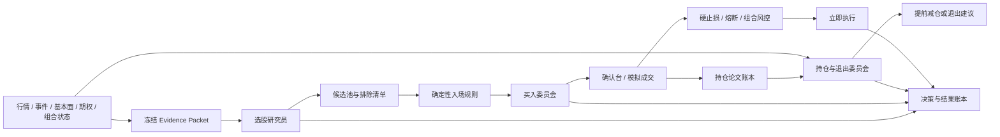

# LLM 交易决策演进路线图

> 目标：让大模型在选股、买入和卖出中承担真实、可衡量的决策职责，同时由确定性程序守住仓位、价格、止损和组合风险边界。
>
> 当前阶段：系统已经具备结构化选股、Evidence Packet、期权摘要、交易复核、论文账本、决策账本和权限开关。下一步的重点是形成可回放的决策闭环，并按证据逐步扩大模型权限。
>
> 详细开发规格见：[llm-trading-evolution-technical-design.md](./llm-trading-evolution-technical-design.md)。

## 1. 当前基线

| 环节 | 已具备能力 | 当前缺口 |
|---|---|---|
| 选股 | `selection-v3` 结构化输出；候选、排除理由、证据引用；行情、事件、基本面和期权视角 | 缺少稳定的定时运行、历史输入完整快照、模型与规则基线的长期对照、组合相关性约束 |
| 买入 | 规则生成交易候选；LLM 可支持、延后或反对；有人确认和权限开关 | 模型还缺少明确的可选交易方案、复审触发器、决策有效期和足够的反事实统计 |
| 持仓/卖出 | 仓位复核、论文状态和退出建议的基础结构已经存在 | 硬风险退出与 LLM 复核边界需要重新明确；缺少事件驱动复核和退出质量评估 |
| 评估 | 决策账本、outcome 和 counterfactual 框架 | 样本不足；输入未必都能按原样回放；缺少按模型、Prompt、市场状态分层的统计 |
| 权限 | selection、entry、exit、scale、template 等权限可以独立配置 | 权限提升尚未绑定统一的量化准入门槛和自动降级规则 |

## 2. 目标决策架构

系统应形成三个职责独立的 LLM 决策角色，每个角色使用独立 Prompt、Schema、评估集和权限状态。



### 2.1 选股研究员

负责回答：

- 哪些股票值得进入候选池；
- 为什么现在值得观察；
- 哪些股票应该排除；
- 哪些证据能证伪当前判断；
- 在组合已有暴露下，候选优先级是否需要调整。

模型拥有候选发现、排序、排除和弃权权。确定性程序继续负责交易范围、流动性、数据质量、黑名单和组合硬约束。

### 2.2 买入委员会

负责回答：

- 当前信号是否值得执行；
- 应立即执行、等待确认，还是放弃；
- 在程序提供的方案中选择哪一种；
- 什么新证据到来后需要重新评估。

程序预先生成有限的合规方案，例如：

1. 标准仓位按当前信号执行；
2. 半仓执行，确认后再加仓；
3. 等待价格、成交量或事件条件；
4. 放弃本次信号。

模型可以选择方案、缩小风险、延后或否决。模型不能扩大程序计算的最大仓位，不能放宽硬止损，也不能编造任意委托价格。

### 2.3 持仓与退出委员会

负责回答：

- 原始买入论文是否仍成立；
- 新事件增强、削弱还是证伪论文；
- 是否应提前收紧保护、减仓或退出；
- 当前浮盈或浮亏是否影响了判断质量。

退出分为两类：

- **硬风险退出**：止损、熔断、账户风险、数据或连接异常保护。程序满足条件后及时执行，并记录给 LLM 复盘。
- **论文退出**：基本面恶化、事件证伪、预期兑现、机会成本上升。LLM 提议，经过规则校验和当前权限对应的确认流程执行。

## 3. P0：先补齐安全与可回放能力

预计一个短迭代完成。这一阶段不扩大实盘权限。

### 3.1 硬退出与 LLM 解耦

调整卖出链路：

- 已生效止损被触发时，不等待 LLM 或人工确认；
- 组合熔断和券商风险拒绝沿用确定性规则；
- LLM 对硬退出生成事后解释和论文状态更新；
- LLM 服务异常、超时或输出不合规时，不能延迟硬退出；
- DRY-RUN 中覆盖止损穿越、跳空、LLM 超时和确认台无人操作。

验收标准：硬止损触发到订单提交的路径不依赖模型响应；回放测试能证明模型故障不影响退出。

### 3.2 保存完整决策快照

每次决策保存可重放的不可变记录：

- 原始 Evidence Packet 正文及 Schema 版本；
- 行情时间、数据来源、新鲜度和市场时段；
- 新闻、事件和证据的稳定标识；
- 完整期权摘要、质量门结果和缺失原因；
- 组合仓位、行业暴露和可用风险预算；
- Prompt 版本、模型标识、参数、原始响应和解析结果；
- 规则基线结果、最终动作、人工动作和后续收益路径。

只保存哈希无法支持完整回放。哈希用于完整性校验，正文快照用于重放、审计和离线评估。

验收标准：指定任意一个 `decision_id`，可以在不读取当日实时数据的情况下重新执行解析、规则校验和评分。

### 3.3 建立统一原因字典

把模型和程序原因映射到稳定枚举，例如：

- `INSUFFICIENT_EVIDENCE`
- `STALE_OR_LOW_QUALITY_DATA`
- `EVENT_RISK`
- `VALUATION_RISK`
- `TECHNICAL_NOT_CONFIRMED`
- `OPTIONS_CONFIRM`
- `OPTIONS_DIVERGE`
- `PORTFOLIO_CONCENTRATION`
- `THESIS_WEAKENED`
- `THESIS_INVALIDATED`

自然语言解释保留给用户阅读，枚举用于统计和权限评估。

## 4. P1：让 LLM 真正承担选股职责

### 4.1 分离“发现池”和“执行池”

建立两层股票集合：

- 发现池可以较宽，由涨幅、事件、行业、财报、异常成交和期权活动产生；
- 执行池必须通过流动性、价格、数据质量、可交易性和组合风险门。

LLM 对发现池进行研究和排除，程序只允许执行池进入买入链路。这样能扩大模型发现机会的空间，同时保持交易边界稳定。

### 4.2 加入组合视角排序

向选股 Evidence Packet 增加：

- 当前持仓和行业暴露；
- 候选之间的相关性和共同风险因子；
- 财报与宏观事件重叠；
- 组合当前回撤和剩余风险预算。

LLM 输出应包含 `standalone_rank` 和 `portfolio_rank`。前者衡量股票本身，后者衡量加入当前组合后的价值。

### 4.3 将期权数据转为时间序列证据

当前期权摘要适合描述当下状态。下一阶段保存历史快照并形成变化特征：

- ATM IV 水平、分位数和日变化；
- 近远月 IV 期限结构及变化；
- 完整链 OI/Volume PCR 及变化；
- Max Pain 与股价距离及变化；
- ATM Call Delta、POP 及变化；
- 数据覆盖率、价差、零报价比例和质量等级。

LLM 只能在质量门通过时将期权数据作为确认或分歧证据，不能把单个期权指标当作独立买入理由。

### 4.4 建立选股对照组

每个研究批次同时保存：

- 规则基线排名；
- LLM 排名；
- LLM 排除股票；
- LLM 主动弃权；
- 随机或简单动量基线。

持续计算 1、3、5、10、20 个交易日结果：收益、最大有利波动、最大不利波动、相对行业收益和风险调整收益。

选股阶段的核心指标：

- Top-N 相对规则基线的超额收益；
- 排除股票的避损价值与错失收益；
- 排名与后续收益的单调性；
- 高、中、低置信度的实际命中率；
- 弃权是否集中在数据不足或市场不确定阶段；
- 在不同市场状态、行业和事件类型下的稳定性。

## 5. P2：让 LLM 参与买入时机与方案选择

### 5.1 为每个信号生成有限交易方案

程序根据风险预算、波动率和入场规则生成候选方案。每个方案包含：

- 触发条件和有效期；
- 计划入场区间；
- 最大仓位和分批比例；
- 初始止损和预期风险金额；
- 取消条件；
- 下一次复核条件。

LLM 输出限定为 `execute_now`、`defer`、`reject`，以及一个 `plan_template_id`。所有数值在提交订单前再次由程序校验。

### 5.2 建立买入复审机制

`defer` 不能成为永久观察状态。每条延后决策必须包含：

- `review_before`；
- `review_triggers`；
- `expire_at`；
- 最多复审次数；
- 到期后的默认行为。

触发器可以是价格突破、成交量确认、期权分歧消失、财报发布或新 SEC/公司事件。

### 5.3 评估 LLM 对买入的实际增量

针对每个规则买入信号保存两条路径：

- 实际采用 LLM 决策后的路径；
- 假设规则立即买入的反事实路径。

买入阶段的核心指标：

- `defer/reject` 避免的亏损；
- 延后造成的错失收益；
- 方案选择后的净 R 和最大回撤；
- 决策延迟和信号过期比例；
- 按原因枚举统计的有效性；
- 同等风险预算下，LLM 路径与规则路径的差异。

## 6. P3：让 LLM 维护持仓论文并参与卖出

### 6.1 建立事件驱动的持仓复核

以下事件触发新的 Position Evidence Packet：

- 定时收盘复核；
- 财报、指引、评级、SEC 文件或公司重大新闻；
- 单日异常波动或成交量；
- 期权 IV/PCR/期限结构明显变化；
- 接近目标价、止损或持仓期限；
- 市场状态和行业状态变化。

每次复核输出相对上一次的增量：新增证据、被撤销证据、论文状态变化和建议动作，避免模型每次从头改写故事。

### 6.2 论文状态机

建议统一为：

- `FORMING`
- `CONFIRMED`
- `WEAKENING`
- `INVALIDATED`
- `REALIZED`
- `EXPIRED`

状态变化必须引用新证据。短期价格涨跌本身不能直接证明基本面论文增强或失效，除非原始论文明确依赖价格行为。

### 6.3 受约束的卖出动作

LLM 可以提出：

- 继续持有；
- 收紧保护线；
- 分批减仓；
- 论文退出；
- 事件前降风险；
- 达到论文目标后兑现。

程序负责校验最小保护、数量上限、交易时段、流动性和组合约束。初期所有论文卖出进入确认台；硬风险退出仍由程序直接处理。

卖出阶段的核心指标：

- 相比机械退出多保留或减少的净 R；
- 提前退出避免的后续最大不利波动；
- 过早卖出造成的机会成本；
- 从首个证伪证据到退出建议的时间；
- 论文状态变化的稳定性和可解释性；
- 硬退出提交延迟与失败率。

## 7. P4：以证据扩大模型权限

权限按角色分别升级，不能用选股表现为卖出权限背书。

| 等级 | 模型权限 | 建议用途 |
|---|---|---|
| `shadow` | 生成决策，不影响流程 | 新 Prompt、新模型和新角色的初始状态 |
| `recommend` | 排序、否决、延后或提出动作，由用户确认 | 选股、买入和论文退出的主要验证阶段 |
| `constrained_action` | 在程序提供的方案内自动选择和执行 | 有充分样本后的小仓位买入或减仓 |
| `suspended` | 自动降级，只保留记录 | 数据质量、模型稳定性或绩效异常时 |

### 7.1 晋级门槛

每次晋级至少检查：

- 样本覆盖多个市场状态、行业和事件类型；
- 相对规则基线存在稳定增量，置信区间不依赖少数极端样本；
- Schema、引用和数值校验错误率满足运行要求；
- 高置信度决策的实际表现优于低置信度；
- 模型超时、不可用和坏输出均能安全降级；
- 回放结果与在线决策一致；
- 最大回撤、单笔风险和组合风险没有恶化到预设边界之外。

第一批样本阈值应写入配置并作为暂定值，完成一次完整统计后再校准，避免凭主观印象提升权限。

### 7.2 自动降级

出现以下情况时，相关角色自动回到 `shadow` 或 `recommend`：

- 输入数据质量连续不合格；
- 输出 Schema 或证据引用错误率显著上升；
- 模型、Prompt 或主要数据源变更后尚未重新验证；
- 滚动窗口表现明显低于规则基线；
- 决策分布异常，例如长期全部观察、全部拒绝或置信度失去区分度。

## 8. 评估与模型治理

### 8.1 版本隔离

每次决策必须绑定：

- `model_id`
- `prompt_version`
- `schema_version`
- `feature_version`
- `rule_version`
- `permission_version`

任一版本发生实质变化都生成新的评估分组，不能把不同版本样本直接合并后宣称有效。

### 8.2 时间无泄漏回放

离线评估只允许使用决策时刻已经可得的数据。新闻发布时间、财报发布日期、行情时区和期权快照时间必须被显式记录。结果标签在决策后单独生成，不能进入 Evidence Packet。

### 8.3 独立批评角色

对于高风险或高置信度决策，可增加一个 Critic。它只检查：

- 是否遗漏反证；
- 是否错误引用证据；
- 是否把推断写成事实；
- 是否违反数据质量门或组合约束。

Critic 不负责重新选股，也不通过简单多数投票决定交易。它输出结构化问题，由原决策模型修订一次，程序再校验。

### 8.4 成本和延迟预算

按角色设定请求预算：

- 选股允许较长上下文和较高延迟；
- 买入复核需要受控延迟和严格超时；
- 硬退出不调用同步 LLM；
- 持仓复核优先采用事件增量，减少重复上下文。

## 9. 建议实施顺序

### Sprint 1：安全闭环与可回放

1. 硬止损、熔断与同步 LLM/人工确认解耦；
2. 保存完整 Evidence Packet 和模型原始响应；
3. 统一原因枚举和版本字段；
4. 增加指定 `decision_id` 的回放命令；
5. 在 DRY-RUN 中验证模型超时、跳空和数据缺失。

交付结果：系统可以安全失败，任意决策可以完整回放。

### Sprint 2：选股效果闭环

1. 定时生成研究批次；
2. 保存每日期权快照和变化特征；
3. 加入组合暴露和相关性；
4. 同时运行规则与 LLM 排名；
5. 自动结算多周期 outcomes，制作评估页面。

交付结果：可以回答“LLM 选股相比规则究竟增加了什么”。

### Sprint 3：买入委员会

1. 生成有限交易方案；
2. 实现 `defer` 的触发复审、有效期和到期处理；
3. 增加规则立即买入的反事实路径；
4. 在 DRY-RUN/模拟盘运行一个完整样本周期；
5. 达标后将 `entry_review` 提升到 `recommend`。

交付结果：模型对买入时机和方案产生可统计的实际影响。

### Sprint 4：论文驱动卖出

1. 完成事件驱动 Position Evidence Packet；
2. 落地论文状态机和证据增量；
3. 生成受约束的减仓与论文退出方案；
4. 评估相对机械退出的收益和风险；
5. 达标后将论文退出提升到 `recommend`。

交付结果：模型能在机械止损前识别论文恶化，并能解释退出依据。

### Sprint 5：有限自动权限

1. 固化晋级、降级和回滚规则；
2. 只在小风险预算下开放 `constrained_action`；
3. 设置单日次数、单笔风险、累计风险和异常熔断；
4. 定期生成模型决策审计报告；
5. 模型或 Prompt 变更后重新进入 shadow 验证。

交付结果：模型在明确边界内自动执行经过验证的决策。

## 10. 下一步直接开工的三个任务

### 任务 A：重构硬退出链路（P0）

梳理所有卖出入口，标注 `hard_risk_exit` 与 `thesis_exit`。硬退出移除同步 LLM 和人工确认依赖，并补齐跳空、超时、模型故障测试。

### 任务 B：决策快照与回放（P0）

为 selection、entry、position 三类决策保存完整输入和版本信息，实现：

```bash
python -m scripts.live_trading.replay_decision --decision-id <id>
```

回放输出应包含原始结果、新结果、字段差异、规则差异和版本差异。

### 任务 C：选股评估看板（P1）

在现有 LLM 建议页增加评估区域，至少展示：

- LLM 与规则 Top-N 的多周期收益；
- 候选、排除和弃权的结果分布；
- 按置信度、行业、市场状态和原因枚举分组的表现；
- 期权确认、分歧和数据不足三类结果；
- 当前权限状态及距离晋级门槛的差距。

完成这三个任务后，再扩展买入方案选择。届时系统会同时具备安全边界、可追溯输入和客观评估，模型权限的每一次增加都有数据依据。
