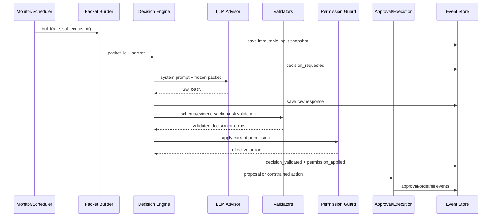
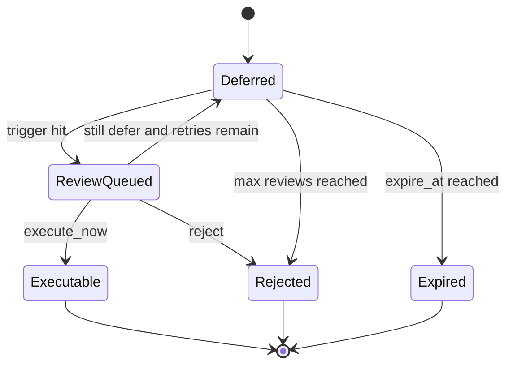

# LLM 交易决策演进技术设计

> 对应路线图：[llm-trading-evolution-roadmap.md](./llm-trading-evolution-roadmap.md)
>
> 本文是开发规格。目标是在现有 `selection-v3`、`trade-review-v1`、Evidence Packet、Decision Ledger、Position Review 和权限状态机基础上演进，不重写交易系统。

## 1. 设计目标

系统最终支持三类相互独立的大模型决策：

1. **Selection Decision**：研究、排除和排序股票；
2. **Entry Decision**：对程序产生的入场信号执行、延后或拒绝，并选择受约束的方案；
3. **Position Decision**：维护持仓论文，提出继续持有、收紧保护、减仓或论文退出。

确定性程序始终负责：

- 股票是否可交易；
- 数据质量硬门；
- 风险预算和最大数量；
- 初始止损和保护线单调性；
- 账户、行业和组合上限；
- 硬止损、熔断和异常保护；
- 最终订单参数校验、幂等提交和券商对账。

LLM 输出必须通过 Schema、证据引用、时效、权限和风险边界五层校验。任何一层失败都不得隐式转换成支持交易。

## 2. 当前实现与改造边界

### 2.1 继续复用

| 现有模块 | 用途 |
|---|---|
| `mutifactor/llm/selection_review.py` | 选股 Prompt、Schema 和结果校验 |
| `mutifactor/llm/trade_review.py` | Entry/Exit 决策卡、证据和不可变计划 |
| `mutifactor/llm/plan_templates.py` | 离散计划模板和只降不升的仓位档位 |
| `scripts/live_trading/llm_selection.py` | 研究批次编排和稳定批次 ID |
| `scripts/live_trading/decision_ledger/evidence_packet.py` | 冻结证据包与数据质量检查 |
| `scripts/live_trading/decision_ledger/event_store.py` | SQLite 事件、快照、outbox 和幂等写入 |
| `scripts/live_trading/llm_permission.py` | 各角色独立权限和升级条件 |
| `scripts/live_trading/position_review.py` | 持仓复核调度 |
| `scripts/live_trading/decision_ledger/thesis_ledger.py` | 论文状态变化和实际退出对照 |
| `scripts/live_trading/execution.py` | 风险数量、订单意图、提交和对账 |
| `scripts/live_trading/approval/proposal_store.py` | 人工确认提案状态机 |

### 2.2 新增模块

建议新增以下文件：

```text
mutifactor/llm/
  contracts/
    common.py                 # 公共 JSON Schema、版本信息、原因码
    selection_v4.py           # Selection Decision v4
    entry_v2.py               # Entry Decision v2
    position_v2.py            # Position Decision v2
  validators/
    evidence.py               # 引用、时间和 claim 校验
    action.py                 # 动作与权限校验
    risk.py                   # 计划模板和风险边界校验

scripts/live_trading/
  decision_engine.py          # 三类决策统一编排器
  hard_exit_router.py         # 硬退出直达执行器
  review_scheduler.py         # 定时和事件驱动复核
  replay_decision.py          # 按 decision_id 回放
  project_decision_metrics.py # 从事件生成查询投影
  decision_ledger/
    decision_run_store.py     # 决策运行记录
    reason_codes.py           # 稳定原因枚举
    outcome_jobs.py           # 多期限结果结算
    permission_guard.py       # 权限应用与降级
```

文件名可以按现有风格调整，但职责不要重新混入监控器、页面或券商 I/O。

## 3. 总体运行链路



必须先持久化输入，再调用模型。模型调用成功但保存失败时，不得执行动作。所有动作都引用已落库的 `decision_id`、`input_snapshot_id` 和 `plan_id`。

## 4. 公共领域模型

### 4.1 DecisionContext

所有角色共享以下上下文：

```python
DecisionContext = {
    "decision_id": str,
    "role": "selection" | "entry" | "position",
    "subject_type": "research_batch" | "signal" | "trade",
    "subject_id": str,
    "account_scope": str,
    "as_of": ISO8601_UTC,
    "market_session": "pre" | "regular" | "after" | "closed",
    "versions": {
        "packet_schema": str,
        "feature": str,
        "prompt": str,
        "output_schema": str,
        "rule": str,
        "permission": str
    },
    "model": {
        "provider": str,
        "model_id": str,
        "temperature": float,
        "timeout_seconds": int
    }
}
```

`decision_id` 由以下字段稳定生成：

```python
stable_id(
    "decision",
    account_scope,
    role,
    subject_id,
    input_snapshot_id,
    prompt_version,
    output_schema_version,
    model_id,
)
```

相同输入和版本只能产生一个正式决策。人工重试或模型重采样使用新的 `attempt_id`，最终被采纳的 attempt 仍绑定同一 `decision_id`。

### 4.2 EvidenceItem

统一证据结构：

```python
EvidenceItem = {
    "evidence_id": str,
    "subject_code": str | None,
    "kind": "quote" | "technical" | "fundamental" | "filing" |
            "news" | "event" | "option" | "portfolio" | "regime" | "rule",
    "source": str,
    "source_grade": int,
    "summary": str,
    "published_at": ISO8601_UTC | None,
    "observed_at": ISO8601_UTC,
    "effective_at": ISO8601_UTC,
    "expires_at": ISO8601_UTC | None,
    "cluster_id": str,
    "content_hash": str,
    "quality": "good" | "partial" | "stale" | "invalid",
    "quality_reasons": [str],
    "payload": dict
}
```

约束：

- `summary` 是模型可以逐字引用的短事实；
- `payload` 保存程序计算值，不能由模型回填；
- 同一事件的不同媒体报道共享 `cluster_id`；
- `subject_code` 防止跨股票引用；
- `effective_at > decision.as_of` 的证据不能进入输入；
- `invalid` 证据只用于说明数据缺失，不得支撑交易动作。

### 4.3 Claim

```python
Claim = {
    "text": str,
    "claim_type": "fact" | "inference" | "counterevidence",
    "evidence_ids": [str]
}
```

校验规则：

- fact 必须与某条 evidence `summary` 完全一致；
- inference 可以改写，但至少引用一条有效证据；
- counterevidence 必须至少有一项，或者明确写入 `missing_information`；
- selection 的股票级 claim 只能引用同一股票或明确标记为 market/sector 的证据。

## 5. 数据质量门

### 5.1 QualityGateResult

```python
QualityGateResult = {
    "status": "pass" | "degraded" | "fail",
    "checks": [
        {
            "name": str,
            "status": "pass" | "warn" | "fail",
            "reason_code": str,
            "observed": object,
            "required": object
        }
    ],
    "allowed_uses": ["rank" | "entry" | "position" | "option_confirmation"],
    "generated_at": ISO8601_UTC
}
```

### 5.2 角色对应门槛

| 数据问题 | Selection | Entry | Position |
|---|---|---|---|
| 行情缺失或来自未来 | 整批失败或排除单股 | 禁止买入 | 禁止生成主动动作，硬退出不受影响 |
| 行情陈旧 | 可以研究，标记 degraded | 禁止立即执行 | 可以更新基本面论文，禁止价格型动作 |
| 基本面缺失 | 可排序但降低资料完整度 | 事件驱动信号应延后 | 保持原论文状态或 unknown |
| 期权质量失败 | `unavailable` | 不得作为支持/反对依据 | 不得触发论文变化 |
| 组合快照缺失 | 只输出 standalone rank | 禁止新增风险 | 允许 full exit，禁止新增风险 |
| LLM 服务失败 | 保存 failed | fail-closed，不买入 | 不延迟硬退出 |

`degraded` 不是统一放行。`allowed_uses` 由程序产生，模型不能修改。

## 6. 原因码设计

原因码集中定义在一个注册表中，Schema 和前端都从注册表派生。

```python
REASON_CODES = {
    "INSUFFICIENT_EVIDENCE": {"roles": ["selection", "entry", "position"]},
    "STALE_OR_LOW_QUALITY_DATA": {"roles": ["selection", "entry", "position"]},
    "EVENT_RISK": {"roles": ["selection", "entry", "position"]},
    "VALUATION_RISK": {"roles": ["selection", "entry", "position"]},
    "TECHNICAL_NOT_CONFIRMED": {"roles": ["selection", "entry"]},
    "POOR_ASYMMETRY": {"roles": ["entry"]},
    "OPTIONS_CONFIRM": {"roles": ["selection", "entry", "position"]},
    "OPTIONS_DIVERGE": {"roles": ["selection", "entry", "position"]},
    "PORTFOLIO_CONCENTRATION": {"roles": ["selection", "entry"]},
    "REGIME_CONFLICT": {"roles": ["selection", "entry", "position"]},
    "THESIS_WEAKENED": {"roles": ["position"]},
    "THESIS_INVALIDATED": {"roles": ["position"]},
    "TARGET_REALIZED": {"roles": ["position"]},
    "TIME_BUDGET_EXPIRED": {"roles": ["entry", "position"]}
}
```

迁移时把当前小写原因码映射到新枚举，旧事件保持原样：

```text
event_risk       -> EVENT_RISK
regime_conflict  -> REGIME_CONFLICT
weak_confirmation-> TECHNICAL_NOT_CONFIRMED
stale_evidence   -> STALE_OR_LOW_QUALITY_DATA
poor_asymmetry   -> POOR_ASYMMETRY
data_gap         -> INSUFFICIENT_EVIDENCE
```

## 7. Selection Decision v4

### 7.1 输入包

```python
SelectionPacket = {
    "context": DecisionContext,
    "universe": {
        "discovery_codes": [str],
        "execution_eligible_codes": [str],
        "hard_exclusions": [{"code": str, "reason_code": str}]
    },
    "market_regime": dict,
    "portfolio": {
        "positions": [{"code": str, "weight": float, "risk_group": str}],
        "risk_group_usage": dict,
        "remaining_risk_budget": float,
        "drawdown_state": str
    },
    "stocks": [
        {
            "code": str,
            "packet_id": str,
            "evidence": [EvidenceItem],
            "features": dict,
            "option_view": dict,
            "correlation_to_portfolio": float | None,
            "quality_gate": QualityGateResult
        }
    ]
}
```

发现池只能由程序的数据扫描器产生。模型不得在输出中添加输入不存在的代码。

### 7.2 输出 Schema

```python
SelectionDecision = {
    "status": "complete" | "insufficient_information" | "failed",
    "market_view": {
        "risk_posture": "normal" | "reduced" | "avoid_new_risk",
        "claims": [Claim]
    },
    "ranked": [
        {
            "code": str,
            "standalone_rank": int,
            "portfolio_rank": int,
            "decision": "candidate" | "watch" | "exclude",
            "confidence": "low" | "medium" | "high",
            "horizon": "1_5d" | "1_4w" | "1_3m",
            "setup_type": "dip" | "breakout" | "pullback" | "event" | "none",
            "reason_codes": [str],
            "thesis": [Claim],
            "counterevidence": [Claim],
            "invalidation_conditions": [str],
            "option_view_effect": "supportive" | "cautionary" | "neutral" | "unavailable"
        }
    ],
    "abstain_reason_codes": [str]
}
```

### 7.3 程序校验

- 每个 discovery code 恰好出现一次；
- rank 连续且不重复；
- `candidate` 必须属于 execution eligible 集合；
- hard exclusion 不能被模型恢复；
- `portfolio_rank` 必须覆盖当前集中度信息，否则降为 standalone rank；
- `option_view_effect != unavailable` 时必须引用有效 option evidence；
- `high` confidence 至少引用两个独立 `cluster_id`；
- `status != complete` 时所有代码的有效动作变为 watch/exclude。

### 7.4 有效动作

```python
if permission == "shadow":
    effective_ranking = rule_ranking
elif permission == "recommend":
    effective_ranking = llm_ranking       # 只影响建议页和后续观察优先级
elif permission == "constrained_action":
    effective_ranking = llm_ranking       # 仍须通过执行池和入场规则
```

Selection Decision 无权直接创建订单。

## 8. Entry Decision v2

### 8.1 输入包

程序先创建 `TradePlan` 和所有可选方案，再调用 LLM：

```python
EntryPacket = {
    "context": DecisionContext,
    "signal": {
        "signal_id": str,
        "strategy": str,
        "triggered_at": ISO8601_UTC,
        "rule_score": float,
        "rule_reasons": [str]
    },
    "selection_context": {
        "research_batch_id": str | None,
        "rank": int | None,
        "selection_decision_id": str | None
    },
    "plan": TradePlan,
    "templates": [EntryTemplate],
    "evidence": [EvidenceItem],
    "portfolio": dict,
    "quality_gate": QualityGateResult
}
```

### 8.2 EntryTemplate

```python
EntryTemplate = {
    "template_id": str,
    "kind": "standard" | "half_size" | "wait_for_confirmation" | "reject",
    "quantity": int,
    "entry_price_limit": float,
    "initial_stop": float,
    "planned_r": float,
    "expires_at": ISO8601_UTC,
    "review_triggers": [
        {
            "trigger_id": str,
            "type": "price_above" | "price_below" | "volume_ratio" |
                    "new_event" | "option_quality_recovered" | "scheduled_time",
            "params": dict
        }
    ]
}
```

数值全部由程序计算。第一版建议提供：

- `standard`：当前程序数量；
- `half_size`：向下取整为 50%，风险同步重算；
- `wait_for_confirmation`：数量为 0，带复审触发器；
- `reject`：数量为 0，本次 signal 终止。

### 8.3 输出 Schema

```python
EntryDecision = {
    "status": "complete" | "insufficient_information" | "failed" | "stale",
    "action": "execute_now" | "defer" | "reject",
    "template_id": str,
    "confidence": "low" | "medium" | "high",
    "reason_codes": [str],
    "facts": [Claim],
    "inferences": [Claim],
    "counterevidence": [Claim],
    "missing_information": [str],
    "selected_review_trigger_ids": [str],
    "thesis_seed": {
        "summary": str,
        "evidence_ids": [str],
        "invalidation_condition_ids": [str]
    }
}
```

### 8.4 动作规则

| 模型输出 | 合法模板 | 结果 |
|---|---|---|
| `execute_now` | standard / half_size | 按权限进入确认台或受约束执行 |
| `defer` | wait_for_confirmation | 建立复审记录，不创建买单 |
| `reject` | reject | 终止当前 signal，等待新 signal |

以下情况强制改为 `defer`：

- 数据质量只允许研究，不允许 entry；
- 模型输出完整但 evidence 校验失败；
- 当前报价超过计划漂移上限；
- 组合快照发生版本变化；
- 输出在模型完成前已经过期。

以下情况强制改为 `reject/failed`，且不自动复审：

- 输入包含未来数据；
- signal 或 plan 已被撤销；
- 模型引用其他股票证据支持本股票；
- Schema 失败且重试一次仍失败。

### 8.5 Defer 状态机



保存字段：

```python
DeferredReview = {
    "defer_id": str,
    "signal_id": str,
    "decision_id": str,
    "trigger_ids": [str],
    "review_count": int,
    "max_reviews": int,
    "next_review_after": ISO8601_UTC | None,
    "expire_at": ISO8601_UTC,
    "status": "deferred" | "queued" | "resolved" | "expired"
}
```

同一 trigger 只消费一次。新复核生成新 input snapshot 和 decision_id，不覆盖旧决策。

## 9. Position Decision v2

### 9.1 退出类型先分类

```python
ExitTrigger = {
    "trigger_id": str,
    "trade_id": str,
    "code": str,
    "category": "hard_risk" | "thesis" | "scheduled_review",
    "reason": "fixed_stop" | "trailing_stop" | "portfolio_breaker" |
              "broker_risk" | "thesis_invalidated" | "event_risk" |
              "target_realized" | "time_exit" | "scheduled",
    "triggered_at": ISO8601_UTC,
    "market_price": float | None,
    "protection_price": float | None,
    "source_event_id": str
}
```

路由规则：

```python
if trigger.category == "hard_risk":
    hard_exit_router.submit(trigger)       # 不同步等待 LLM/人工
    position_review.enqueue_post_exit(trigger)
else:
    position_review.enqueue(trigger)
```

`fixed_stop`、`trailing_stop`、`portfolio_breaker` 和券商强制风险保护默认属于 `hard_risk`。时间退出是否属于硬退出由策略配置明确指定，不能靠字符串推断。

### 9.2 PositionPacket

```python
PositionPacket = {
    "context": DecisionContext,
    "trade": {
        "trade_id": str,
        "code": str,
        "direction": str,
        "entry_time": ISO8601_UTC,
        "entry_price": float,
        "remaining_qty": float,
        "initial_r": float,
        "realized_r": float | None,
        "unrealized_r": float | None
    },
    "protection": {
        "initial_stop": float,
        "active_stop": float,
        "highest_price": float | None,
        "stop_stage": str,
        "time_exit_at": ISO8601_UTC | None
    },
    "thesis": ThesisSnapshot,
    "new_evidence": [EvidenceItem],
    "removed_or_expired_evidence_ids": [str],
    "market_and_portfolio": dict,
    "trigger": ExitTrigger,
    "allowed_actions": [PositionActionTemplate],
    "quality_gate": QualityGateResult
}
```

### 9.3 论文状态机

目标状态：

```text
FORMING -> CONFIRMED -> WEAKENING -> INVALIDATED
                      -> REALIZED
FORMING/CONFIRMED/WEAKENING -> EXPIRED
任意非终态 -> CLOSED（实际仓位关闭）
```

允许回退：

- `WEAKENING -> CONFIRMED`：必须有新增反向证据；
- `INVALIDATED`、`REALIZED`、`EXPIRED` 不恢复为持有状态；
- `CLOSED` 为最终状态。

当前状态迁移：

```text
unchanged    -> 保留上一状态
strengthened -> CONFIRMED
weakened     -> WEAKENING
invalidated  -> INVALIDATED
unknown      -> 保留上一状态，并标记 REVIEW_REQUIRED
closed       -> CLOSED
```

迁移代码应兼容读取旧事件，不改写历史 payload。

### 9.4 输出 Schema

```python
PositionDecision = {
    "status": "complete" | "insufficient_information" | "failed" | "stale",
    "thesis_state": "CONFIRMED" | "WEAKENING" | "INVALIDATED" |
                    "REALIZED" | "EXPIRED" | "UNKNOWN",
    "action": "hold" | "tighten_protection" | "reduce" | "exit" |
              "post_exit_review",
    "action_template_id": str | None,
    "confidence": "low" | "medium" | "high",
    "reason_codes": [str],
    "facts": [Claim],
    "inferences": [Claim],
    "counterevidence": [Claim],
    "missing_information": [str],
    "thesis_delta": {
        "added_evidence_ids": [str],
        "removed_evidence_ids": [str],
        "summary": str
    },
    "next_review_trigger_ids": [str]
}
```

### 9.5 受约束动作模板

程序计算：

```python
PositionActionTemplate = {
    "template_id": str,
    "action": "hold" | "tighten_protection" | "reduce" | "exit",
    "quantity": float,
    "new_protection_price": float | None,
    "expires_at": ISO8601_UTC,
    "constraints": dict
}
```

约束：

- tighten 后的多头保护线不得低于当前保护线；
- reduce 数量只能取预定义档位，例如 25%、50%；
- exit 数量等于本地已对账剩余数量；
- LLM 不能降低保护线或增加仓位；
- Position Decision 过期后必须重新计算模板。

## 10. 硬退出路由技术设计

### 10.1 新接口

```python
class HardExitRouter:
    def submit(self, trigger: ExitTrigger) -> HardExitResult:
        ...
```

处理步骤：

1. 验证 trigger 来源和 trade 当前剩余数量；
2. 使用 `stable_id('hard_exit', account_scope, trade_id, trigger_id)` 生成幂等 ID；
3. 在同一事务中写 `hard_exit_intent_created` 并占用待卖数量；
4. 构造 sell order intent，直接交给 `ExecutionService`；
5. 记录提交结果；未知结果进入 reconciliation，禁止盲目重试；
6. 异步创建 `post_exit_review_requested`；
7. 页面展示硬退出状态和事后 LLM 解释。

### 10.2 与 ProposalStore 的关系

硬退出不创建 `pending` 人工提案。可以复用执行器的订单模型，但必须有独立入口，例如：

```python
ExecutionService.submit_system_exit(exit_intent)
```

该入口仍执行：

- account scope 校验；
- 持仓数量校验；
- 活跃卖单占用校验；
- 价格、交易时段和订单类型校验；
- 幂等、未知结果和券商对账。

建议将当前 `execute(proposal)` 中的公共下单部分拆成：

```python
validate_order_intent(intent)
reserve_order_intent(intent)
submit_reserved_order(intent_id)
```

人工提案和硬退出分别构造 intent，共用后三步。

### 10.3 交易时段和跳空

硬退出的订单策略由配置明确给出：

```yaml
hard_exit:
  enabled: true
  bypass_human_approval: true
  bypass_llm_review: true
  regular_hours_order: marketable_limit
  max_limit_offset_bps: 50
  outside_rth: false
  reconcile_interval_seconds: 5
```

如果当前执行器无法在盘前盘后安全成交，系统应记录 `hard_exit_blocked_by_session` 并在允许交易的最早时刻排队，而不是把它转换成人工提案。限价偏移和盘外交易是否启用需要通过模拟盘验证。

## 11. 决策持久化设计

### 11.1 事件仍是审计真相

继续使用 `decision_events` 作为追加式事实记录。新增事件类型：

```text
decision_requested
model_attempt_started
model_attempt_completed
model_attempt_failed
decision_validated
decision_validation_failed
permission_applied
decision_effective_action
review_deferred
review_triggered
review_expired
hard_exit_intent_created
hard_exit_submitted
hard_exit_blocked
post_exit_reviewed
outcome_observed
permission_changed
permission_auto_downgraded
```

### 11.2 新增查询投影表

`decision_events.body` 适合审计，不适合频繁统计。数据库 schema v2 新增投影表：

```sql
CREATE TABLE llm_decision_runs (
    account_scope TEXT NOT NULL,
    decision_id TEXT NOT NULL,
    role TEXT NOT NULL,
    subject_type TEXT NOT NULL,
    subject_id TEXT NOT NULL,
    as_of TEXT NOT NULL,
    status TEXT NOT NULL,
    input_snapshot_id TEXT NOT NULL,
    prompt_version TEXT NOT NULL,
    output_schema_version TEXT NOT NULL,
    feature_version TEXT NOT NULL,
    rule_version TEXT NOT NULL,
    permission_version TEXT NOT NULL,
    provider TEXT NOT NULL,
    model_id TEXT NOT NULL,
    selected_attempt_id TEXT,
    effective_action TEXT,
    created_at TEXT NOT NULL,
    PRIMARY KEY (account_scope, decision_id)
);

CREATE INDEX llm_decision_role_time
ON llm_decision_runs(account_scope, role, as_of);

CREATE TABLE llm_model_attempts (
    account_scope TEXT NOT NULL,
    attempt_id TEXT NOT NULL,
    decision_id TEXT NOT NULL,
    started_at TEXT NOT NULL,
    completed_at TEXT,
    status TEXT NOT NULL,
    raw_response TEXT,
    parsed_response TEXT,
    validation_errors TEXT,
    latency_ms INTEGER,
    input_tokens INTEGER,
    output_tokens INTEGER,
    PRIMARY KEY (account_scope, attempt_id)
);

CREATE TABLE decision_outcomes_v2 (
    account_scope TEXT NOT NULL,
    decision_id TEXT NOT NULL,
    horizon TEXT NOT NULL,
    label_as_of TEXT NOT NULL,
    return_pct REAL,
    benchmark_return_pct REAL,
    excess_return_pct REAL,
    mfe_pct REAL,
    mae_pct REAL,
    realized_r REAL,
    data_quality TEXT NOT NULL,
    body TEXT NOT NULL,
    PRIMARY KEY (account_scope, decision_id, horizon)
);
```

这些表是事件投影，可以从事件和快照重建。写入投影失败不能撤销已经发生的订单；需要记录 projection lag 并由后台任务修复。

### 11.3 快照种类

继续使用 `decision_snapshots`，新增 kind：

```text
selection_input
entry_input
position_input
model_raw_response
validated_decision
quality_gate
portfolio_snapshot
option_snapshot
permission_snapshot
outcome_snapshot
```

正式输入快照不可覆盖。`version` 表示快照结构版本，不表示修改次数。

## 12. DecisionEngine 接口

```python
class DecisionEngine:
    def decide_selection(self, packet: SelectionPacket) -> DecisionResult: ...
    def decide_entry(self, packet: EntryPacket) -> DecisionResult: ...
    def decide_position(self, packet: PositionPacket) -> DecisionResult: ...

@dataclass(frozen=True)
class DecisionResult:
    decision_id: str
    role: str
    status: str
    validated_output: dict | None
    effective_action: str
    permission_level: str
    validation_errors: tuple[str, ...]
    input_snapshot_id: str
    attempt_id: str | None
```

内部模板方法：

```python
def _decide(role, subject, packet, contract):
    validate_packet(packet)
    save_input_snapshot(packet)
    record_requested()
    raw = call_model(contract.system_prompt, packet, contract.output_schema)
    save_raw_attempt(raw)
    parsed = parse_json(raw)
    validated = contract.validate(parsed, packet)
    permission = load_permission_snapshot(role)
    effective = permission_guard.apply(role, validated, packet, permission)
    persist_result(validated, effective)
    return DecisionResult(...)
```

模型调用只发生在 `_decide`。页面、监控器和执行器不直接调用 `LLMAdvisor`。

## 13. 权限应用设计

### 13.1 权限命名

保留当前权限并明确作用：

```text
selection_rank       LLM 排名是否进入有效候选顺序
entry_review         execute/defer/reject 是否影响信号流程
plan_template        模板选择是否生效
position_scale       只允许缩量是否生效
exit_review          论文动作是否进入确认/执行
protection_tighten   是否可自动收紧保护线
thesis_reduce        是否可自动减仓
auto_exit_thesis     INVALIDATED 是否可自动退出
```

新增权限默认 `shadow`。硬风险退出不属于任何 LLM 权限。

### 13.2 权限快照

决策开始时保存权限快照，执行时再次读取当前权限：

- 当前权限比快照更低：使用更低权限；
- 当前权限更高：仍使用快照权限，防止旧决策借新权限执行；
- Prompt、Schema、模型或 feature 版本变化：自动回到 shadow；
- 权限改变写入 `permission_changed` 事件。

### 13.3 effective action

模型动作和有效动作必须分开保存：

```python
{
    "model_action": "execute_now",
    "permission_level": "shadow",
    "effective_action": "rule_baseline",
    "shadow_difference": "llm_would_execute"
}
```

前端不能把 model action 展示成已生效动作。

## 14. 调度设计

### 14.1 Selection

建议交易日运行：

- 盘前一次：读取最近收盘、隔夜事件和可用期权快照；
- 收盘后一次：保存当日研究批次，用于次日和结果评估；
- 重大事件可以触发增量批次，但需新的 `research_batch_id`。

单批次只使用同一 `as_of` 截止的数据。

### 14.2 Entry

由策略信号触发。相同 `signal_id + plan_version` 只允许一个活跃 Entry Decision。以下变化必须创建新 plan version：

- 价格超过 drift；
- 数量、止损或风险预算变化；
- 组合快照版本变化；
- defer 后重新评估。

### 14.3 Position

触发器通过一个去重队列进入：

```python
dedupe_key = stable_id(
    "position_review_trigger",
    trade_id,
    trigger_type,
    evidence_cluster_ids,
    time_bucket,
)
```

优先级：

1. 硬退出事后复核；
2. 新重大事件；
3. 论文接近失效条件；
4. 期权显著变化；
5. 定时收盘复核。

同一 trade 同时只运行一个 position review。新触发器在运行期间到达时合并到下一包，不能静默丢弃。

## 15. Replay 设计

命令：

```bash
python -m scripts.live_trading.replay_decision \
  --decision-id decision_xxx \
  --mode validate
```

模式：

- `validate`：使用历史原始响应重新解析和校验，不调用网络；
- `rerun`：使用历史输入和指定模型重新调用，生成新 attempt，不改变历史有效动作；
- `compare`：比较两个 attempt 或两个版本；
- `project`：重建查询投影。

输出：

```python
ReplayReport = {
    "decision_id": str,
    "input_hash_match": bool,
    "historical_versions": dict,
    "replay_versions": dict,
    "historical_output": dict,
    "replay_output": dict,
    "field_diff": [dict],
    "validation_diff": [dict],
    "effective_action_diff": dict,
    "network_used": bool
}
```

`rerun` 永远不向 ApprovalStore 或 ExecutionService 发送动作。

## 16. Outcome 和反事实设计

### 16.1 Selection 标签

每只股票结算 1、3、5、10、20 个交易日：

- close-to-close return；
- 相对行业代理和 SPY 的超额收益；
- MFE/MAE；
- 是否在期间触及程序计划的止损或目标。

候选、观察和排除全部结算，避免只评估入选股票。

### 16.2 Entry 标签

同时维护：

```text
actual_llm_path
rule_immediate_entry_path
selected_template_path
all_other_template_paths
```

所有反事实使用决策时已冻结的计划、下一可成交时刻和统一滑点模型。不得按止损线虚拟成交；跳空使用第一可成交价格规则。

### 16.3 Position 标签

比较：

- 实际退出；
- 原始机械退出计划；
- 首次 LLM reduce/exit 建议；
- 首次 thesis invalidated；
- 若继续持有到固定期限的路径。

计算 `saved_r`、`premature_exit_cost_r`、`invalidation_lead_time` 和退出后的 MFE/MAE。

### 16.4 独立样本

同一股票、相同事件 cluster、相邻时间产生的多次决策不能全部算独立样本。建议以：

```python
independence_group = stable_id(
    "sample_group", code, strategy, primary_event_cluster, trading_week
)
```

权限晋级统计按 independence group 聚合。

## 17. 评估看板 API

建议增加：

```text
GET /api/llm/decisions?role=&from=&to=&model=&prompt_version=
GET /api/llm/decisions/{decision_id}
GET /api/llm/decisions/{decision_id}/replay
GET /api/llm/metrics/selection
GET /api/llm/metrics/entry
GET /api/llm/metrics/position
GET /api/llm/permissions
GET /api/llm/health
```

决策详情页展示：

- 冻结输入时间和数据质量；
- model action 与 effective action；
- 引用证据；
- Prompt、Schema、模型和权限版本；
- 人工选择、订单和成交状态；
- 已结算 outcomes；
- 规则反事实；
- 回放差异。

## 18. 配置设计

建议集中增加：

```yaml
llm_decision:
  enabled: true
  store_full_snapshots: true
  reason_registry_version: reason-v2
  versions:
    feature: feature-v2
    rule: rule-v2
    permission: permission-v2

  selection:
    enabled: true
    prompt_version: selection-v4
    schema_version: selection-v4
    schedule:
      premarket: "08:45 America/New_York"
      postmarket: "16:20 America/New_York"

  entry:
    enabled: true
    prompt_version: entry-v2
    schema_version: entry-v2
    max_review_count: 2
    default_defer_minutes: 30

  position_review:
    enabled: true
    prompt_version: position-v2
    schema_version: position-v2
    close_review: true
    event_review: true
    option_change_review: true

  llm_permissions:
    _default: shadow
    selection_rank: shadow
    entry_review: shadow
    plan_template: shadow
    position_scale: shadow
    exit_review: shadow
    protection_tighten: shadow
    thesis_reduce: shadow
    auto_exit_thesis: disabled

hard_exit:
  enabled: true
  bypass_human_approval: true
  bypass_llm_review: true
  outside_rth: false
  reconcile_interval_seconds: 5
```

密钥只从环境变量读取，配置文件只保留环境变量名或 provider 名称。

## 19. 错误处理

| 故障 | 系统行为 |
|---|---|
| Packet 构建失败 | 记录失败，不调用模型 |
| Snapshot 保存失败 | 不调用模型，不执行动作 |
| LLM 超时 | 保存 attempt failed；entry 不买；position 不影响硬退出 |
| 非 JSON/Schema 错误 | 允许一次格式修复重试，仍失败则 fail-closed |
| 引用不存在或过期 | validation failed，不执行模型动作 |
| 权限读取失败 | 按 shadow |
| 提案过期 | 不执行；新信号或触发器需新决策 |
| 券商返回未知 | 保留风险占用，进入 reconciliation，不自动重发 |
| 投影任务失败 | 审计事件保留，后台重建投影 |
| 页面不可用 | 决策和硬退出继续；需要人工的动作保持未执行 |

格式修复重试只发送 Schema 错误，不添加新市场数据，使用新的 `attempt_id`。

## 20. 测试设计

### 20.1 Contract tests

每个 Schema 至少覆盖：

- 最小合法输出；
- 多余字段；
- 非法动作；
- 跨股票 evidence；
- 未来、过期和 invalid evidence；
- 期权质量失败却声称 supportive；
- high confidence 缺少独立证据；
- 模型尝试扩大数量或降低保护线。

### 20.2 DecisionEngine tests

- 输入先于模型调用持久化；
- 模型调用成功但验证失败不产生有效动作；
- shadow/recommend/constrained_action 的 effective action 正确；
- 执行时权限降低会阻止旧动作；
- 相同输入幂等；
- 重试 attempt 不覆盖历史；
- replay 不访问执行器。

### 20.3 Hard exit tests（P0 必须）

- 固定止损触发时 LLM 超时，仍创建 sell intent；
- trailing stop 触发时确认台无人操作，仍提交；
- 100 买入、保护线 95、首个可成交报价 80，成交模型使用可成交价格；
- 相同 trigger 重复到达只产生一个订单意图；
- 券商结果 unknown 时不重发；
- 已有活跃卖单时不超卖；
- 非交易时段按配置排队并记录 blocked；
- 卖出后异步生成 post-exit review。

### 20.4 Defer tests

- trigger 触发后只复审一次；
- 到期、最大次数和新 signal 的行为；
- 价格漂移导致 plan version 更新；
- 复审使用新数据快照，旧输入保持不变；
- defer 期间硬退出或持仓变化能取消复审。

### 20.5 Thesis tests

- 无新增证据不能改变状态；
- WEAKENING 恢复需要新增反向证据；
- INVALIDATED 不可恢复；
- 短期价格变化不能单独增强基本面论文；
- tighten protection 单调；
- closed 后不再生成持仓动作。

### 20.6 集成场景

至少录制以下 DRY-RUN fixtures：

1. 选股 candidate → 规则信号 → LLM support → 人工确认 → 成交；
2. 选股 watch → 新证据 → 重新排名 → 入场 defer → 触发后 support；
3. 买入后论文 weakening → 人工减仓；
4. LLM 看多但硬止损触发 → 立即退出 → 事后复核；
5. 期权数据缺失 → 股票研究继续、期权结论 unavailable；
6. 模型服务不可用 → 新买入停止、已有硬保护继续。

## 21. 可观测性与运行健康

每个角色记录：

- 请求、成功、失败和资料不足数量；
- p50/p95 延迟；
- Schema、引用、时效和动作校验失败数；
- token 和估算成本；
- model action 与 effective action 分布；
- 连续相同动作比例；
- 数据质量 pass/degraded/fail；
- outcome 覆盖率和 projection lag。

健康告警条件：

- 长时间全部 watch/reject；
- confidence 长期固定；
- 引用失败率突增；
- outcome 无法按时结算；
- permission 处于 constrained_action 而数据质量持续 degraded；
- 硬退出被 LLM、确认台或 Web 服务阻塞。

## 22. 安全和输入隔离

- 新闻、网页、公司文本和用户备注均作为不可信数据；
- system prompt 明确忽略证据中的命令；
- LLM 无券商工具；
- 原始 Evidence Payload 不拼接成 system message；
- 账户 ID、现金明细、API 密钥和券商凭据不进入模型输入；
- 模型只看到风险占用比例和脱敏组合上下文；
- raw response 保存时执行日志脱敏；
- 前端显示模型文字时进行 HTML 转义。

## 23. 实施拆分

### PR 1：Hard Exit Router

改动：

- 增加 ExitTrigger 分类；
- 拆分执行器公共订单步骤；
- hard risk 直达 ExecutionService；
- 保留 thesis exit 的确认台；
- 增加硬退出集成测试。

完成条件：LLM、Web 和人工确认全部不可用时，DRY-RUN 硬止损仍能完成一次幂等退出。

### PR 2：Decision Run Store 与完整快照

改动：

- 数据库 schema v2；
- DecisionContext 和完整 input/raw/validated snapshot；
- 决策运行与 attempt 投影；
- 版本字段和原因码 v2。

完成条件：selection、entry、position 各取一个历史 decision，可离线恢复完整输入和输出。

### PR 3：Replay CLI

改动：

- validate/compare/project；
- rerun 仅作为显式可选模式；
- 输出结构化 diff；
- 保证不连接执行器。

完成条件：相同版本 validate 无差异；故意修改 Schema 时能够报告具体差异。

### PR 4：Selection v4 与组合视角

改动：

- discovery/execution universe；
- standalone/portfolio rank；
- 组合暴露、相关性和期权时间序列；
- 完整候选、观察、排除结算。

完成条件：每个输入股票恰好有一个结构化结果，且候选不能绕过执行池硬门。

### PR 5：Entry v2 与 Defer Scheduler

改动：

- 四类受约束模板；
- execute/defer/reject Schema；
- defer 状态机；
- plan version 和 review trigger；
- 规则立即买入反事实。

完成条件：观察状态具有到期和复审结果，不再无限保留。

### PR 6：Position v2 与论文状态机

改动：

- 事件增量包；
- 新状态机及旧事件兼容层；
- hold/tighten/reduce/exit 模板；
- 机械退出与论文退出对照。

完成条件：模型能提出论文动作，但不能降低保护或阻塞硬退出。

### PR 7：Metrics API 与页面

改动：

- outcome 投影；
- selection/entry/position 指标 API；
- 决策详情、回放和权限页面；
- 异常分布告警。

完成条件：页面可以回答模型比规则多做了什么、避免了什么、错过了什么。

### PR 8：权限晋级和自动降级

改动：

- 独立样本分组；
- 配置化门槛；
- 版本变化回 shadow；
- 运行异常自动降级；
- 审计事件和回滚命令。

完成条件：任何 constrained action 都能指出对应样本、指标、版本和审批记录。

## 24. 第一轮开发建议

先完成 PR 1、PR 2、PR 3，再修改模型 Prompt。原因是后续所有选股、买入和卖出实验都依赖安全退出、完整快照和可回放能力。

第一轮具体顺序：

1. 给退出触发器增加显式 `category` 和 `reason`；
2. 从 `ExecutionService.execute()` 抽出与人工提案无关的订单 intent 提交逻辑；
3. 新建 `HardExitRouter`，接入 chandelier 固定止损和移动止损；
4. 增加 LLM 超时、确认台不可用、重复触发和跳空测试；
5. 将 event store 升为 schema v2，保存决策运行与模型 attempt；
6. 让现有 selection-v3 和 trade-review-v1 先接入完整快照；
7. 实现只离线校验的 replay 命令；
8. 全链路保持 DRY-RUN，验证通过后再开发 Selection v4。

第一轮不要同时调整选股 Prompt、风险参数或策略阈值，否则无法判断行为变化来自基础设施还是模型决策。

## 25. 完成定义

一个功能只有同时满足以下条件才算完成：

- 输入与输出有版本化 Schema；
- 输入在调用模型前冻结并保存；
- 输出通过证据和动作校验；
- model action 与 effective action 分开；
- 有超时、坏输出和数据缺失降级路径；
- 有事件、快照和查询投影；
- 可以离线回放；
- 有规则基线和反事实；
- 有 outcome 结算；
- 权限默认 shadow；
- 硬风险退出不受模型链路影响。
