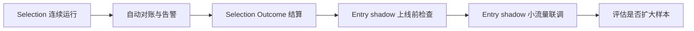

# LLM 交易系统下一步行动计划（2026-09-10）

> 当前状态：Selection 已在 `shadow` 模式完成第一轮真实联调；Entry、Position 保持 `legacy`；所有实际交易继续由规则和人工确认决定。

## 1. 下一阶段的核心目标

下一步先证明 Selection shadow 可以稳定、重复地生成可回放决策，再把 Entry 切入 shadow。暂不扩大 LLM 权限，也不同时接 Position，避免数据质量、契约稳定性和交易流程变化混在一起。

执行顺序：



## 2. P0：Selection shadow 稳定性观察

### 2.1 连续运行

至少积累 **3 个独立交易日** 的 Selection 决策。每天收盘数据可用后运行：

```bash
python3 scripts/live_trading/run_daily_selection.py --config config.yaml
```

每批必须满足：

- 8 只基础池股票全部出现在 candidate/watch/exclude 中；
- 每个 `decision_id` 只有一个正常模型 attempt；
- input snapshot、permission snapshot、validated snapshot 完整；
- replay 的 `input_hash_match=true`、`validated=true`、`network_used=false`；
- `permission_level=shadow`、`effective_action=rule_ranking`；
- 不产生 proposal、order 或 position 副作用。

### 2.2 增加自动对账命令

新增 `scripts/live_trading/reconcile_selection_decision.py`，输入 `decision_id` 或默认读取最新研究批次，输出：

```json
{
  "decision_id": "...",
  "batch_linked": true,
  "universe_count": 8,
  "ranked_count": 8,
  "attempt_count": 1,
  "snapshots": {
    "selection_input": 1,
    "permission_snapshot": 1,
    "validated_decision": 1
  },
  "replay_valid": true,
  "order_side_effects": 0,
  "passed": true
}
```

失败时返回非零退出码，便于以后加入调度和告警。

### 2.3 修正健康指标语义

当前 `/api/llm/health` 在只有一个有效 Selection 样本时返回 `all_same_action=true`。这是样本不足，不应视为模型退化。

修改 `project_decision_metrics.py`：

- 样本数低于最小门槛时返回 `status=insufficient_sample`；
- `all_same_action` 只在不少于 10 个独立决策时参与告警；
- 同时返回 `sample_size` 和 `independence_group_count`；
- 页面明确区分“尚无足够样本”和“动作分布异常”。

### 2.4 P0 完成条件

- 连续 3 个独立交易日全部通过自动对账；
- validated rate 达到 100%，或者所有失败都有明确、已修复的确定性原因；
- 没有重复模型调用；
- 没有交易副作用；
- Selection 页面与 ledger 内容一致。

若连续出现契约失败、输入时间错误或股票遗漏，继续修 Selection，不进入 Entry。

## 3. P1：接通 Selection Outcome

Selection 的价值不能用“模型输出看起来合理”判断，必须结算未来收益并保留反事实。

### 3.1 自动结算

把现有 `run_outcomes.py` 接入交易日调度，在日线收盘数据稳定后结算：

- 1d、3d、5d、10d、20d；
- 标的绝对收益；
- 相对 SPY 收益；
- 相对行业代理收益；
- 期间最大有利变动和最大不利变动；
- candidate/watch/exclude 分组表现。

数据不足的 horizon 保持 pending，并写明 `data_quality`，不能提前结算或静默跳过。

### 3.2 Selection 评估指标

至少展示：

- candidate 相对 watch/exclude 的收益差；
- Top 1/Top 3 命中率；
- confidence 与结果的校准；
- `option_view_effect` 分组表现；
- 模型排序相对规则排序的增量；
- 按模型、Prompt、contract version 分组的稳定性。

样本少于 20 个独立批次时只展示描述统计，不做权限晋级判断。

## 4. P1：Entry shadow 上线准备

Selection 连续 3 日稳定后，再把 Entry 从 `legacy` 切到 `shadow`。

### 4.1 上线前必须补齐的检查

1. 从真实历史 proposal 抽取 10 个冻结 fixture，覆盖：
   - 规则支持买入；
   - 价格漂移；
   - 期权数据不足；
   - 财报/重大事件临近；
   - 组合集中度不足；
   - proposal 在模型响应前发生 revision；
   - 模型超时和无效 JSON。
2. 逐个验证 Entry v2 输出只能选择程序生成的模板。
3. 验证 `model_action` 为 execute/defer/reject 时，shadow `effective_action` 仍为规则和人工基线。
4. 验证模型不可用时 proposal 不会永久停在“评估中”。
5. 验证同一 proposal revision 最多调用一次模型。

### 4.2 配置切换

通过上述检查后，只修改：

```yaml
llm_decision:
  engine_v2:
    selection: shadow
    entry: shadow
    position: legacy
```

首次 Entry shadow 联调只在 `DRY-RUN` 环境进行。至少观察 10 个独立 proposal，再考虑扩大到 SIMULATE。

### 4.3 Entry shadow 对账内容

每个 proposal 核对：

- proposal ID、signal ID、plan ID、plan revision；
- legacy input snapshot 与 v2 input snapshot 的关联；
- 模型选择的 template ID；
- model action 与 effective action；
- 人工决定、override reason；
- 最终订单状态；
- rule immediate-entry 反事实结果。

### 4.4 Defer 的处理

本阶段模型返回 `defer` 时只记录 `shadow_defer.would_create=true`，不创建活动 Defer，不改变信号生命周期。

只有以下条件全部满足后，才单独讨论 `entry_defer=recommend`：

- 至少 30 个独立 Entry 样本；
- defer 触发器可稳定消费且不会重复复审；
- defer 相对立即入场确实降低不利变动或提高风险调整收益；
- 过期、最大复审次数和持仓变化取消路径均通过。

## 5. 暂缓事项

以下事项不在紧接着的一轮实施：

- Position shadow；
- LLM 自动减仓或退出；
- constrained action 真实券商下单；
- 提高 Selection/Entry 权限；
- 同时修改 Prompt、策略阈值和风险参数。

Position 应在 Entry shadow 稳定后接入。硬止损仍始终绕过 LLM。

## 6. 建议的代码提交拆分

### Commit 1：Selection 自动对账

- 新增 `reconcile_selection_decision.py`；
- 增加对账单元测试和最新批次入口测试；
- 对账失败返回非零退出码。

### Commit 2：Metrics 小样本语义

- 修复 `all_same_action` 小样本误报；
- 增加 sample size 和 independence groups；
- 更新 health API 测试。

### Commit 3：Outcome 调度

- 接入 Selection 1/3/5/10/20d 结算；
- 增加缺数据、节假日和 horizon 边界测试；
- 页面展示结算覆盖率。

### Commit 4：Entry shadow fixtures

- 从真实 proposal 结构构建脱敏 fixture；
- 覆盖 revision、timeout、defer、reject 和模板绑定；
- 保持运行配置中的 Entry 为 legacy。

### Commit 5：Entry shadow 首次联调

- 配置切换 Entry=`shadow`；
- 运行 DRY-RUN proposal；
- 保存并检查决策对账报告；
- 发现问题时只修 Entry 契约或桥接，不调整交易策略。

## 7. 下一次立即执行的工作

下一次开发应从 **Selection 自动对账脚本** 开始，然后修正 Metrics 小样本语义。这两项完成后，让 Selection 再运行两个独立交易日。若三个交易日均稳定，再开始 Entry shadow fixtures。

现阶段不建议立即把 Entry 切为 shadow：Selection 刚完成第一个有效批次，而且首轮联调已经发现 schema、时间口径、兼容投影和 replay 四类真实问题。先把这些检查自动化，可以防止相同类型的问题进入买入确认链路。
