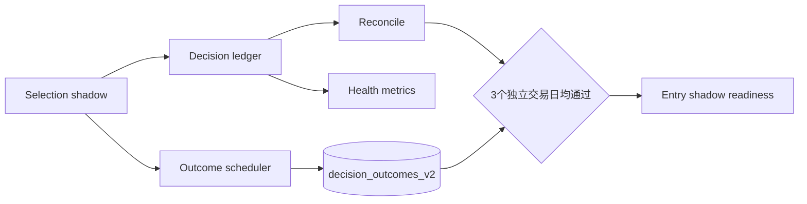

# LLM 交易下一阶段技术设计（2026-09-10）

本文把 `llm-trading-next-actions-2026-09-10.md` 转成可执行设计。当前发布状态保持：Selection=`shadow`、Entry=`legacy`、Position=`legacy`。本阶段不改变规则下单和人工确认的控制权。

## 1. 目标与边界

本阶段交付四条能力：Selection 批次自动对账、健康指标小样本语义、Selection Outcome 自动补算、Entry shadow 上线门。Selection shadow 只产生模型判断和账本记录，`effective_action` 仍为 `rule_ranking`；Outcome 调度只读取历史日线并写 `decision_outcomes_v2`。



## 2. Selection 自动对账

入口为 `scripts/live_trading/reconcile_selection_decision.py`：

```bash
python3 scripts/live_trading/reconcile_selection_decision.py --json
python3 scripts/live_trading/reconcile_selection_decision.py --decision-id DECISION_ID --json
```

不传 ID 时读取最新研究批次。账户作用域来自 `llm_decision.engine_v2.account_scope`，避免 Web、CLI 和完整系统查询不同 namespace。

对账规则：

1. 研究批次的 `decision_id` 必须指向 `selection/validated` DecisionRun，且 `subject_id` 等于 `research_batch_id`。
2. `candidates + exclusions` 必须无重复地覆盖整个冻结 universe。
3. 每个正式 DecisionRun 恰好有一个 `completed` attempt。
4. `selection_input`、`permission_snapshot`、`validated_decision` 各有一份对应快照。
5. 离线 replay 必须同时满足输入哈希一致、契约校验通过、未使用网络。
6. 批次必须是 `shadow/rule_ranking`。
7. 与该 decision ID 关联的订单、成交或开仓事件必须为零。

命令成功退出码为 0，任何检查失败退出码为 1。输出保留分项 checks，调度或 CI 可直接消费，无需解析日志文字。

## 3. 健康指标

`ProjectDecisionMetrics.health()` 的最小独立样本门槛默认为 10。独立组使用 DecisionRun 的 `subject_id`，Selection 对应研究批次，Entry 对应信号，Position 对应持仓复核对象。

返回语义：

| 条件 | status | all_same_action | 是否告警 |
|---|---|---:|---:|
| 样本或独立组少于 10 | `insufficient_sample` | `null` | 否 |
| 至少 10 组且动作完全相同 | `abnormal` | `true` | 是 |
| 至少 10 组且动作有分布 | `ok` | `false` | 否 |

确认台的健康区域显示样本进度和独立决策数。这样首批 Selection 的 `rule_ranking` 不再被误报为模型退化。

## 4. Outcome 数据模型与补算

Selection outcome 使用真正的 `decision_id` 作为外键，旧批次缺少它时才兼容使用 `research_batch_id`。每个 `(scope, decision_id, horizon, code)` 最多一行，由数据库主键保证幂等。

每次任务都扫描已有研究批次并补算 1/3/5/10/20 个交易日：

- 已具备足够未来收盘价：写 `data_quality=good` 和收益、SPY 超额收益、MFE、MAE。
- 已有基准价格但未来数据不足：写对应 horizon，`data_quality=pending_future_bars`，body 记录 `available_future_bars`。
- 后续数据到齐：同一主键用完整结果替换 pending。
- 没有决策基准收盘价：暂不构造虚假基准，下一交易日继续补算。

基准 SPY 与股票日线在同一次行情读取中取得。缺失 SPY 时仍可写绝对收益，基准收益保持空值。

## 5. 交易日调度

完整系统启动 `OutcomeSchedulerThread`，Web-only 不启动。默认纽约时间交易日 17:30 后到期；服务在 17:30 后重启仍可补跑，不要求卡在精确一分钟。

```yaml
llm_decision:
  outcomes:
    enabled: true
    time: "17:30"
```

调度器先原子写入 `daily_job_claimed`，键由 scope、任务类型和交易日组成，因此多进程或循环 tick 不会重复发起。同一结算本身也按 outcome 主键幂等。任务通过参数数组启动 Python 子进程，不使用 shell；超时为 30 分钟。任务失败写日志，历史 pending 会在下一交易日再次补算。

目前周末直接跳过。美股节假日可能领取一次空任务，但不会生成错误收益或交易副作用；接入正式交易日历可作为后续增强，不阻塞 shadow 验证。

## 6. Entry shadow 上线门

代码保持 Entry=`legacy`。切换前需要从真实 proposal 结构生成脱敏 fixtures，至少覆盖正常 execute、价格漂移、期权缺失、重大事件、组合限制、revision 竞争、timeout 和无效 JSON。现有场景回归验证契约、模板绑定和主链路；真实 fixtures 必须在累计三个通过对账的 Selection 交易日后冻结，避免用人工构造数据替代实际输入分布。

切换条件：

- 三个独立交易日的 Selection 对账全部 `passed=true`；
- 对账期间没有重复 attempt 和订单副作用；
- Outcome 已产生 pending 或 good 行，且 decision 外键正确；
- 真实 Entry fixtures 全部通过；
- 首轮只在 DRY-RUN 启用 `entry: shadow`。

## 7. 验证与运行手册

每日 Selection 完成后：

```bash
python3 scripts/live_trading/reconcile_selection_decision.py --json
```

手工验证 Outcome（不会下单）：

```bash
python3 scripts/live_trading/run_outcomes.py --config config.yaml
```

完整 DRY-RUN：

```bash
python3 run_all.py --dry-run
```

验收时保存三个交易日的对账 JSON，并查询 `/api/llm/health` 和 `/api/decision-health`。前者用于引擎指标，后者供确认台统一展示。

## 8. 后续实现顺序

1. 再运行两个独立交易日并保存对账结果。
2. 检查 1d Outcome 从 pending 转为 good，确认 SPY 相对收益存在。
3. 抽取并脱敏十条真实 Entry proposal fixtures。
4. 完成 Entry readiness 回归后，将 DRY-RUN 的 Entry 切为 shadow。
5. 累计至少十个独立 Entry proposal，再评估模型的 execute/defer/reject 与规则基线差异。

Position、自动卖出和 constrained broker execution 继续保持关闭；硬止损路径不依赖 LLM。
