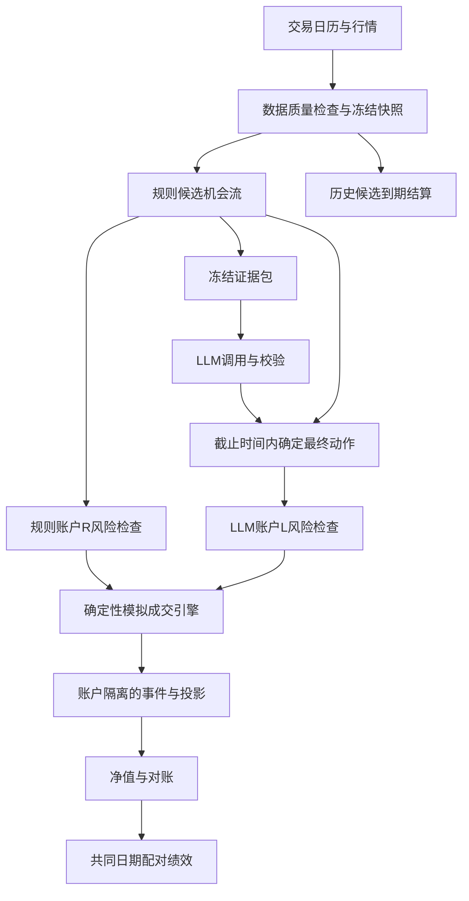

# 回撤约20%约束下的规则与LLM双账户：详细设计 v0.1

日期：2026-09-15。状态：设计草案，可分批实施；尚未修改运行代码、配置或账户。

上位文档：[系统下一阶段分析与路线](return-drawdown-llm-roadmap-2026-09-15.md)。目标沿用用户确认的约20%账户最大回撤容忍度，在该风险约束下提高扣费收益，并验证LLM的独立贡献。20%不是可保证的损失上限。

## 1. 设计决策与交付边界

第一版建设两个独立的前瞻模拟账户：R为冻结规则父策略，L为同一父策略加LLM入场否决。二者共享事前冻结的候选机会与市场事件，各自计算风险资格、资金和成交。人工操作单独记录，不混入这两个账户。

首轮LLM只能输出PASS、VETO、ABSTAIN，不生成订单参数。模型不可用时L恢复父策略；数据或确定性风控不合格时两边均不得用LLM放行。新增双账户引擎使用纯模拟执行器，不可持有券商客户端；现有DRY-RUN链路用于另行验证执行状态机。两者的成交假设与指标分别标注。

第一版不迁移现有实盘或DRY-RUN持仓，不接管旧确认台，不扩充原实验股票池，不上线杠杆，也不同时引入LLM持有管理。原15股前瞻实验继续保留原协议；新实验独立命名。

### 1.1 当前模块与实施选择

| 当前模块 | 已有能力 | 设计处理 |
|---|---|---|
| `outcome_scheduler.py`、`shadow_jobs.py` | 持久化任务尝试、退出码、重试 | 扩展任务依赖和截止时间，解耦setup与模型成功 |
| `decision_ledger/event_store.py` | 稳定事件ID、payload哈希、事务、outbox | 复用事件格式与入库函数；新增实验投影，不另造事件格式 |
| `decision_run_store.py` | 输入快照、模型尝试、运行版本 | 复用；区分模型原始结果与最终应用动作 |
| `evidence_packet.py` | 证据包、时间与质量字段 | 扩展双时间校验、分级质量与截止时间，不依赖单一`ok` |
| `execution.py`、`hard_exit_router.py` | 风险数量、执行状态与硬退出路由 | 复用概念与测试；真实执行适配不纳入双账户第一版 |
| `position_registry.py` | namespace隔离的持仓/订单JSON账本 | 保持兼容；双账户增加显式现金及事务投影，不复用全局REGISTRY |
| `medium_term/portfolio_engine.py` | 基于已知exit_matrix的历史组合模拟 | 保留历史基准；新增增量step接口，通过特定fixture做一致性校验 |
| `run_daily_setups.py` | shadow setup生产 | 接入适配器；只有明确可执行的规则信号才转为Opportunity |

新增建议目录为`scripts/portfolio_shadow/`：`schema.py`、`store.py`、`candidate_adapter.py`、`risk_policy.py`、`llm_overlay.py`、`paper_engine.py`、`replay.py`、`report.py`、`cli.py`。这些名称为拟新增模块，不表示现在已存在。

## 2. 运行架构



LLM不是规则候选生产的上游。R不等待模型；L只等待一个有界决策窗口。模型晚到结果保留审计，不回写已应用动作。

控制平面负责manifest、版本、任务租约、暂停与恢复；数据平面负责市场事件、证据、决策、成交与净值。外部HTTP调用不放在SQLite事务里，避免锁住账户账本。

## 3. 实验manifest与启动校验

每个正式实验需要不可变manifest，保存到`experiments/<experiment_id>/manifest.json`，内容包含：

| 字段 | 要求 |
|---|---|
| `experiment_id / status / start_session` | 状态为DRAFT、FROZEN、RUNNING、PAUSED、CLOSED；正式入组只能发生在FROZEN之后 |
| `parent_strategy_id / version / code_hash` | 精确指定信号、排序、持有期、退出与重复候选规则 |
| `universe_id / universe_hash` | 成员、security_id映射、生效期、风险组及产品类型；不能引用可变的当前观察池 |
| `account_scopes` | `SHADOW:<id>:R`、`SHADOW:<id>:L`；与旧DRY-RUN严格区分 |
| `initial_cash / currency` | 建议模拟初始资金100000 USD，与历史基准便于比较；双方一致 |
| `risk_policy / execution_policy` | 风险预算、现金结算、成本、成交及停牌规则，全部显式版本化 |
| `llm_policy` | 模型、参数、prompt/schema版本、截止时间、调用预算、ABSTAIN原因码 |
| `calendar_version / data_hashes` | 交易日历、行情及公司行动版本 |
| `evaluation_protocol` | 主指标、入组窗、结果成熟期、评审时间、成本分摊方法 |

现在不替历史结果选定“最佳持有期”。正式父策略需待统一风险实验完成。DRAFT可用fixture或指定规则适配器做工程联调；缺父策略、股票池、退出方式或风险预算时，`freeze`必须失败，不能用隐式默认值启动正式实验。

变更冻结参数必须新建experiment_id；暂停/恢复不重置净值高点，不删除先前亏损，也不将迟到信号回填为正常成交。

## 4. 时间、候选及决策协议

### 4.1 时间语义

所有持久化时刻使用带时区UTC；`session`使用纽约交易日，不按服务器所在中国日期分组。由版本化交易日历给出正常收盘、半日市与下一交易日。

建议初版时间安排：收盘后20分钟开始冻结当日数据与规则候选；LLM在候选冻结后可启动；最终动作截止于下一交易日09:20纽约时间；计划执行为09:30开盘。模型调用只尝试一次、总超时60秒，预算耗尽或故障当场ABSTAIN，不循环重试到取得期望答案。上述为工程默认草案，冻结后才生效。

截止时间由事件发生时刻与实际接收时刻共同约束。晚收到的数据只能进入下一版本观察，不能改变已冻结动作。若服务在09:20后重启，未决动作按当时能证明已持久化的资料定为ABSTAIN；无法证明按时收到的结果不得补用。

### 4.2 Opportunity：共同机会流

每条机会字段：`opportunity_id, experiment_id, security_id, source_candidate_id, parent_version, signal_session, signal_time, observed_at, planned_execution_session, rank, entry_rule, stop_reference, exit_policy_id, market_snapshot_id, input_hash`。

ID为上述业务身份字段的规范化哈希；去重不能只用股票代码。同一身份不同payload视为冲突，阻断入组，不能静默覆盖。排序固定为父策略排序字段、security_id、opportunity_id，不能使用模型返回先后顺序。

共同机会流位于账户资格检查之前。因此L因先前VETO多出现金而能够买入、R因持仓已满不能买入，是合法路径差异，必须记录各自原因。

候选总账终态包含：`RULE_REJECTED / DATA_BLOCKED / WAITING / EXPIRED / READY`；READY之后才有各账户的`RISK_REJECTED / VETOED / INTENT_CREATED / MISSED_EXECUTION`。等待状态与终态分开计数，不能为了对账把等待中的候选删除。

### 4.3 Evidence Packet与动作

证据的`published_at`与`observed_at`必须分别合法、带时区且不晚于决策as_of；关键时间缺失或无法解析不能视为正常。行情质量按应到交易会话判定，不能仅用“距现在24小时”覆盖周末、半日市和停牌。

质量分两级：关键行情、身份、账户或风控数据缺失为BLOCK；可选新闻不足为LLM_INSUFFICIENT，模型ABSTAIN但规则可继续。证据等级由采集器确定，不由模型输出覆盖。

模型输出契约：

```json
{
  "schema_version": "entry-veto-v1",
  "opportunity_id": "...",
  "packet_id": "...",
  "action": "VETO",
  "reason_code": "MATERIAL_THESIS_CONTRADICTION",
  "evidence_ids": ["..."],
  "counterevidence_ids": ["..."],
  "explanation": "..."
}
```

验证器检查股票绑定、packet身份、动作枚举、证据存在与有效时间。仅验证引用存在不等于证明推理正确；后续人工抽查证据是否支持结论，并记录审计质量。VETO必须有允许的风险原因和有效证据；其余无效结果转换ABSTAIN。第一版允许原因集中于重大指引/经营逻辑反证、重大公司事件风险，不让模型以“资金不足”等程序理由否决。

`raw_action`保留原响应；`applied_action`单独冻结。模型自报confidence仅供研究，不作为概率或仓位输入。VETO只取消本次机会，释放资金保持现金，不当天临时补买下一名。

## 5. 状态机与故障行为

### 5.1 决策状态机

`CREATED → SNAPSHOT_FROZEN → CALL_STARTED → VALIDATED / FAILED / TIMED_OUT → ACTION_FROZEN → APPLIED`

FAILED与TIMED_OUT仍可到ACTION_FROZEN，动作是ABSTAIN。模型返回与截止任务竞争时，使用同一决策应用主键及事务内条件更新，只有一个动作能冻结。冻结后收到回复记录`late_response_observed`，不改变应用结果。

进程在调用发送后、返回持久化前崩溃：尝试记为UNKNOWN；若供应商支持可靠请求ID查询则查询，否则不再次发送，最终ABSTAIN，成本记估算待核对。不能把“账本无响应”理解为“请求未发出”。

### 5.2 任务状态机

`PENDING → RUNNING → SUCCEEDED / DEGRADED / FAILED / BLOCKED_DEPENDENCY / MISSED_DEADLINE`

DEGRADED表示已按预定规则降级并完成有效输出；例如LLM超时但L已有ABSTAIN动作。任务结果使用结构化`JobResult(status, reason_code, artifact_ids, retryable)`，退出码仅为进程层诊断。

任务key为`experiment_id + job_type + session + policy_version`，尝试另加attempt。租约包含owner、heartbeat、expires_at及fencing_token。纯计算任务租约过期可重新claim，提交必须校验token，阻止旧worker迟到覆盖。模型调用和外部执行采用更严格未知状态恢复，不能套用无条件重试。

既有ShadowJobs对running任务不自动恢复，迁移时保留旧事件；旧running需人工审计或专门恢复命令，不凭新租约默认规则重新发送旧调用。

### 5.3 执行状态机

模拟意图：`INTENT → RESERVED → FILLED / REJECTED / EXPIRED`。故障fixture可扩展PARTIALLY_FILLED；未知成交不可直接释放保留资金。真实DRY-RUN执行联调继续使用现有`submitting/submitted/unknown/reconciling`等状态，不能被模拟账户的简化状态替换。

确定性风险拒绝、已冻结VETO和错过执行窗口均有明确终态。缺市场数据时不得拿入场价代替当前成交价；保留未完成标记并暂停受影响新风险。

## 6. 双账户引擎与成交会计

### 6.1 引擎接口

建议核心接口为：

- `adapt_candidates(snapshot, parent_manifest) -> Opportunities`
- `evaluate_risk(account_state, opportunity, market_event, policy) -> RiskDecision`
- `resolve_overlay(packet, model_attempt, deadline) -> AppliedAction`
- `step(account_state, market_event, intents, policy) -> StateTransition`
- `commit_transition(connection, expected_sequence, transition) -> sequence`
- `replay(events, manifest) -> AccountState`

风险、模拟成交和状态转移为无网络纯逻辑；提交负责并发、幂等与outbox。重放只消费已经记录的输入及动作，不重新调用模型或查询最新行情。

历史引擎消费未来退出矩阵，而新引擎只能消费截至当前事件已知的信息。先实现增量退出条件，再与历史引擎在相同规则、已完成样本、同公司行动口径下逐日对比；不以调用旧exit_matrix假装完成前瞻引擎。

### 6.2 成交约定

第一版为日线EOD模拟：前一交易日信号、下一交易日开盘成交。计划必须在开盘前冻结；当天收盘取得开盘价后进行记账，只表示对事前计划的机械结算，不允许根据当天涨跌选择是否买入。

开盘可做的资格复核仅使用当时开盘价格、事前止损基准和账户状态。数量按此复核计算，因此是“开盘价已知可定量成交”的研究近似，不等同于真实开盘竞价下单。执行联调另外测量下单延迟和价格偏差。

单边费用默认10bp，与现有研究可比；滑点另列参数，首版0bp作为对照，压力场景额外10/20bp。真实流动性容量尚未证明时必须标记，不能把零滑点模拟表现称为可实现收益。

日内硬止损用保守日线规则：开盘已穿过止损则按开盘价减卖出滑点；否则最低价触及止损则按止损价减滑点。入场日同样生效。收盘计算的移动保护线最早下一会话生效，避免利用日内高点后再假定提前抬高止损。若父策略需要更细路径，须使用更细行情或阻止该策略接入。

同一日处理次序冻结为：公司行动 → 已有仓位开盘风险退出/计划退出 → 资金结算与可用额 → 候选按序开盘入场 → 日内止损 → 收盘估值与下一日保护线。日内止损释放的现金不得追溯用于当天开盘买入。

### 6.3 现金、费用与分红

账户记录`cash_available / cash_reserved / unsettled_cash / dividend_receivable / positions / fees / model_cost / initial_equity / high_water / sequence`。资金值用固定精度Decimal或整数微美元存储，规范化JSON不输出NaN；报告层才转float。整股入场，公司行动导致碎股按明确规则保留或现金替代。

初版采用现金账户模拟，卖出资金按版本化T+1会话规则结算后才可用于新买入；R/L/被动比较组一致。该选择是实验会计设定，接真实账户时另核对券商账户权限。旧历史引擎若即时复用卖出款，必须重跑或显式桥接，不能称完全同口径。

除息日对前一日合资格持仓记应收；支付日转可用现金。若支付日缺失，保留应收及质量状态，不提前变为购买力。拆股同步调整数量、成本和止损价格，账户权益不应因纯拆股跳变。

每笔fill与现金、持仓、费用、事件同事务落库。L承担其全部模型尝试成本，包括失败与ABSTAIN；R无模型成本。共享研究基础设施成本单列，若纳入实用净收益按事前固定规则分摊。报告同时显示交易净值及全成本净值；风险监控采用全成本净值。

资金不变量：可用现金与保留资金非负；卖出量不超过可卖数量；权益等于全部现金及应收加持仓市值；拆股前后经济价值一致；每个fill只产生一次资金变化。

### 6.4 缺行情与迟到修正

持仓缺收盘价时生成`valuation_status=PROVISIONAL`，展示上次估值并注明陈旧天数，但不把它当作正式零收益。正式配对绩效停在双方都已完成的连续会话，不删除中间坏日后继续累计。

数据修正新增revision与supersedes指针；原始事件及按当时资料作出的决策不改写。区分“当时可知的运营账本”和“更正行情后的估值视图”，不得用更正数据反向改变买卖动作。

## 7. 风险策略详细约定

每次入场检查顺序：实验与账户状态 → 行情身份时效 → 已有仓位/活跃意图 → 现金与结算 → 单票/总市值暴露 → 风险组限额 → 单笔及组合止损风险 → 整股可买数量。数量取所有约束给出的最小值，费用纳入现金预留，全部未成交意图纳入容量占用。

用当前标记价到有效保护线的损失衡量已有持仓保护风险，并另保留初始风险用于归因。保护线高于现价时不能记零风险并继续加仓，应进入待退出/风险异常状态。跳空风险单独压力估计，不伪装成止损距离已经覆盖。

单笔0.5%/0.75%/1.0%仅为开发实验档位。正式manifest必须显式填写总风险、单票市值、风险组限额、最大仓位数和缺风险组行为；字段缺失拒绝冻结。风险组不明的产品不得自动套用普通股票默认值。

回撤阶梯候选设计如下，须离线验证后再冻结：

| 状态 | 进入条件 | 行为 | 恢复草案 |
|---|---|---|---|
| NORMAL | 初始/完成恢复 | 原风险预算 | — |
| REDUCED | 完整收盘净值回撤≥10% | 新开仓单笔预算乘0.5，不自动砍旧仓 | 回撤<8%连续5个完整会话 |
| PAUSED_ENTRY | 回撤≥15% | 禁止新增风险，维持既有退出 | 回撤<12%连续5会话并完成风险审查，降至REDUCED |
| REVIEW_REQUIRED | 回撤≥18%或账本异常 | 禁止新增风险、强制审查 | 仅显式审查事件解除；不能重置高点 |
| LIMIT_BREACH | 回撤≥20% | 标记目标违约、停止扩大实验权限 | 保留已有退出执行与后续观察；不隐藏违约 |

阈值仅在完整估值下自动更新；估值不完整直接阻止新增风险。账户20%阈值不等于自动清仓开关，本版依靠前置预算和既有硬退出控制风险。若希望新增组合强平，需要独立模拟反弹损失、流动性与执行优先级后另定版本。

## 8. 持久化、幂等与迁移

建议实验使用独立文件`data/portfolio_shadow/<experiment_id>/ledger.sqlite3`，R/L共享这个文件但scope不同；复用现有事件/outbox表及函数。这样保留相同事件协议，且测试和迁移不触及当前执行库。

新增投影表如下，全部由事件可重建：

| 表 | 主键/唯一键 | 关键内容 |
|---|---|---|
| `shadow_experiments` | experiment_id | manifest_hash、状态、schema_version |
| `shadow_opportunities` | experiment_id, opportunity_id | 冻结输入、session、rank、候选终态 |
| `shadow_applications` | scope, opportunity_id | action、reason、decision_id、截止时刻、应用状态 |
| `shadow_account_state` | scope | sequence、完整账户状态、状态哈希 |
| `shadow_daily_nav` | scope, session, revision | 权益、费用、现金、暴露、质量、对应sequence |
| `shadow_job_runs` | job_key, attempt | owner、租约、fencing_token、终态、artifact_ids |

订单及fill第一版保留在账户状态和不可变事件中，避免同时维护两套订单真相；后续查询需求明确后再建投影。事件包含experiment_id、scope、opportunity_id、decision_id、intent_id及schema_version关联字段。

提交采用`BEGIN IMMEDIATE`，校验expected_sequence和任务fencing_token；一个事务内插入事件、更新账户投影及应用状态、写outbox。相同事件ID和payload重复提交返回幂等成功；相同ID不同payload报冲突并停止该实验新风险。

R与L可分别原子提交，不要求网络或模型结果跨账户大事务。日报只有在双方该会话终态齐备后才能标记paired_complete；重启后补齐缺的一边，不能重做已完成一边。

迁移仅增表/字段，先备份、校验schema版本；旧代码遇到更高版本拒绝写入。SQLite outbox导出为至少一次交付，消费者按event_id去重。JSONL与报告均为派生产物，不作为恢复主库。

## 9. 报告、比较与验收接口

拟新增CLI：

- `python3 -m scripts.portfolio_shadow.cli validate --manifest <path>`：只校验，不创建账户。
- `... freeze --manifest <path>`：冻结DRAFT；必须完整填写研究协议。
- `... run-session --experiment <id> --session YYYY-MM-DD`：执行到期任务并输出结构化终态。
- `... replay --experiment <id> --to-session YYYY-MM-DD`：不访问网络，重建并比较状态哈希。
- `... report --experiment <id>`：输出Markdown、CSV与机器可读summary.json。

以上命令是拟实现接口，现在不能视为已有可运行命令。

日报包含运行版本、任务状态、完整候选漏斗、R/L净值与回撤、持仓风险、VETO/ABSTAIN原因、未成熟结果、异常与成本。短期显示累计收益，达到完整年度后再以CAGR作主要年化指标。

主要效果指标：共同连续日期的L−R全成本收益差、各自MDD、回撤修复时间和暴露差。反事实被否决交易单列，不能加总成可投资账户收益。人工作用不计入L。

统计协议冻结后才入组；重叠交易不按独立样本处理。先展示逐日收益差与区块重采样区间，区块参数和敏感性规则预登记。3–6个月入组及主要持有期成熟是观察计划，不是保证足够功效。若差异不确定，保持shadow。

## 10. 必须通过的测试

| 测试 | 输入/故障 | 断言 |
|---|---|---|
| 无模型增量对照 | 所有动作PASS，模型成本置0 | R/L每日持仓、现金与NAV完全相同 |
| 纯成本对照 | 所有PASS但有模型成本 | 差异由成本及其后续数量影响完整解释 |
| VETO路径 | 一次否决后出现新候选 | 否决当日不补买；后续按各自现金和风险处理 |
| 超时与晚到竞争 | 超时任务与模型结果并发提交 | 仅一个应用动作冻结；迟到响应不改成交 |
| 崩溃恢复 | fill事件后、投影前模拟异常 | 事务全部回滚或全部提交；重放一致 |
| 重复任务与旧worker | 两次claim、租约过期 | 同一意图仅一次生效；旧token不得提交 |
| 账户隔离 | 同一股票两账户不同数量 | 现金、持仓、意图与报告scope无交叉 |
| 无前视性 | 改动未来bar/晚到新闻 | 截止时刻前的候选及动作不变 |
| 公司行动 | 拆股、首日除息、延迟支付 | 无凭空盈利；应收不提前变购买力 |
| 止损与资金顺序 | 入场日触发止损、开盘跳空 | 使用冻结规则成交；日内释放款不追溯用于开盘 |
| 结算约束 | 同日卖出后尝试买入 | 未结算资金不能被使用 |
| 候选漏斗 | 缺证券行情、无次日开盘、过期 | 原始分母闭合且每条有状态 |
| 数据缺口 | 持仓价格缺失 | NAV标记暂定；正式连续绩效停止延伸 |
| 风险阶梯 | 跨10/15/18/20%与恢复 | 进入、迟滞、审查和违约状态符合协议 |
| 空日与节假日 | 无候选、半日市、DST转换 | 无候选也有账户估值；无虚构交易会话 |

此外，用手工可算的两股多日案例核对现金、费用、应收、止损和净值；再对历史引擎做共同支持口径的一致性测试。完整策略绩效不能靠“测试全绿”替代。

## 11. 分批实施与上线顺序

| 批次 | 交付 | 验收门槛 |
|---|---|---|
| PR1 | 收盘任务解耦、结构化终态、日志及失败对账 | LLM失败时setup仍可运行；outcome异常可定位；旧任务不重复调用 |
| PR2 | manifest、scope隔离、Opportunity与完整漏斗 | 缺关键配置不可freeze；旧15股实验不受影响 |
| PR3 | 账户状态、增量paper engine、会计与重放 | 全PASS对照一致、手工案例一致、事务故障测试通过 |
| PR4 | 硬风险策略与现有DRY-RUN执行适配测试 | 不依赖LLM的风险动作可测；不改变真实执行开关 |
| PR5 | Evidence Packet扩展与LLM三态旁路 | 晚到/超时/无效结果确定降级，引用可追踪 |
| PR6 | 日报、配对绩效、冻结前瞻协议 | 双账户日终齐备后发布有效配对结果 |

先用fixture贯通全部链路，再使用真实行情、固定PASS运行双账户，最后才接真实模型。前10个交易日只验工程；父策略研究完成、正式manifest冻结后才开始绩效入组。工程样本不回填成正式前瞻样本。

回滚方式是禁用新实验入口、保留数据与事件、继续完成已有持仓模拟退出。历史应用动作不删除；模型故障按已冻结协议ABSTAIN，若主动长期移除LLM则结束该实验版本并另开版本，不能把不同处理方式拼接为同一个策略。

## 12. 当前待冻结项与下一步

详细设计已明确实现路线，以下数值选择留到对应实验后冻结，不阻碍PR1–PR3开发：父策略与持有期、正式股票池、单笔/组合/风险组预算、是否采用回撤阶梯、成本与现金结算对照、前瞻评审日期。

推荐立即开始PR1：解除setup对Selection成功的依赖，将模型失败对账与outcome异常恢复做成独立终态。其后PR2、PR3交付一个不接模型也能逐日运行、重放一致的双账户，再通过PR5加入LLM。这样每一步都有可以检查的运行结果。

本文只完成设计，未实施这些接口，也未再次运行在线模型或历史绩效实验。引用基于当前工作区读取；实施前应重新检查并保留用户已有修改。
