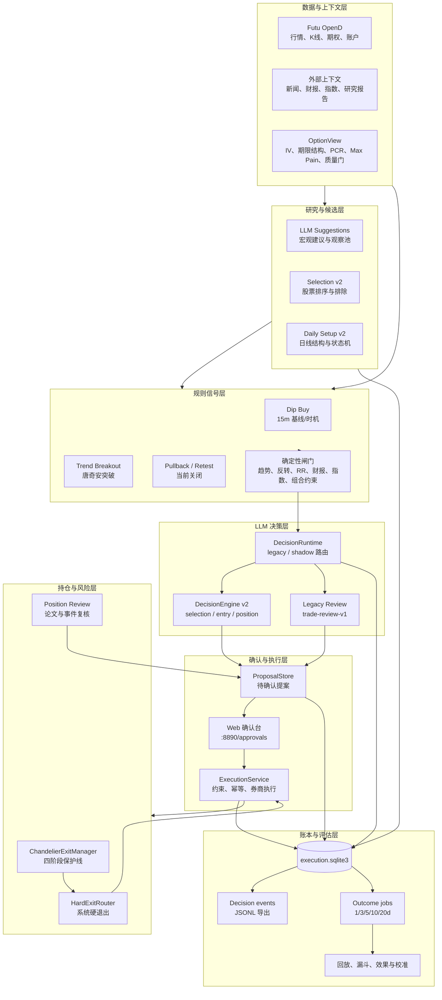
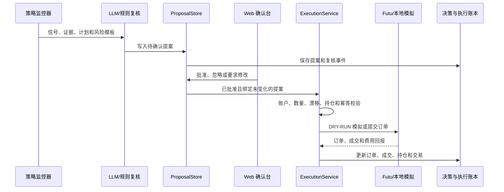

# quant_us-main 当前系统架构（2026-09-10）

> 本文以 2026-09-10 的代码和本地运行配置为准，描述系统当前已经实现、已经接入和实际生效的行为。规划中的能力不作为现状记录。

## 1. 系统定位

`quant_us-main` 是一个面向美股的研究、信号、人工确认和交易执行系统。系统把确定性规则作为交易安全边界，把 LLM 用于选股研究、入场复核和持仓研究，并通过决策账本持续评估 LLM 的实际贡献。

当前主运行模式仍是人工确认：策略发现机会后生成提案，LLM 给出研究或复核意见，用户在确认台批准后才进入普通买入执行。固定止损、移动止损等硬风险退出不等待 LLM，也不等待人工确认。

当前本地配置的关键状态如下：

| 能力 | 当前状态 | 实际影响 |
|---|---|---|
| 券商环境 | `SIMULATE` | `--simulate` 会连接模拟账户，不涉及真实资金 |
| 默认启动 | `--dry-run` | 不向券商提交订单 |
| LLM | DeepSeek `deepseek-chat`，已启用 | 可生成研究与复核结果 |
| Selection v2 | `shadow` | 记录 LLM 排序，但不改变规则排序 |
| Entry v2 | `legacy` | 买入复核仍走原有 `trade-review-v1` 链路 |
| Position v2 | `legacy` | 持仓复核仍走原有链路 |
| 期权视角 | `shadow` | 进入研究上下文和账本，不直接决定交易 |
| 买入策略 v2 | `shadow` | 日线 setup 被扫描和记录，不生成正式买入订单 |
| 独立 dip_buy | 关闭 | 不再把单独的 15 分钟抄底信号作为正式候选 |
| dip_buy 基线 | 开启 | 继续记录影子结果，用于后续对照实验 |
| 唐奇安突破 | 开启 | 仍是主运行时的正式信号源之一 |
| Pullback / breakout retest | 关闭 | 代码存在，当前不启动 |

## 2. 总体分层



## 3. 进程和启动模式

统一入口是 `run_all.py`。

| 命令 | 启动内容 | 是否提交券商订单 |
|---|---|---|
| `python3 run_all.py --dry-run` | Web、监控器、止盈止损、日任务调度 | 否，执行结果在本地账本中模拟 |
| `python3 run_all.py --simulate` | 同上，连接配置中的 `SIMULATE` 账户 | 是，仅模拟账户 |
| `python3 run_all.py --real` | 同上，连接配置指定的交易环境 | 取决于 `trd_env`，需谨慎配置 |
| `python3 run_all.py --web-only` | 只启动 Web 页面 | 否 |

完整服务启动以下常驻组件：

1. Flask Web 服务，默认监听 `8890`。
2. `ChandelierExitManager`，管理已有持仓的保护线与退出。
3. `DipBuyMonitor`。当前独立正式信号关闭，但仍可保留影子基线和盘中 timing 能力。
4. `TrendBreakoutMonitor`，当前启用。
5. 可选的 `PullbackMonitor`，当前两个模式均关闭。
6. `OutcomeSchedulerThread`，每 30 秒检查日线 setup 扫描和 outcome 结算是否到期。

调度器通过 SQLite 中的日任务 claim 保证同一账户作用域、同一交易日、同一任务只成功领取一次，因此服务重启或多进程并发不会重复执行已领取任务。

## 4. 数据与上下文层

### 4.1 行情和账户

Futu OpenD 是运行时的主要市场与交易接口：

- 日线、1/5/15/60 分钟 K 线；
- 当前报价和交易时段；
- 期权链；
- 模拟或真实账户的订单和成交回报。

Web 层维护行情连接池，监控器和执行模块各自封装所需连接。交易时段按美东时区判断，区分盘前、常规、盘后和夜盘。

### 4.2 事件和基本面上下文

`signal_context.py` 为研究和信号补充新闻、财报、分析师信息及其他外部上下文。数据质量和时间戳会进入 evidence packet，供 LLM 使用和后续审计。

### 4.3 期权市场视角

`option_view.py` 汇总以下信息：

- ATM IV 水平及变化；
- IV 期限结构；
- 完整期权链 Put/Call OI 比；
- Max Pain；
- ATM Call 的 Delta 和 `prob_of_profit`；
- 报价新鲜度、合约覆盖和字段完整性等数据质量门。

当前为 shadow。期权摘要可以增强或削弱研究结论，但不能绕过股票规则、风险限制或人工确认，也不会单独触发下单。

## 5. 选股与研究链路

选股系统有两类产物：

1. `run_suggestions.py` 生成面向页面的宏观建议和观察候选，保存到共享的 `.quant_suggestions/us_latest.json`。
2. `run_daily_selection.py` 对研究股票池构建证据包，调用 Selection v2，并把研究批次保存到 `.quant_suggestions/us_research_batches.jsonl`。

Selection v2 接收：候选集合、逐股证据、规则特征、期权摘要、市场环境、组合风险和数据质量。模型输出排序、候选/观察/排除、论文、反证、失效条件和缺失信息。

当前 Selection 是 shadow：

- LLM 结果完整写入决策账本；
- 页面可以展示 LLM 研究候选；
- 正式候选顺序仍使用规则排序；
- outcome 结算后可以比较 LLM 排序与规则排序的表现。

`reconcile_selection_decision.py --json` 用于检查最新研究批次和决策账本是否对齐，包括批次、决策状态、候选数量、投影和异常原因。

## 6. 买入策略架构

### 6.1 日线 setup v2

新版买入逻辑把“股票是否进入可研究的中期结构”和“盘中何时下手”分开。

`setup_features.py` 从日线计算趋势、均线、回撤、波动、成交量、稳定化和反转特征。`setup_state_machine.py` 将股票推进到以下状态：

```text
INACTIVE
  → WATCH
  → ARMED
  → TRIGGERED
  → EXPIRED / INVALIDATED
```

当前支持的主要 setup 类型：

- `trend_pullback`：较长期趋势仍成立，价格回撤到合理区域后重新稳定；
- `reversal_confirmed`：经历较深回撤或恐慌后，出现足够明确的止跌和反转证据。

`run_daily_setups.py` 在收盘后运行扫描，`SetupStore` 把状态持久化到执行数据库。当前模式是 shadow，因此扫描结果用于观察、统计和实验，不直接生成可执行订单。

### 6.2 盘中入场时机

`entry_timing.py` 负责在已经通过日线 setup 的前提下判断盘中确认，避免把 15 分钟指标当成独立选股逻辑。其职责是改善成交时机和初始风险，而不是证明中期投资论文。

### 6.3 现有正式信号

唐奇安突破仍在运行。信号形成后还要依次经过追高限制、流动性/成交量、持仓数量、冷却和其他策略规则。

原有 dip_buy 的规则包括日线趋势、15 分钟评分、反转确认、60 分钟环境、盈亏比、财报窗口和指数环境。当前 `standalone_dip_buy=false`，因此它主要作为历史基线和日线 setup 后的 timing 组件，不应再被理解为独立的中期买入策略。

## 7. LLM 决策层

系统定义三种决策角色：

| 角色 | 输入 | 主要输出 | 当前路由 |
|---|---|---|---|
| Selection | 股票池、证据、期权、组合状态 | 排序、候选、排除、论文与失效条件 | v2 shadow |
| Entry | 已触发信号、交易计划、风险模板、证据 | 立即执行、等待、拒绝 | legacy |
| Position | 持仓、保护线、论文、新证据 | 持有、减仓、论文退出等建议 | legacy |

`DecisionRuntime` 按角色读取 `legacy/shadow` 配置。进入 v2 时，`DecisionEngine` 负责：

1. 冻结输入快照和版本信息；
2. 建立模型 attempt；
3. 调用当前配置的 LLM；
4. 校验结构化输出、证据引用和动作合法性；
5. 根据权限计算 `model_action` 与 `effective_action`；
6. 写入决策事件、投影和可回放快照。

调用模型之后发生的错误不会回退到旧模型，避免同一事实产生两套不可审计的判断。只有在创建模型调用快照前的路由或 packet 构建阶段，配置允许时才可回退 legacy。

LLM 的动作权限受程序模板和 `PermissionGuard` 约束。模型只能从程序预先计算的动作中选择，不能自行扩大数量、放宽止损、突破组合风险或直接发券商订单。

## 8. 提案、人工确认和执行

普通买入路径如下：



`ProposalStore` 的内存对象用于页面实时交互，提案和决定同时进入持久账本。批准动作会绑定股票、方向、计划、价格和复核结果；批准后若出现重大新证据或绑定字段发生变化，执行层拒绝沿用旧批准。

`ExecutionService` 统一处理：

- 账户作用域隔离；
- 风险预算和下单数量；
- 最大持仓与风险组限制；
- 价格漂移；
- 幂等订单意图；
- 部分成交、撤单、拒单和迟到回报；
- 手续费更正；
- 持仓、交易和已实现盈亏更新。

## 9. 卖出与风险控制

卖出分为两条独立路径。

### 9.1 硬风险退出

固定止损、保本线、移动止盈、ATR trailing、组合熔断和券商风险属于硬退出。`ChandelierExitManager` 维护四阶段保护状态，保护线只能朝降低风险的方向移动。新报价先检查此前已生效的保护线，再更新下一阶段保护线；跳空穿线按可成交价格处理。

触发后由 `HardExitRouter` 调用 `ExecutionService.submit_system_exit()`。这条路径不经过 LLM 和人工确认，防止风险退出因模型不可用或用户未操作而延迟。

### 9.2 论文与事件退出

论文失效、事件风险、目标兑现和仓位调整属于研究型退出。Position Review 可以给出建议，但普通情况下仍生成提案，进入确认台后由用户决定是否执行。

## 10. 持久化与决策账本

主要真相源是 `data/execution.sqlite3`。文件在首次需要写入持仓、提案、事件或日任务时创建，因此全新工作区未运行完整链路时可能不存在。

数据库按 `account_scope` 隔离，当前决策作用域是 `DRY-RUN`。主要内容包括：

- 持仓、订单、成交和交易 book；
- 决策事件和 outbox；
- 输入快照、模型调用 attempt、决策结果；
- 提案及人工批准凭据；
- selection、setup 和 outcome 投影；
- 调度任务领取记录。

`data/decision_ledger/events-v1.jsonl` 是从 outbox 导出的追加式事件副本，便于审阅和外部分析。SQLite 事件是运行时真相源，指标表和报告属于可重建投影，投影失败不应回滚已经发生的订单或成交。

每个重要对象通过 ID 关联：

```text
research_batch / setup / signal
  → decision_id
  → input_snapshot_id + model_attempt_id
  → proposal_id
  → order_intent_id + broker_order_id
  → fill_id
  → trade_id
  → outcome_id
```

这条关联链用于回答“模型看到了什么、建议了什么、程序最终采用了什么、人做了什么、券商成交了什么、后来表现如何”。

## 11. Outcome、回放与评估

`OutcomeSchedulerThread` 在收盘后执行两类日任务：

- 日线 setup shadow 扫描；
- Selection 的 1/3/5/10/20 个交易日 outcome 结算。

评估层可以进行：

- 单条决策离线回放；
- 规则排序与 LLM 排序对比；
- selection/entry/position 漏斗统计；
- 模型成功率、校验失败和数据不足统计；
- 反事实结果和 LLM 增量效果分析；
- 周报、输入质量和论文账本分析。

当前 shadow 阶段的核心目标是积累可归因样本，证明 LLM 在统一候选、统一成交与统一成本口径下是否提供增量，而不是用页面上看起来合理的文字判断效果。

## 12. 离线回测与实验系统

离线实验与交易运行时隔离，不读在线提案来动态调参，也不修改运行时配置。

### 12.1 传统策略回测

系统保留以下回测能力：

- 唐奇安主回测、敏感性、walk-forward 和 regime 实验；
- dip_buy 15 分钟逐 bar 重放；
- Chandelier 卖出回测；
- 混合入场研究和组合口径分析。

回测执行遵循当前修正后的时序：已有保护线先检查，入场日可以触发止损，跳空按开盘或可成交价格处理，信号日和成交日分离。

### 12.2 买入策略实验基础设施

五个基础模块已经实现：

| 模块 | 职责 |
|---|---|
| `experiment_manifest.py` | 冻结实验 ID、代码、配置、数据范围与哈希，禁止覆盖产物 |
| `historical_universe.py` | 构建历史时点可交易股票池，减少幸存者偏差 |
| `buy_strategy_experiment_runner.py` | 在冻结输入上运行 A/B/C/D 入场实验 |
| `exit_matrix.py` | 对每套冻结入场运行 E1-E12 卖出矩阵和成本情景 |
| `buy_strategy_report.py` | 输出固定格式统计、分组 bootstrap、D-C 配对和 Holm 校正 |

A/B/C/D 的含义：

| 组 | 入场定义 |
|---|---|
| A | 旧 15 分钟 dip_buy |
| B | 日线 setup + 旧 15 分钟 timing |
| C | 日线 setup + 次日开盘 |
| D | 日线 setup + 新 15 分钟 timing |

`portfolio_backtest.py` 在各实验和退出情景内按时间重建组合，执行最多三仓约束。报告同时覆盖成本、年份、个股集中度、交易集中度、MAE/MFE、最大回撤和统计不确定性。报告不自动挑选最佳参数，最终 `retain/reject/inconclusive` 必须按预先登记的验收标准填写。

## 13. Web 页面和主要 API

页面：

| 地址 | 用途 |
|---|---|
| `/` | 行情与 K 线分析 |
| `/approvals` | 待确认交易提案和人工操作 |
| `/suggestions` | LLM 研究批次、观察候选与建议 |

主要 API：

| API | 用途 |
|---|---|
| `/api/approvals` | 读取待确认提案 |
| `/api/approvals/<id>/<action>` | 批准、忽略等操作 |
| `/api/decision-health` | 确认台的决策健康摘要 |
| `/api/suggestions` | 研究与建议列表 |
| `/api/llm/decisions` | 决策运行列表 |
| `/api/llm/decisions/<id>` | 单次决策详情 |
| `/api/llm/decisions/<id>/replay` | 离线回放 |
| `/api/llm/metrics/<role>` | 各角色效果指标 |
| `/api/llm/permissions` | 当前动作权限 |
| `/api/llm/health` | LLM 决策链健康状态 |

开发模拟提案和价格的 API 仅用于 DRY-RUN 验收。

## 14. 安全边界和故障原则

系统当前依赖以下边界保持可控：

1. 普通买入必须通过确定性规则、LLM/规则复核、人工确认和执行约束。
2. LLM 只能选择程序提供的动作模板，不能直接下单或放宽风险。
3. 数据质量不足时，系统限制可用角色或拒绝决策；不会把缺失数据解释为中性证据。
4. 模型调用、输出解析或校验失败时记录失败原因，不把未验证文本转成交易动作。
5. 硬止损和系统退出不依赖 LLM。
6. 账户作用域写入同一数据库但逻辑隔离，单个进程禁止混用作用域。
7. 订单意图和成交处理具备幂等性，迟到回报不能重新打开终态订单。
8. DRY-RUN、本地模拟账户和真实账户由启动参数及 `trd_env` 共同决定。

## 15. 当前边界与尚未完成的闭环

截至本文日期，系统已经具备完整的技术骨架，但以下能力尚未成为正式交易决策：

- Selection v2 仍是 shadow，LLM 排序没有获得正式候选控制权；
- Entry v2 和 Position v2 仍为 legacy，新的结构化协议没有切入有效动作；
- 日线 setup v2 只运行 shadow，还没有替代正式信号链；
- 期权视角只用于辅助研究和数据积累；
- 日线 setup 的独立 outcome 与策略晋级仍需积累多个交易日样本；
- LLM 的价值必须通过规则基线、反事实和真实 outcome 对账证明后才能逐级提升权限。

因此，当前系统的准确定位是：**具备可审计 LLM 决策与实验基础设施的人工确认式美股模拟交易系统，正在从短周期规则信号演进到“日线 setup 决定候选、盘中 timing 决定时机、LLM 提供可度量增量”的架构。**

## 16. 代码导航

| 领域 | 核心文件 |
|---|---|
| 统一启动 | `run_all.py` |
| Web | `web/app.py` |
| 抄底与盘中 timing | `scripts/live_trading/dip_buy_monitor.py`、`entry_timing.py` |
| 日线 setup | `setup_features.py`、`setup_state_machine.py`、`setup_scanner.py`、`setup_store.py` |
| 唐奇安突破 | `trend_breakout_monitor.py` |
| LLM 路由与引擎 | `decision_runtime.py`、`decision_engine.py`、`decision_bridge.py` |
| LLM 合约 | `mutifactor/llm/contracts/`、`mutifactor/llm/validators/` |
| 提案与执行 | `approval/proposal_store.py`、`execution.py` |
| 卖出与风控 | `chandelier_exit_manager.py`、`hard_exit_router.py`、`dual_chandelier.py` |
| 账本 | `position_registry.py`、`decision_ledger/` |
| 日任务 | `outcome_scheduler.py`、`review_scheduler.py`、`run_outcomes.py` |
| 期权 | `option_view.py` |
| 实验 | `experiment_manifest.py`、`historical_universe.py`、`buy_strategy_experiment_runner.py`、`exit_matrix.py`、`buy_strategy_report.py` |

