# quant_us-main 当前系统架构（2026-09-12）

> 本文描述仓库当前代码、本地配置和已记录的验证状态；纳入 `f2b291a` 的 M2 构件和随后本地复核修正。它取代 [2026-09-10 版架构快照](system-architecture-2026-09-10.md)作为当前说明。配置、样本和实验状态会变化，运行前仍须检查实际 `config.yaml`、Git commit 和账本。**已实现的接口、当前启用的链路、已通过质量门的研究结论是三种不同状态。**

## 1. 系统定位与当前状态

系统有两条相互隔离的主线：

1. **在线交易/前向研究线**：Futu 行情和账户 → 规则信号与 LLM 研究 → 人工确认或 shadow 记录 → DRY-RUN/模拟执行 → SQLite 决策账本与到期结果。
2. **离线历史实验线**：冻结的存续证券名单 → 主数据、日线、公司行动与时间质量门 → A/B/C 入场和 E1–E11 退出矩阵 → 不可覆盖报告；另有双时间历史证据仓，为未来 D 组探索准备输入。

当前最准确的总体状态是 **`engineering_pass`，M1 尚未放行，M2 `blocked`，M3 前向批次 0 只完成配置核对、没有形成有效新批次**。现有 39 只样本的历史收益只作条件性诊断。Selection v2 为 `shadow`；Entry 和 Position v2 仍为 `legacy`。日线买入 setup v2 为 `shadow`，不进入确认台；旧的唐奇安信号仍是当前可产生提案的买入链路之一。硬止损不等 LLM。

| 维度 | 当前实际状态 | 不能据此推断 |
|---|---|---|
| 样本 | 2026-09-12 登记 39 只存续证券候选，`US.SPY` 另作日历/基准 | 代表历史全市场或已消除幸存者偏差 |
| 在线观察池 | 跟踪的 `config.yaml` 仍是 9 只；已登记方案 A 并生成本机未跟踪的 `data/shadow/config_shadow.yaml`，三池均为 39 只 | 39 只配置已实际跑出有效批次 |
| 数据质量 | 40/40 ticker 映射成功；18/40 上市日占位或未知；`US.HON` 公司行动未解析 | 39 只所有历史证券日期均已核验 |
| 价格 | 已下载不复权日线、建双价格视图及逐决策日 as-of 特征构造器 | 旧 `SURVIVOR-003` 已采用这些价格重跑 |
| 历史证据 | 双时间过滤、拒绝日志、严格/诊断包、标签校验已实现；富途财报严格层 0 条 | D 组已有可信历史 LLM 标签 |
| 实验 | A/B/C 的 11 种退出 × 4 种成本可运行；旧 39 只 QFQ 回放为 `inconclusive` | 买入/卖出规则已证明有优势 |
| 前向对账 | 当前账本最新旧批次 `passed=false`，但订单副作用为 0；见批次 0 记录 | 已满足 2 个交易日/3 个有效批次 |

## 2. 全局组件图

```mermaid
flowchart TB
  subgraph LIVE[在线交易与前向研究]
    F[Futu OpenD<br/>行情、期权、账户] --> SEL[Selection 研究批次<br/>LLM v2 shadow]
    F --> SET[周线环境 + 日线 setup<br/>v2 shadow]
    F --> DON[唐奇安规则监控]
    SEL --> LED[(execution.sqlite3<br/>决策快照、attempt、事件)]
    SET --> LED
    DON --> REV[Entry 复核<br/>当前 legacy]
    REV --> PROP[ProposalStore]
    PROP --> UI[Web 确认台]
    UI --> EX[ExecutionService<br/>DRY-RUN/模拟/实盘由启动模式控制]
    EX --> LED
    EX --> POS[持仓 + Chandelier 硬风险退出]
    POS --> EX
    LED --> OUT[Outcome / replay / metrics]
  end
  subgraph OFFLINE[离线历史实验]
    SRC[Futu 原始归档<br/>当前存续样本] --> MASTER[security_master_v2<br/>symbol_history / actions]
    SRC --> RAW[不复权日线 + QFQ 对照]
    MASTER --> QA[主数据/行动/映射/许可质量门]
    RAW --> QA
    QA --> ASOF[按决策日 as-of 特征<br/>原始价用于执行]
    ASOF --> UNIV[security_id 时点 universe<br/>T-1 流动性]
    UNIV --> ABC[Manifest + A/B/C runner]
    ABC --> MATRIX[E1–E11 退出/成本/三仓组合]
    MATRIX --> REPORT[分层报告与不确定性]
    EVID[历史证据仓<br/>published_at + observed_at] --> PACK[严格/诊断 packet]
    PACK -.时间证据达标后.-> D[D 组受限回放探索]
  end
```

两条线共享的是**方法与对照定义**，不是可随意互换的数据文件。在线账本不会自动把历史实验改成已验证；离线 Manifest 也不会改变在线下单权限。

## 3. 在线进程、运行模式和订单边界

统一入口是 `run_all.py`：`--dry-run` 启动 Web、止盈止损管理器、启用的唐奇安监控器和日任务调度，但不向券商提交订单；`--web-only` 只开页面；`--simulate` 使用配置中的 Futu 模拟账户；`--real` 由交易环境配置决定实际下单。**研究联调使用 DRY-RUN/shadow，不使用 `--real`。**

`OutcomeSchedulerThread` 定期检查日线 setup shadow 和 selection outcome 到期任务。它不负责自动调用 `run_daily_selection.py`：LLM 选股研究批次仍由独立命令或另行调度产生。若完整服务已运行，手工调用 setup/outcome 前先查任务领取状态，避免把同一日期的手工运行误当成新独立批次。

`config.yaml` 当前关键路由：`llm_decision.engine_v2.selection: shadow`、`entry: legacy`、`position: legacy`、`buy_strategy_v2.mode: shadow`、`account_scope: DRY-RUN`。`buy_strategy_v2.standalone_dip_buy: false`；旧 15 分钟 dip_buy 不作为统一入口的独立主链。Selection 的股票池来自 `dip_buy.watch_list ∪ trend_breakout.watch_list`，setup 优先读 `buy_strategy_v2.watch_list`，为空才退回 `dip_buy.watch_list`。[M3 批次 0](m3-shadow-batch0-config-check-2026-09-12.md)已登记方案 A：本机 `data/shadow/config_shadow.yaml` 把三池设为 39 只，命令需显式传 `--config`；跟踪的默认 `config.yaml` 仍是旧 9 只。

## 4. 在线研究、买入与卖出数据流

### 4.1 LLM 选股 selection

`run_daily_selection.py` 冻结观察池，对已收盘日线计算价格、收益、ATR、均线等程序特征，并汇集事件及期权摘要构建输入包。`DecisionRuntime` 按角色选择 `legacy` 或 `shadow`；v2 的 `DecisionEngine` 记录输入快照、单次模型 attempt、结构化输出、引用校验和程序最终有效动作。Selection `shadow` 保存研究排名与排除原因，但不替代规则排序或直接生成订单。`reconcile_selection_decision.py --json` 校验批次与账本、attempt、快照、回放及无订单副作用。

期权视角由 `option_view.py` 提供 ATM IV 与变化、期限结构、完整链 PCR、Max Pain、ATM Call Delta/获利概率及数据质量结果；它是研究证据，不可绕过股票规则。`run_suggestions.py` 的页面建议与 Selection 决策批次是不同产物，不应以页面“观察”卡片数量代替 selection 有效决策数。

### 4.2 买入

中期 setup 使用日线与周线结构，`setup_features.py`、`setup_state_machine.py` 和 `setup_scanner.py` 形成状态与拒绝原因，`SetupStore` 写入账本。当前 `run_daily_setups.py` 只运行 shadow：不会创建 proposal、调用 LLM 或下单；关联最近研究批次 ID 用于后续归因。入场时机和初始风险仍受确定性规则约束，不能因 LLM 文本建议绕过次日开盘、跳空或初始止损检查。

正式提案路径主要来自当前启用的规则监控器（如唐奇安）：信号 → legacy Entry 复核/规则质量门 → `ProposalStore` → `/approvals` 人工操作 → `ExecutionService` → Futu 或本地 DRY-RUN。确认台为空表示没有到达该路径的待确认提案，不能说明 selection、setup 或 LLM 没有运行。`ExecutionService` 保留账户、数量、价格漂移、持仓、订单意图幂等与成交回报校验。

### 4.3 卖出

`ChandelierExitManager` 维护持仓止损、保本及移动保护线；硬风险触发通过系统退出路由进入执行层，不等待 LLM 或人工确认。Position v2 当前未取得有效动作权限；论文/事件驱动的复核仍属 legacy/研究型建议，需与机械退出单独比较。不能把历史退出矩阵的 E1–E11 直接视为在线自动卖出规则。

## 5. 在线账本、对账与结果

`data/execution.sqlite3` 是持仓、订单、提案和决策事件的运行时真相源，按 `account_scope` 区分。账本记录 `decision_id`、输入快照、模型 attempt、程序有效动作、proposal、order/fill/trade 与后续 outcome；事件 outbox 可导出 JSONL 供审计。页面与指标是投影，不能替代账本核对。同一本地 SQLite 同时被服务和手工进程写入时要遵守单写者运行约束，不需要迁移数据库副本。

`run_outcomes.py` 对 selection 研究批次逐步写 1/3/5/10/20 个交易日结果；尚未到期的窗口记录 `pending_future_bars`，不应计入已实现表现。回放、漏斗与 `project_decision_metrics.py` 等分析只在账本对象 ID、候选分母和结果到期时有归因意义。当前批次 0 只读对账显示旧批次 `passed=false`，含模型证据引用包外 ID 的校验失败；`order_side_effects=0`。下一批必须先对齐研究池并取得 `passed=true`，再累计独立交易日。

## 6. 离线证券、价格与时点质量层

`scripts/data/security_master_v2.py` 定义 `security_master_v2`、`symbol_history`、`corporate_actions` 三表；`security_id` 为研究连接键，ticker 以有效区间解析。`source_archive.py` 保留来源原始响应、请求和哈希，导入/审计 CLI 输出冲突及质量文件。当前 Futu 基本资料只证明**当前目录**，不能自动证明历史 ticker 更名、历史上市日或当时的全市场成分。用户不纳入退市样本；研究对象被明确限定为选定存续证券。

行情层保存不复权日线作执行价格，QFQ 作来源差异交叉检查。`price_views.py` 的 as-of 视图要求决策日期，且只返回该日及以前 bar；`asof_features.py` 与 `asof_feature_panel.py` 对每个决策日只应用已经生效的公司行动，生成日线 MA/ATR 面板。`attach_execution_prices.py` 只给旧 QFQ setup 作开盘价尺度迁移诊断，新 M2 应直接由 as-of 面板生成 setup。未解析行动因子或跨证券行动必须阻断或隔离。周线、回撤、枢轴与状态机尚未接到逐日 as-of 链，`full_snapshot_features` 仅用于量化旧错法，不可进入正式回测。`id_bridge.py` 与 v2 universe 把 symbol 日线、T−1 流动性和 setup 连接到 `security_id`；无法映射、来源冲突、未解析行动和上市前数据应在质量漏斗中显式拒绝。

[M1 审计](m1-data-audit-record-2026-09-12.md)已有 6 件本地产物：逐证券质量、公司行动核对/差异、ticker 失败清单、来源 Manifest 和汇总。40/40 当前 ticker 映射成功、18/40 上市日未知或占位；窗口内 850 条行动中记录 843 一致、3 条不一致（`US.HON` 标未解析；剩余条目的分类以审计文件为准）。8 只有拆股的证券中，1526/11290 个 setup 位于其拆股日之前，说明旧全快照特征有可量化的前视暴露；**这不是收益方向影响大小的结论**。旧 `SURVIVOR-003` 仍使用 QFQ 执行价和全快照特征，因此 M1 未放行、M2 不可把旧实验直接晋升为新正式结论。

## 7. 离线 A/B/C/D 实验与历史证据

Manifest 绑定代码 commit、配置、数据/质量文件哈希、样本选择日、存续范围、价格版本、成本和预登记验收标准，产物不可覆盖。当前 `buy_strategy_experiment_runner.py` 的实际嵌套分组是：

| 组 | 在同一 setup 上增加的条件 | 当前可解释性 |
|---|---|---|
| A | 符合次日开盘可成交/初始保护条件 | 规则基础组 |
| B | A + 周线环境门 | 周线门增量 |
| C | B + 日线确认 | 日线确认增量 |
| D | C + 合格 LLM 决策 | 历史证据/标签未达标，`inconclusive` |

`exit_matrix.py` 使用 **E1–E11** 的日线退出、4 种成本和每情景独立的最多三仓组合约束；`buy_strategy_report.py --groups ABC` 可在 D 缺失时输出 132 单元与 `LLM_INCREMENT_STATUS=inconclusive`。退出模拟已处理成交当日、跳空止损、旧保护线先检查、右删失和组合仓位释放时刻。历史报告按普通股/ETF/杠杆 ETF、年份、成本、集中度与不确定性分层；由于 39 只存续样本及旧测试收益已知，不可称为盲测或全市场推断。

`scripts/evidence/` 是**离线历史证据仓**，与在线最新事件/期权包分开。证据记录 `event_at`、`published_at`、`observed_at`、`ingested_at`、来源、版本、内容哈希和可用性证明。严格 packet 只收决策截止前**已公开且可证明已被观察**的版本；缺 `observed_at` 的富途财报只能进入诊断包，诊断包禁止按严格模式回放。`replay_historical_selection.py` 当前是冻结 packet/外部标签的离线校验器，**不自动调用模型生成历史 D 标签**。即使以后补了历史双时间材料，今天的模型仍可能记住后续结果，历史 D 只能作为受限回放探索；可信增量更依赖前向 shadow。

## 8. 当前阻断、下一步与代码导航

| 阻断/条件 | 影响 | 下一动作 |
|---|---|---|
| 18 只证券上市日未核验、`US.HON` 行动未解析 | 对应历史证券日期不得冒充通过质量门 | 保留缺口；排除/降级受影响区间并追溯来源 |
| 旧 A/B/C 用 QFQ 成交和全快照特征 | M1 未放行，M2 `blocked` | 将不复权执行价和逐日 as-of 特征接入完整 setup/入场/退出，再用新编号重跑 |
| 默认在线池仍是 9 只，39 只 shadow 配置尚未实际跑批 | 忘记 `--config` 会跑错研究群组 | 每条前向命令显式传 `data/shadow/config_shadow.yaml`，记录配置哈希 |
| 旧 selection 对账失败 | 不能计作有效研究批次 | 修复证据引用/结构化输出链后另起批次，对账必须通过 |
| 历史严格证据 0、无 D 标签 | 不能验证历史 LLM 增量 | 保持 D `inconclusive`；先积累真实交易日前向批次 |

工程交接执行顺序与验收标准见 [下一阶段交接方案](next-stage-handoff-plan-2026-09-12.md)；前向命令见 [shadow 运行手册](forward-shadow-runbook-2026-09-12.md)。**两个独立交易日、三个有效研究批次只是链路联调底线，不是收益优势证据。**

| 领域 | 代码入口 |
|---|---|
| 统一进程与 Web | `run_all.py`、`web/app.py` |
| 在线 selection | `scripts/live_trading/run_daily_selection.py`、`llm_selection.py`、`reconcile_selection_decision.py` |
| 在线 setup/买入 | `run_daily_setups.py`、`setup_features.py`、`setup_state_machine.py`、`setup_scanner.py`、`trend_breakout_monitor.py` |
| 决策与执行 | `decision_runtime.py`、`decision_engine.py`、`decision_bridge.py`、`approval/proposal_store.py`、`execution.py` |
| 卖出/结果 | `chandelier_exit_manager.py`、`hard_exit_router.py`、`run_outcomes.py`、`decision_ledger/` |
| 离线主数据/价格 | `scripts/data/security_master_v2.py`、`source_archive.py`、`price_views.py`、`asof_features.py`、`asof_feature_panel.py`、`attach_execution_prices.py`、`id_bridge.py` |
| 历史实验 | `scripts/historical_universe.py`、`experiment_manifest.py`、`buy_strategy_experiment_runner.py`、`exit_matrix.py`、`buy_strategy_report.py` |
| 历史证据 | `scripts/evidence/evidence_store.py`、`build_historical_packet.py`、`replay_historical_selection.py` |
