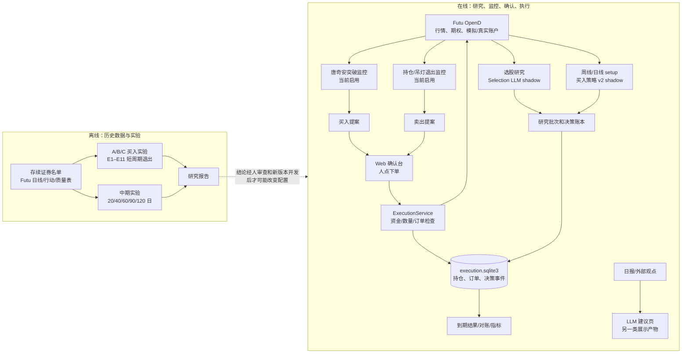
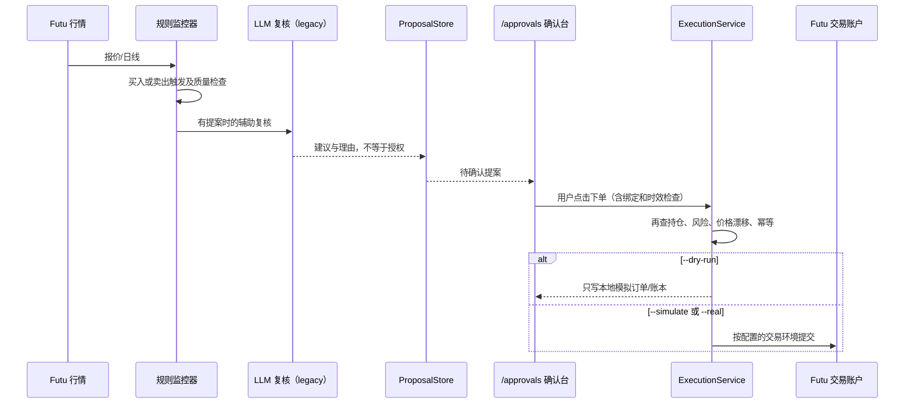
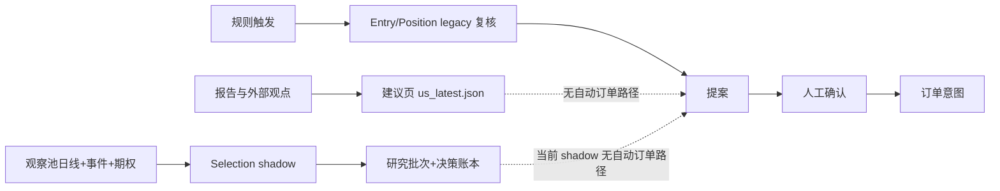
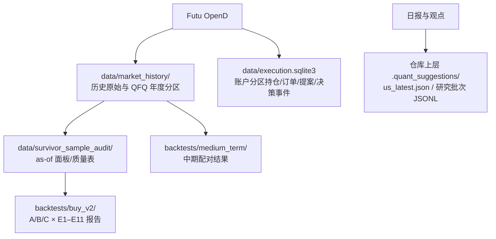
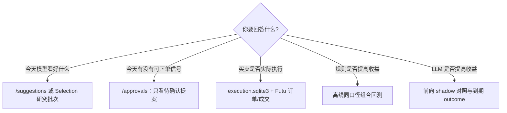

# quant_us-main 系统架构全图（2026-09-13）

这份图按**当前代码和 `config.yaml`**绘制。先记住一句话：系统目前是**两套独立的东西**——左边是运行中的美股研究/交易服务，右边是历史策略实验。历史实验的收益不会自动改变线上买卖规则，LLM 的研究卡片也不会自动变成订单。

## 1. 一张图看全局

图中箭头表示数据或调用关系，**虚线不代表已自动部署**。`gs_backtest` 是仓库外的对照项目，也没有接入本系统。项目边界仅为美股；旧代码/配置中残留港股命名和兼容分支，不代表本轮策略研究包含港股。

## 2. 用户操作到订单：真正生效的路径

这条链**只对真正生成 proposal 的监控信号成立**。当前 `run_all.py` 启动唐奇安监控器和吊灯退出管理器；`pullback`、`breakout_retest` 当前关闭。旧 15 分钟 `dip_buy` 监控器没有被统一入口启动，虽然 `dip_buy.watch_list` 仍被多个模块借用。中期 `run_daily_setups.py` 只生成 shadow setup，**不创建 proposal、不调用 LLM、不下单**。因此确认台空白，不代表系统没有做选股研究或 setup 扫描。

**卖出安全边界按代码而非注释理解：**`ChandelierExitManager` 当前启用卖出人工确认；配置中没有启用 `hard_exit.enabled`，所以止损触发通常生成卖出提案，等待人工操作，提案超时则不执行。`HardExitRouter` 的直达执行能力存在于代码中，但不是当前默认生效路径。未来若改变此开关、原因码或执行环境，必须重新验证路径；不能仅凭组件名假定硬止损已自动挂在券商。

## 3. 三类 LLM 输出为何看起来相似

| 页面/产物 | 输入与入口 | 当前用途 | 会产生交易提案吗 |
|---|---|---|---|
| `/suggestions` 的建议卡 | `llm_suggestions/run_suggestions.py` 读取报告和观点，写共享 `us_latest.json` | 观察名单、研究展示 | 不会；页面“加入观察池”也不是下单 |
| Selection 研究批次 | `run_daily_selection.py` 收集观察池日线、事件、期权摘要，调用 DeepSeek；`selection: shadow` | 排名、理由、失败原因、后续 outcome | 不会 |
| Entry/Position LLM 辅助 | 当前路由 `entry: legacy`、`position: legacy`，跟随实际规则提案/持仓复核 | 对具体提案给意见；受规则和人工确认约束 | LLM 自身不会；只有规则提案被人工批准后才走执行器 |

Selection 的期权视角 `option_view.mode: shadow` 提供 IV、期限结构、PCR 等研究证据，不交易期权，也不改变规则得分或仓位。模型“观察”与确认台的“待买入”是不同对象。

## 4. 三种启动方式和资金边界

| 命令 | 启动内容 | 订单效果 |
|---|---|---|
| `python3 run_all.py --web-only` | Web 页面；不启动交易监控线程 | 页面可查看/调试；无监控器自动生成新提案 |
| `python3 run_all.py --dry-run` | Web、吊灯退出、启用的规则监控器、setup/outcome 调度 | 本地 DRY-RUN 账本，不向券商提交订单 |
| `python3 run_all.py --simulate` | 完整服务，`dry_run=False` | 连接配置中的 Futu `SIMULATE` 账户，可提交模拟订单 |
| `python3 run_all.py --real` | 完整服务，`dry_run=False` | 使用 `live_manager.trd_env`；当前配置是 `SIMULATE`，若改成 `REAL` 则可能提交真实资金订单 |

`llm_decision.engine_v2.account_scope: DRY-RUN` 是决策账本命名空间；它不等同于 Futu 的 `trd_env`。判断是否有券商订单，须同时核对启动参数、`trd_env`、账本订单和券商回报。

## 5. 数据保存在哪里

SQLite 是运行时账本，程序使用时会创建文件；`data/` 下大量行情、快照和实验输入被 Git 忽略，代码提交本身不保证别人拥有相同数据。离线回测产物**不回写交易持仓**，也不会自动投影到确认台。`/approvals` 看 proposal；`/suggestions` 看研究建议；两页显示的数量无须相等。

## 6. 历史策略研究的真实状态

| 研究层 | 已有产物 | 目前可得结论 | 尚缺什么 |
|---|---|---|---|
| 旧 A/B/C | 15 只质量放行存续股、短周期 E1–E11 原始价审计；另有 13 只科技存续股历史验证 | 可看条件成交的单笔收益与规则增量；科技组 C 相对 A 未显示稳定增量 | 不是当前可执行组合的 CAGR，也没有证明 LLM 增量 |
| 中期 P0 | `QUICK-HORIZON-20260913-001`，同一批 3,511 笔 A 组入场比较 20/40/60/90/120 日 | 平均单笔净收益依次 2.14%、4.87%、8.20%、12.24%、16.16%；40 日离场在这批已知历史里偏早 | 这 15 只包括 BAC、HD，不能称为纯科技池；交易重叠，无账户 CAGR、硬止损或资金约束 |
| 中期 P1/P2 | `scripts/medium_term/` 有动量、退出、组合会计的基础函数；P1 尚未放行 | **没有 60–120 日账户年化收益结论** | 核实公司行动与完整周特征；冻结科技股池；资金账户回测；P2 才比较 B1/B2/B3 |
| LLM 增量 | 在线 Selection shadow、决策账本、到期 outcome；离线双时间证据接口 | 能审计模型说了什么、何时说；尚不能声称提升收益 | 足量独立前向批次、相同交易条件下与规则组比较 |

P0 的 16.16% 是**120 日的平均单笔净价格收益**，绝不是“年化 16.16%”。外部 `gs_backtest` 的 MA20/60 结果也只是参考：它实际包含 15 只股票，日线信号典型持仓远短于 60–120 日，不能替代本系统的中期组合验证。

## 7. 当前应该怎么理解系统

**下一阶段只保留一个主问题：**延长持有后，按真实五仓资金限制、硬止损和成本计算，科技股组合 CAGR/回撤是否优于当前规则与 QQQ？在这张账户级结果表出来前，中期策略不进入在线买卖，LLM 继续作为研究/复核层，不把 shadow 排名当指令。

## 8. 主要代码入口

| 功能 | 文件 |
|---|---|
| 统一启动、配置 | `run_all.py`、`config.yaml` |
| Web 三页 | `web/app.py`，`web/templates/index.html`、`approvals.html`、`suggestions.html` |
| LLM 研究批次 | `scripts/live_trading/run_daily_selection.py`、`decision_runtime.py`、`decision_engine.py` |
| 中期 setup shadow | `scripts/live_trading/run_daily_setups.py`、`setup_scanner.py`、`setup_state_machine.py` |
| 当前买入提案 | `scripts/live_trading/trend_breakout_monitor.py`、`approval/proposal_store.py` |
| 卖出监控与执行 | `scripts/live_trading/chandelier_exit_manager.py`、`hard_exit_router.py`、`execution.py` |
| 账本及到期结果 | `scripts/live_trading/position_registry.py`、`decision_ledger/event_store.py`、`outcome_scheduler.py` |
| 历史短周期 | `scripts/buy_strategy_experiment_runner.py`、`scripts/exit_matrix.py`、`scripts/buy_strategy_report.py` |
| 历史中期 | `scripts/medium_term/quick_horizon_check.py`、`exit_matrix.py`、`portfolio_engine.py` |

本图是 2026-09-13 的实现快照；有意将**已实现组件、当前启用路径、历史实验结论**分开标示，避免把代码存在误当成线上生效。
