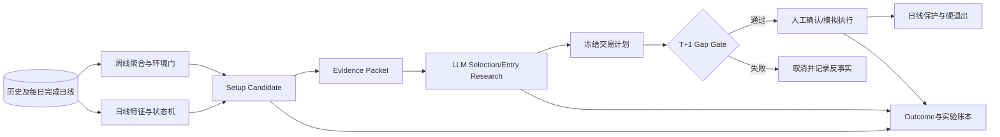

# 周线环境 + 日线 Setup + LLM 买入策略改造技术设计（2026-09-11）

## 1. 决策

买入主链停止使用 15 分钟 K 线。新的买入架构使用：

```text
周线：判断中长期下跌阶段和是否允许研究
日线：识别筑底、反转和失效结构
LLM：判断下跌原因、基本面可逆性、催化剂和反证
执行：T 日收盘冻结决策，T+1 使用预先登记的成交规则
```

15 分钟 `dip_buy`、`entry_timing.py` 和对应回测脚本作为 legacy 历史代码保留，用于复现旧结果；它们不再由 `run_all.py` 启动，不进入新数据清单、正式 A/B/C/D 实验或新策略参数选择。

本文取代以下旧设计中关于 15 分钟入场择时的部分：

- `buy-strategy-optimization-technical-design-2026-09-10.md`；
- `buy-strategy-validation-plan-2026-09-10.md`；
- `buy-strategy-data-preparation-2026-09-10.md` 中的 15 分钟数据要求。

## 2. 目标与非目标

### 2.1 目标

1. 将一至两个月的下跌、筑底和反转放到相匹配的时间尺度上判断。
2. 把长期环境、价格结构、LLM研究和成交规则拆开，使每层贡献可测量。
3. 所有特征只读取 T 日收盘时已完成的数据。
4. 使用 T+1 固定执行，消除盘中择时造成的复杂度和未来数据泄漏。
5. 保持止损、仓位、账户和人工批准等确定性安全边界。
6. 用嵌套 A/B/C/D 实验衡量周线、日线确认和 LLM 的边际价值。

### 2.2 非目标

- 不用周线或日线指标自动预测最低点；
- 不让 LLM 自行生成价格、止损或仓位；
- 不在本轮优化卖出参数；
- 不用测试集反复调节阈值；
- 不删除旧策略代码和旧实验产物。

## 3. 总体架构



## 4. 时间语义

一次买入决策严格分为三个时间：

| 时间 | 含义 |
|---|---|
| `feature_as_of` | T 日收盘，所有周线和日线特征的截止时间 |
| `decision_at` | T 日收盘后，LLM和程序完成决策的时间 |
| `entry_time` | T+1 的预先登记执行时刻 |

约束：

```text
feature_as_of <= decision_at < entry_time
```

周线由截至 T 日的已完成日线聚合。当前周可以是“截至 T 日的周线状态”，但不得包含 T 日之后的数据。特征快照必须保存 `as_of`、最后日线 session 和 feature version。

## 5. 周线环境门

### 5.1 聚合

日线按 `W-FRI` 聚合：

```text
weekly_open   = first(daily_open)
weekly_high   = max(daily_high)
weekly_low    = min(daily_low)
weekly_close  = last(daily_close)
weekly_volume = sum(daily_volume)
```

所有聚合输入必须已经通过 `completed_daily_bars()` 截止检查。

### 5.2 特征

第一版冻结以下周线特征：

- 周线 MA10、MA20、MA40；
- MA20 最近4周斜率；
- 距52周高点回撤；
- 周线 ATR14；
- ATR是否收缩；
- 周线状态 `trend/recovering/falling`。

### 5.3 环境分类

`trend`：

```text
weekly_close > weekly_ma40
weekly_ma20_slope_4w > 0
```

`recovering`：

```text
weekly_drawdown_52w <= -10%
weekly_close > weekly_ma10
weekly_ma10 最近两周不再下降
weekly_atr14 未继续显著扩张
```

`falling`：不满足以上两类。

`weekly_gate = regime in {trend, recovering}`。`falling` 状态不允许生成正式 setup。

周线阈值属于第一版实验起点，不代表已经验证。正式实验冻结后不可修改。

## 6. 日线 Setup

### 6.1 特征

沿用并冻结：

- MA20、MA50、MA200及斜率；
- ATR14；
- 60日高点回撤；
- 距最近低点天数；
- 最近5日是否不再创新低；
- 确认后的 swing low 和 higher low；
- 5日反转区间上沿；
- 20日成交量比；
- 对行业ETF的20日相对强度；
- SPY是否位于MA200之上。

### 6.2 状态机

```text
FALLING
  → CAPITULATION
  → STABILIZING
  → REVERSING
  → CONFIRMED
```

任何时刻如果周线门关闭，状态回到 `FALLING`，原因记为 `WEEKLY_REGIME_BLOCKED`。

状态只能根据当前和历史快照推进：

- `FALLING`：日线下降趋势持续或结构低点被破坏；
- `CAPITULATION`：单日跌幅和成交量达到恐慌阈值；
- `STABILIZING`：至少设定天数没有再创新低；
- `REVERSING`：出现 higher low，并收复MA20或MA20转平；
- `CONFIRMED`：收盘突破此前已确认的反转区间上沿。

### 6.3 Setup 类型

`trend_pullback`：周线仍处于长期趋势，日线完成正常回撤和结构修复。

`reversal_confirmed`：周线进入 recovering，日线从较深回撤中形成明确反转。

候选必须保存：

```text
setup_id
stock
setup_time
strategy
state
weekly_gate
weekly_regime
daily_confirmed
trigger_price
invalidation_price
initial_stop
atr14
signal_close
selection_decision_id
feature_version
reason_codes
```

## 7. LLM职责

LLM只处理规则不擅长的语义问题：

- 下跌由市场、行业、短期预期还是公司永久性恶化造成；
- 财报后的估值和盈利预期是否已经重置；
- 未来1～3个月的催化剂及其可验证性；
- 反证、数据缺口和论文失效条件；
- 期权信息是否确认市场恐慌或提示尾部风险。

模型对每个已通过价格结构的候选输出：

```text
candidate  基本面允许进入候选
watch      证据不足，继续观察
reject     不适合左侧或反转买入
```

只有 `candidate` 能进入实验D组。`watch` 和 `reject` 都不成交，但必须保存固定期限反事实 outcome。

LLM不能：

- 修改 `initial_stop`；
- 扩大数量或风险预算；
- 将周线门失败的股票强行纳入；
- 使用决策时刻之后的新闻或行情；
- 直接调用券商接口。

## 8. T+1执行

第一版统一采用 T+1 开盘价，避免用盘中路径选择最好成交点。

执行前检查：

```text
next_open_time > setup_time
next_open_price > initial_stop
next_open_price <= signal_close + 0.75 * ATR14
```

超过最大跳空追价线时取消，不延后寻找更有利的盘中成交。取消原因和未成交反事实都写入账本。

实盘/模拟接入时，T日产生的提案应保存计划价格范围；T+1页面批准后，`ExecutionService`继续执行价格漂移、仓位、风险组和幂等检查。

## 9. 卖出

新策略不依赖15分钟退出。正式实验使用 E1-E11：

- E1-E4：5/10/20/40交易日固定持有；
- E5：初始止损 + 20日超时；
- E6-E9：不同倍数的日线ATR移动保护；
- E10：日线结构止损；
- E11：日线结构与ATR组合。

原 E12 的15分钟退出从正式矩阵移除。运行时硬风险退出仍由 `ChandelierExitManager` 和 `HardExitRouter` 管理，不依赖LLM。

## 10. 数据管道

正式输入只包含：

```text
security_master.csv
daily bars
daily_liquidity
trading_calendar
data quality reports
```

周线由冻结日线确定性生成，不单独下载。日线按股票和年份缓存，下载检查点保存路径、行数、分页数和SHA-256。再次运行时只补缺失分区。

15分钟数据不再下载、标准化、校验或写入新 Manifest。旧15分钟缓存如存在可以保留，但不是新实验依赖。

## 11. A/B/C/D实验

四组共享完全相同的股票池、日线、成本、T+1执行和卖出矩阵：

| 组 | 规则 | 要回答的问题 |
|---|---|---|
| A | 日线Setup + T+1开盘 | 日线结构的基线表现 |
| B | A + 周线环境门 | 周线环境是否改善日线候选 |
| C | B + 日线CONFIRMED | 等待日线确认是否改善回撤和期望 |
| D | C + LLM candidate过滤 | LLM是否在相同价格规则下提供增量 |

四组是嵌套样本，满足：

```text
D ⊆ C ⊆ B ⊆ A
```

主要配对比较：

- B-A：周线门增量；
- C-B：日线确认增量；
- D-C：LLM增量。

每组分别运行E1-E11和0.1%、0.2%、0.5%、1.0%成本场景。继续使用 independence group bootstrap、配对比较和 Holm 校正。

## 12. 运行时迁移

### 阶段1：Shadow

- `run_all.py`不再启动 `DipBuyMonitor`；
- 收盘后调度 `run_daily_setups.py`；
- 保存周线环境、日线状态、候选和LLM关联；
- 不生成实际买入订单。

### 阶段2：Proposal

在满足样本数和预登记验收标准后：

- 仅 `CONFIRMED + LLM candidate` 生成T+1提案；
- 仍需人工确认；
- 只进入DRY-RUN和SIMULATE；
- 对账 proposal、decision、order、fill 和 outcome。

### 阶段3：受限执行

- 保持最多三仓和风险组上限；
- 保持人工确认；
- 连续多个交易日无账本和执行异常后再讨论提升LLM权限。

## 13. 兼容与废弃策略

| 组件 | 状态 |
|---|---|
| `dip_buy_monitor.py` | legacy保留，不由统一入口启动 |
| `entry_timing.py` | legacy保留，不被新主链引用 |
| `run_dip_buy_backtest.py` | 历史复现用途 |
| `run_hybrid_entry_study.py` | 历史复现用途 |
| 数据下载 `15m` | 从新CLI移除 |
| 15分钟质量检查 | 从新CLI移除 |
| E12 | 从正式退出矩阵移除 |

旧账本中的 `entry_mode=dip_buy` 仍可读取，不能迁移或重写历史事实。

## 14. 测试要求

必须覆盖：

1. `as_of`之后的日线不会进入周线聚合；
2. 周线 `falling` 阻断日线候选；
3. 状态不能从 `FALLING` 单日跳到 `CONFIRMED`；
4. 候选保存周线环境和日线确认字段；
5. T+1时间必须晚于Setup时间；
6. 高开超过0.75 ATR被拒绝；
7. A/B/C/D满足嵌套关系；
8. D组只接受LLM candidate；
9. 正式退出矩阵只含E1-E11；
10. 数据下载CLI只接受日线；
11. Manifest不包含15分钟数据且必须包含质量报告；
12. `run_all.py`不实例化 `DipBuyMonitor`；
13. 完整回归测试通过。

## 15. 验收标准

代码验收：

- 新主链不存在15分钟行情依赖；
- 周线和日线特征使用相同冻结日线；
- 所有正式成交均为T+1规则成交；
- 实验和报告矩阵完整；
- 无未来数据泄漏；
- 历史legacy链仍可独立复现；
- 全量测试通过。

策略晋级标准继续由实验Manifest预先登记。代码完成不等于策略有效，D组也不能因为文字看起来合理而自动获得交易权限。

